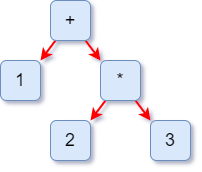
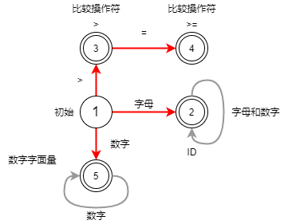

::: info 前置知识

+ 编程语言
+ 数据结构与算法
+ 正则表达式
:::

编译原理是一种研究翻译的技术，很多技术巨头的软件都具有二次编程的能力，比如 Office，CAD、Mathematica等，无论是哪个技术巨头，它们的核心能力都是拥有自己的语言和相关的生态，这都是编译技术带来的

对于我个人来说，接触编译原理的初次想法就是：“我真的需要学习编译技术来写一门新的语言吗？”，直到我学了一段时间后，才发现我这种想法把编译原理的用途简单化了，在我用 Spring 时发现它对注解的支持和字节码的动态生成也属于编译技术，以及 Web 前端会使用一些模板引擎实现界面设计和代码相分离，这种模板甚至支持条件分支，循环等语法，形成更容易执行的前端代码

但是我在学习这门课程时时产生了很多问题，原因是市面上很多讲述编译原理的书都过于抽象和理论，导致我拿起书就很快放下了，在我看来，编译原理真的需要理论和实践相结合，以达到学以致用的程度

## 前端技术

这里的前端并不是指 Web 前端，而是指的是编译程序对代码的分析和理解过程，它通常和语言的语法有关，跟目标机器无关，与之对应的就是后端，后端则是生成目标代码的过程，跟目标机器有关

编译器的前端技术分为**词法分析、语法分析、语义分析**三个部分，主要涉及自动机和形式语言方面的基础

### 词法分析

编译器的第一项工作就是词法分析，像阅读文章一样，而文章是由一个个中文单词组成的，只不过在这里叫做“词法记号”，英文叫 Token，下面是个例子：

```c
#include <stdio.h>
int main(void){
  int age = 22;
  if (age >= 45){
    printf("old man");
  } else {
    printf("young man");
  }
  return 0;
}
```

对于人来说，可以识别出 int、if、else、return 这样的关键字，main、age、printf 这样的标识符，还有花括号、圆括号、分号这样的符号，以及数字常量、字符串字面量等，这都是 Token，词法分析程序就需要识别出这样的 Token，虽然英文内容通常用空格和标点将单词分开，但是对于计算机语言来说，用空格和标点分割是不行的。比如 `age >= 45`，应该被识别成`age`、`>=`、`45`，但是它们在代码中是可以连在一起的：`age>=45`，中间不一定非要空格

这和中文有点像，因为中文每个字之间是没有空格的，但是作为母语的本能我们会下意识地把句子里的词语给识别出来，这个过程叫做分词

对此，可以定义一个规则来区分不同的 Token，比如：

+ 对于`age`标识符，它以字母开头，后面可以是字母或数字，直到遇到第一个既不是字母又不是数字的字符时结束
+ 对于`>=`操作符，扫描到一个`>`时，就应该注意它可能时一个`>`，但`>=`操作符第一个也是以`>`开头，所以应该继续往下看一位，如果遇到`=`，那就是`>=`，否则就是`>`
+ 对于`45`数字字面量，扫描到第一个数字时就开始把他看作数字，直到遇到非数字的字符

这些规则都可以通过手写程序实现，但是也可以通过词法分析的生成工具实现，比如 Lex，这些工具都是基于一些规则来工作的，这些规则用“正则文法”表达，符合正则文法的表达式叫做**正则表达式**。生成工具也可以读取正则表达式，生成一种叫“有限自动机”的算法，来完成具体的词法分析工作

::: tip 正则文法
它是一种最常见的规则，写正则表达式就是用的正则文法，前面描述的几个规则是一种口语化的正则文法
:::

::: tip 有限自动机
是指有限个状态的自动机器，比如马桶分为两个状态“注水”和“水满”，摁下按钮它转到“注水”状态，浮球上升一定高度时，注水阀门关闭，转到“水满”状态
:::

词法分析器它分析整个程序的字符串，遇到不同字符，会驱使它迁移到不同的状态，比如扫描`age`时处于标识符状态，遇到`>`时处于操作符状态

### 语法分析

编译器下一个工作是语法分析，语法分析在词法分析的基础上识别出程序的语法结构，它是一个树状的结构，一个程序就是一棵树，叫做抽象语法树（Abstract Syntax Tree, AST），树的每个节点就是一个语法单元，层层的嵌套树状结构是人对程序的理解，因为程序总是一个结构嵌套另一个结构，大程序嵌套子程序，子程序又可包含子程序，对于一个表达式`1+2*3`的语法树是这样的：

::: center

:::

形成 AST 的作用就是让计算机更容易去处理，因为从根节点遍历整颗树就可以获得表达式的值，这些构造也可以通过程序实现，但是有几种实现的思路。一种思路是自上而下的进行分析，首先构造根节点，代表整个程序，之后向下扫描 Token 串，构建它的子节点，当遇到 int 类型的 Token 时，就已经知道遇到了变量声明语句，于是构建一个“变量声明”节点；接着遇到 age 并建立一个子节点，这是第一个变量，之后遇到 = ，意味着这个变量有初始值，那么建立一个初始化的子节点；最后遇到 45，这样一个树就扫描完毕了，程序退回到根节点，开始构建第二个子节点，一直递归扫描，直到构建成完整的树，这个算法叫递归下降算法（Recursive Descent Parsing）。与之对应的还有自底向上算法，这个算法会先将最下面的子节点识别出来，组装成上一级节点，一直到整个树组装完毕

这些东西也是有大量的现成工具，比如 Yacc、JavaCC 等

### 语义分析

接下来的工作就是语义分析，对于计算机来说，就是让它理解我们真实意图，把一些模棱两可的地方消除掉，比如某个表达式计算结果时社么数据类型？如果数据类型不匹配，是否需要自动转换？一个代码块内外部有相同名称的变量，执行的时候应该用哪个？同一个作用域内不能有相同的变量，这是唯一性检查

语义分析就是做这样的事情，将判断的结果作为属性标记在 AST 上，比如 age 这个标识符的数据类型会被标识 int，当然也可以标记很多属性，有些属性在前两个阶段就被标记了，比如源代码所处于的行号，在这一行的第几个字符。在程序报错的时候会清楚的直到出错的位置，做完这些标注后，编译器就会根据这些信息生成目标代码了，这是属于后端的部分

## 正则文法和有限自动机

词法分析的工作是将字符串提取出一个个 Token，并且是一边读取一边提取，打造手工词法分析器的过程，就是写出正则表达式，画出有限自动机，然后根据图形更加直观的写出解析代码的过程，比如解析`age >= 45`，需要根据一些规则来绘制有限自动机：

::: center

:::

上图是一个严格意义上的有限自动机，它有五种状态：

1. 初始状态：刚启动词法分析，程序所处状态
2. 标识符状态：遇到第一个字符是字母时，就迁移到状态 2，后续字符是字母和数字时，继续保留在状态 2，不是就离开状态 2，并写下 Token，回到初试状态
3. 大于操作符状态：当第一个字符是`>`，进入状态 3，它是操作符中的一种情况：
4. 大于等于操作符状态：如果状态 3 的下一个字符是 `=`，就进入状态 4，变成 `>=`，它也是操作符的一种情况
5. 数字字面量状态：初始状态时，下一个字符是数字，进入状态 5，如果仍然是数字，继续保持在状态 5

单圈表示临时状态，双圈表示是一个合法的 Token

正则文法可以被转换成等价的有限自动机，这个过程叫做正则文法到有限自动机的转换。这种转换允许将正则表达式转换成一个能够有效识别匹配的自动机。同样地，有限自动机也可以被转换成等价的正则文法。这种转换可以帮助理解自动机是如何识别特定模式的字符串的。总的来说，正则文法和有限自动机是描述和识别正则表达式的两种不同的方式

## 中间表示

中间代码生成就是前端编译器将源程序的抽象语法树（AST）转换为后端可以进行优化处理的中间表示形式的过程。一般来说，中间代码需要满足以下条件：

1. 和源程序语义等价，能准确反映源程序的含义
2. 与机器无关，独立于目标体系结构，为后续目标代码生成提供方便
3. 对优化友好，具有简单的控制流和数据流结构，便于各种优化分析和转换

常见的中间代码形式包括:

+ 三地址码：每条码使用最多三个操作数和一个操作符
+ 单static单赋值形式(SSA)：每个变量只有一个定义点，优化流分析
+ 对象代码：将程序表示为一组对象和函数间的调用关系

中间代码生成主要步骤:

1. 对AST进行语义检查和属性分析
2. 遍历AST将各种语法结构转换为对应的中间代码表示
3. 优化生成的中间代码,如基本块结构清理等
4. 代码整体连接成一个连贯的中间代码流程

正确生成中间代码是优化的基础,它隐藏语法细节,抽象语义信息,有利于后续各种全流水线优化变换。中间代码也为二进制代码生成奠定基础

## 优化

## 后端技术

后端负责优化和目标代码生成工作，将前端生成的中间表示形式转化为目标机器可以直接执行的 object 文件或可执行文件

### 代码优化

对中间表示或者目标代码进行各种优化转换,如常量传播优化、代数运算优化等,生成更高效的目标代码

### 代码生成

从优化后的中间表示或目标指令串生成实际的机器语言指令,采用各种指令选择与寻址方式来对代码进行解读

### 汇编与链接

汇编阶段将优化后的目标代码转换成机器语言助记符,链接阶段将不同对象文件组合成一个可执行文件

## 参考资料

+ 编译器设计
+ 编译原理（第2版）
