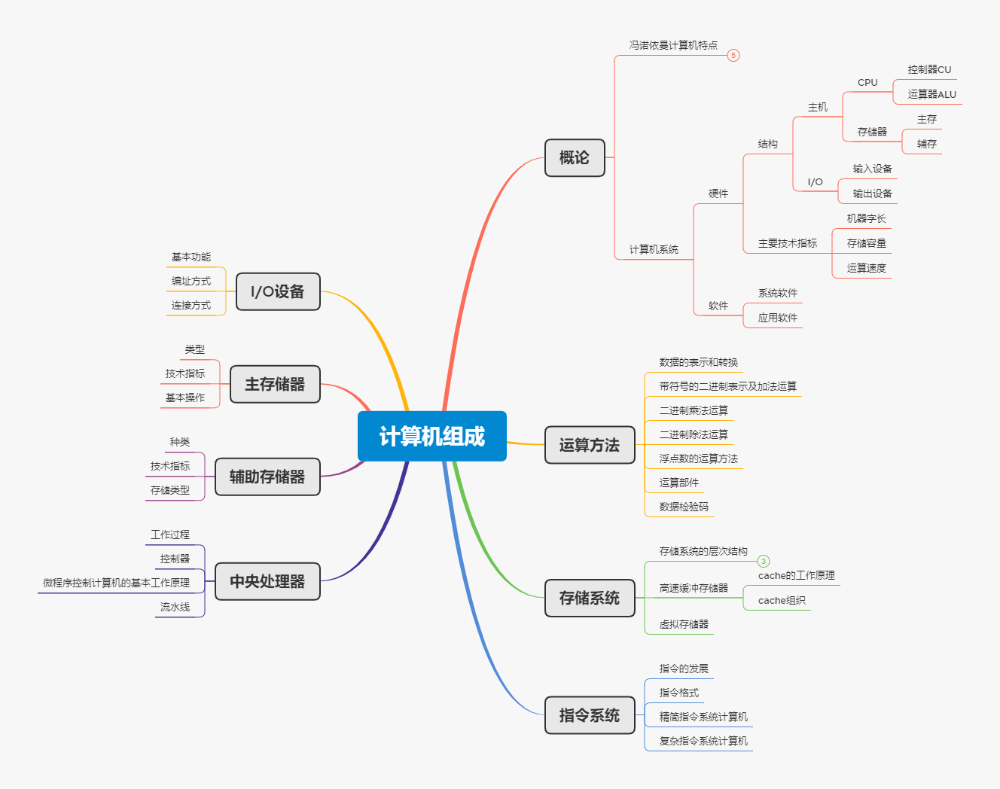
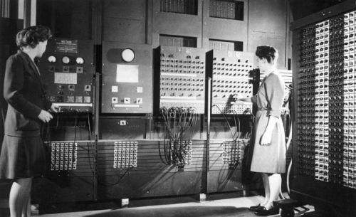
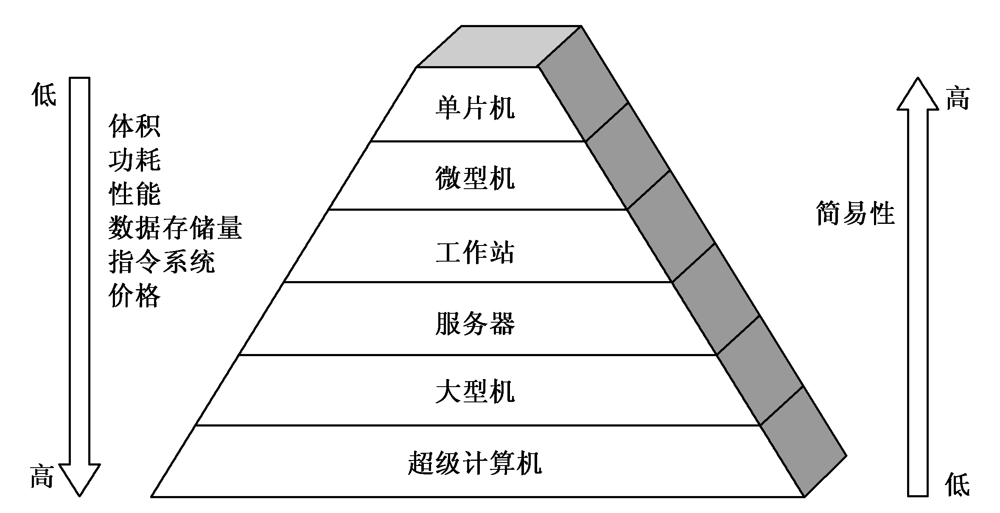

::: info 前置知识

+ 数字电路
:::

从肉眼来看，计算机是由 CPU、内存，显示器等这些设备组成的硬件，虽然绝大部分人都是从事应用层面的软件开发，但是组成原理是计算机其他课程的一个引导，因为向下可以学习数电，向上可以学习编译原理和操作系统这些课程，所以说无论学习计算机的哪一门核心课程都应该先学习一下计算机组成原理，这样会对硬件原理和软件架构都有一个全局性的了解

但是这门课也是非常难的一门，因为概念非常多，并且信息量很大，比如想要理解 CPU 中的算数逻辑单元怎么实现加法，就需要涉及到如何将整数表示成二进制，如果讨论计算机的指令如何从高级语言变成可执行的机器码，那么就会变成编译原理这门核心课

那么总结来说，计算机组成研究的是计算机中的部件之间的连接关系和相互关系，以及它们之间的工作原理

::: center

:::

到底是学什么呢？其实有点像装电脑

## 电脑的硬件组成

电脑必须要有三大件，CPU、内存和主板

CPU 是电脑中最核心的硬件，它的全名叫做中央处理器（Central Processing Unit），所有的计算都是交给 CPU 进行的，同时 CPU 几乎是整个电脑中造价最贵，科技水平最高的

第二个是内存（Memory），打开的程序，都要加载到内存中去才能运行，内存越大，放的东西越多，而 CPU 就是通常处理内存中数据，但是 CPU 不能直接插到内存上

主板提供了 CPU 和内存连接的通道，主板是一个有各种各样插槽的配件，CPU 和内存都需要插到主板上，主板的芯片组和总线解决了 CPU 和内存之间如何通信的问题，芯片组控制了数据传输的流转，总线是数据传输的通道

当有了这三大件，只要配上电源供电，计算机就可以运行起来了，但是还缺少一些输入输出设备，也就是 I/O 设备，比如没有显示器就看不到计算机输出的图像、文字等信息，这就是所谓的输出设备。鼠标键盘也不能少，这样才能向计算机中输入数据，它们也就是所谓的输入设备

最后可能需要一个硬盘，这样数据才能够永久的保存下来，且大部分人都会使用机箱，装上风扇，解决灰尘和散热问题，不过它们都不是计算机的必备硬件，也就是说拿鞋盒当机箱都没有问题

如果想要打游戏，可能还需要配上显卡，显卡也是必不可少的，可能有的主板自带显卡或者 CPU 自带显卡，但是如果要玩游戏，或者做深度学习，多半就要买一张独立的显卡插在主板上，显卡也里有一个处理器，也就是 GPU，它也可以做运算

## 冯诺依曼体系结构

一台电脑就这么组装起来了，但是平常使用的智能机也是这样的吗？

手机由于体积原因，并没有什么所谓的 CPU 插槽和内存插槽这些东西，所以手机制造商将这些东西都封装到一个芯片里，然后嵌入手机的主板上，这种方式叫做 SoC（System on a Chip）。这样看来电脑和手机可能组成方式不太一样，但是程序的运行方式没什么区别，都是将程序加载到内存中执行。这是因为个人电脑，手机等设备都遵循着一个概念，即**冯诺依曼体系结构**，也叫存储程序计算机。它有两种概念，一个是**可编程**，一个是**存储**

::: tip 冯诺依曼体系结构
将程序指令和数据一起存储的计算机设计概念结构
:::

计算机是由各种门电路组成的，通过组装成一个电路板，来完成特定的程序，一旦需要修改程序，就必须重新组装电路，这样的计算机就是不可编程的，因为程序在硬件层面上被写死了。比如计算器只能做加减乘除，做不了任何计算逻辑固定之外的事。如果将程序本身存储在内存中，然后通过加载不同的程序来解决不同的问题，那么就实现了可编程

早期计算机只能运行固定用途的程序，改变程序必须更改结构，重新设计电路，在当时重启程序并不像现在重新编译一样简单，这就导致计算机非常局限，于是冯诺依曼提出了将程序存储起来，并设计通用的电路，运行程序的时候，把程序当成电路能够理解的语言，然后让通用电路执行相关的逻辑，这就是冯诺依曼体系的核心概念：**存储程序指令，并设计通用电路**

::: tip 现代计算机结构
现代计算机结构从本质上来讲还是冯诺依曼结构，但对原有的结构进行了改变来解决冯诺依曼原有结构 CPU 和存储设备之间的性能差异，在这个结构中，存储器，运算器，控制器在一个结构上面，现在计算机的结构可以理解为**以存储器为核心的结构**
:::

ENIAC 是 1946 年在美国宾夕法尼亚大学制成的，但实际上真正意义上的第一台计算机是阿塔纳索夫-贝瑞计算机，ENIAC 发明者是从阿塔纳索夫继承了电子数字计算机的主要设计构想，因此阿塔纳索夫-贝瑞计算机是世界上第一台计算机，而 ENIAC 是通用的第一台电子数字计算机，因为 ENIAC 是可编程的计算机

::: center

:::

## 计算机的分类

+ 电子模拟计算机：通过电压来表示数据，并用盘上连线控制，它的精度较低，存储量较小，没有逻辑判断能力，而数字计算机通过数字 0 和 1 表示，并通过程序来控制，它的精度非常高，存储量非常大，逻辑判断能力也非常强

+ 电子数字计算机：是现在最主流的计算机，通常也被称为电脑或者电子计算机，且可以进一步分为专用计算机和通用计算机，**它们是根据计算机的效率、速度、价格、运行的经济性和适应性来划分的**

专业计算机是最有效，最经济和最快速的计算机，但是他的适应性很差。通用计算机适应性很强，但是牺牲了效率，速度和经济型，通用计算机又可以分为超级计算机，大型机，服务器，PC 机，单片机和多核机，区别在于体积，简易性，功耗，性能，数据存储容量，指令系统规模和机器价格

::: center

:::

+ 个人计算机：通常对个人用户来讲提供良好的性能，且价格低廉

+ 服务器：为多用户运行大型程序的计算机，执行大负载任务，通常是多个用户并行访问，提供比个人计算机更强的性能以及更加可靠的稳定性。低端服务器一般用于商务应用或者 Web 服务，而高端服务器又叫做**超级计算机**，常用于科学计算，这类计算机代表着最高价格以及最高的计算性能，但在整个计算机市场中占用的比例较少，跟个人计算机比起来，当前民用最强 CPU 连超算的十分之一都赶不上，可谓差距之大

+ 嵌入式计算机：是数量最多的一类，常用于汽车，电视、控制飞机等设备的处理器，它的设计目标是运行单一的应用程序，对成本和功耗有严格限制，必须快速的执行有限功能，且必须保证正常运转

## 程序概念

计算机系统由硬件和系统软件组成的，它们共同来运行应用程序

计算机的硬件只能执行简单的低级指令，一个复杂的应用程序到简单的指令需要经过多个软件层次来将高层次的操作翻译成简单的低级指令，这是一种抽象的解释。在层次中，最外层是应用软件，中间是硬件，而系统软件在两者之间

### 系统软件

系统软件提供操作系统、编译程序、加载程序、汇编程序等，对于现代计算机系统来说，**操作系统**和**编译程序**是必须的。操作系统是用户程序和硬件之间的接口，提供了基本的输入和输出，分配内外存，为应用程序提供计算机资源的操作

编译程序用于将高级语言编写的程序翻译成硬件能够执行的指令，对于计算机来说最简单的信号是“通”和”断“，所以计算机用两个符号 0 和 1 表示。也因此计算机的语言通常被称之为**二进制数**，每个符号就是一个**二进制位**或**一位**（bit），而计算机指令就是一个个二进制位组成的位串

### 转向高级语言

最初程序员是通过二进制来和计算机打交道的，由于二进制太过难以理解，它们很快发明了助记符，最初助记符是手工翻译成二进制，后来开发了一种**汇编程序**，将助记符自动翻译成对应的二进制，这种符号语言又叫**汇编语言**，而计算机理解的二进制语言叫**机器语言**

后来人们意识到可以编写一个能够将接近人类语言翻译成计算机指令的程序，于是就设计了高级语言的编译程序，使用高级编程语言大大提高了软件的开发效率，这些高级语言由一些单词和代数符号组成，可以由编译器转换成汇编语言，再由汇编器转换成机器语言交给计算机执行

## 计算机的性能

评价计算机性能是一个复杂的过程，尤其随着现代计算机架构的复杂化，不同使用场景对性能的要求也有所不同。一般来说，个人计算机强调响应时间，即完成单个任务的时间。而服务器更注重吞吐率，即单位时间内完成的任务数量。通常，减少响应时间也会提升吞吐率

::: tip 响应时间和吞吐率

+ 响应时间：指计算机完成某个任务的总时间
+ 吞吐率：指单位时间内完成的任务数量
:::

通常减少响应时间也提升了吞吐率，一般将性能定义为响应时间的倒数：

::: center
性能 = 1 / 响应时间
:::

例如，若程序在处理器 A 上需要 6 秒完成，而在处理器 B 上需要 3 秒，根据公式计算可知，B 的性能是 A 的两倍

### 频率

CPU 频率指 CPU 内部时钟的频率，单位为赫兹(Hz)，时钟频率决定 CPU 一个时钟周期内可以执行的指令数，频率越高，CPU 在同样时间内可以执行的指令就越多，理论上处理能力越强。但频率过高也会增加功耗。目前常见 CPU 主频在 2GHz 至 5GHz 之间

CPU 时钟简单来说就是用于同步和调控 CPU 内部各个组件工作的信号发生器

CPU 时钟信号是由晶体振荡器产生的固定频率的脉冲信号，类似于“心跳”信号，协调和同步CPU内部各个组件的工作。时钟频率决定了 CPU 每秒能执行的时钟周期数，而每个时钟周期内，CPU 可以执行基本的操作，如取指令、解码指令等

影响 CPU 频率的因素：

+ 制程技术：更小的制程技术通常意味着更高的频率
+ 超频能力：需优化时钟信号传输和电路稳定性
+ 生产工艺和供电电压：工艺和电压影响频率
+ 核心数目和散热设计：多核和良好的散热设计影响频率
+ 微架构优化：优秀的微架构提升频率
+ 功耗限制和 PCB 布局：影响高负载时的频率

所以总体来说，频率由多方面因素共同决定，是 CPU 综合竞争力的重要指标之一

频率单位：

+ Hz（赫兹）：时钟频率的基本单位，代表每秒钟脉冲个数
+ kHz (千赫)、MHz (兆赫)、GHz (吉赫)、THz (太赫)：分别表示更高数量级的频率

1Hz 只能表示 CPU 时钟的频率，即每秒钟产生的时钟脉冲数，但不能确定一条指令的执行时间

时间虽然能够衡量性能，但有两个问题：

+ 时间不准：一个程序不一定每次运行时间是一样的，因为 CPU 实际上在各个程序之间切换
+ CPU 性能：CPU 可能满载运行，也可能降频运行，导致时间有所差异

所以应该对 CPU 时间进行拆解，将执行时间变成时钟周期数和时钟周期时间的乘积：

::: center
程序的 CPU 执行时间 = CPU 时钟周期数 * CPU 时钟周期时间
:::

时钟周期时间就是 CPU 主频，比如 AMD 3200G 的主频是 3.6GHz，可以简单粗暴的理解为，CPU 在 1 秒内执行的指令是 3.6G 条，CPU 内部是由晶振驱动的，类似于墙上的挂钟，“滴答滴答”一秒一秒的走，通过挂钟就能识别出来最小的单位是秒。而 CPU 每一次的震荡时间就是时钟周期时间，只要这个主频越高就代表它走的越快，因此最简单的性能提升方式就是缩短时钟周期时间，但是对于人类说这个操作相当于更换了 CPU，因此将目光瞄向了时钟周期数，如果能减少程序需要的时钟周期数，一样能够提升性能

时钟周期数受程序的指令数影响较大，所以可以进一步拆解成“指令数 * 每条指令的平均时钟周期数”，简称 CPI，这样上面的公式就变成了：

::: center
程序的 CPU 执行时间 = 指令数 \* CPI \* CPU 时钟周期时间
:::

除了优化这些东西来提升性能，还可以将一个芯片集成多个 CPU 来提升性能，所以就出现了向单核处理器向多核处理器的转变

## 功耗墙

虽然在 CPU 多放一些晶体管，提高时钟频率就能够让它更快，但对于 CPU 来说是有功耗上限的，因为同一个体积的性能提升是有限的，仅通过堆硬件的方式，在如今已经不能够满足对程序性能的需求了，所以需要从以下几个方面入手：

+ 加速大概率事件
+ 通过流水线提高性能
+ 通过预测提高性能

## 计算机的计算单位

### 容量单位

长期以来，KB、MB 等缩写被同时用于表示十进制和二进制值，导致了混淆。IEC 引入二进制前缀就是为了解决这个问题，但在实际使用中，并没有在消费者市场中广泛的接受和普及

十进制前缀（SI前缀）：

+ 基于 10 的幂
+ 常用于日常生活和许多科学领域
+ 例如：kilo (k) = 10^3^, mega (M) = 10^6^, giga (G) = 10^9^

二进制前缀（IEC前缀）：

+ 基于2的幂
+ 主要用于计算机科学和数字电子领域
+ 例如：kibi (Ki) = 2^10^, mebi (Mi) = 2^20^, gibi (Gi) = 2^30^

| bit    | Byte  | KIB    | MIB      | GIB       | TIB    | PIB        | EIB      |
| ------ | ----- | ------ | -------- | --------- | ------ | ---------- | -------- |
| 比特位 | 字节  | 千字节 | 兆字节   | 吉字节    | 太字节 | 拍字节     | 艾字节   |
| -      | 8bits | 1024B  | 1024KB   | 1024MB    | 1024GB | 1024TB     | 1024EB   |
| 门电路 | -     | 寄存器 | 高速缓存 | 内存/硬盘 | 硬盘   | 分布式存储 | 数据仓库 |

::: warning 二进制的换算
在千字节之后，所有的单位的换算关系都是 1024，只有字节和比特位使用的是 8 进制位，同时 1024 = 2^10^
:::

::: caution 为什么网上买的硬盘容量标称 500G，格式化之后变成了 465G？
这是因为硬盘制造商使用的是 SI 前缀来标记容量，也就是说 1G 等于 1000MB，而操作系统使用的是二进制前缀，所以(500 * 1000^3^)/1024^3^ 约等于 465G，硬盘商使用 1000 进制位，则是因为硬盘的扇区，也就是存储数据的地方，在记住这个扇区的容量时，使用的是人类容易理解的十进制，更容易去沟通和协商
:::

### 速度单位

在互联网走进千家万户的同时，会经常听到各种 2M、4M、以及 10M 这样的关键字，这里的单位并不是容量单位，而是一种速度单位，网络速度通常以比特每秒（bps）为单位，而不是字节每秒（B/s），1 字节 = 8 比特

::: caution 为什么电信拉的 100M 光纤，测试峰值速度只有 12M 每秒？
100M 是 100Mbps 的缩写，而 100Mbps 等于 100Mbit/s，所以换算成实际的速度单位为：100Mbit/s = (100/8)MB/s = 12.5MB/s
:::

## 字符与编码集

字符也就是在计算机表达的"语言"，常见的包括：数值、字母、文字和符号，如：1、a、A、试、$...都表示的是一个字符，在计算机中，不同的字符可能需要不用的存储容量进行存储。字符集表示多个字符的集合，每个字符集可以包括不同的字符

将字符集中的字符编码映射成集合中的某一个对象如：比特模式、自然数序列、电脉冲等，以方便字符在计算机中存储和在计算机网络中传递，它表示的是一种规则。通常特定的字符集采用特定的编码方式，即一种字符集对应一种字符编码，如: ASCII、ISO-8859-1、GB2312、GBK 都是表示了字符集又表示了对应的字符编码，但 Unicode 字符集是特例，它对应的字符编码有：UTF-8、UTF-16、UTF-32

### ASCII 码及其扩展

标准 ASCII 使用 0-127 这 128 个数字来表示字符，因此 7 个 bits 就可以完全表示 ASCII 码，其中包括 95 个可打印字符，33 个不可打印字符（包括控制字符）：33 + 95 = 128 = 2^7^

::: warning 缺陷
ASCII 的局限在于只能显示 26 个基本拉丁字母、阿拉伯数字和英式标点符号，因此只能用于显示现代美国英语，对其他语言依然无能为力
:::

随着时间的发展，ASCII 码逐渐的满足不了更多的需求了，主要表现在很多应用或者国家中的符号都无法表示，这时就对 ASCII 码进行了第一次扩充，将 7bits 增加到 8bits，就可以让 ASCII 码表示 256 个字符，于是产生了可扩展的 ASCII 码，这个扩展版本通常被称为“Extended ASCII”或“8-bit ASCII”

### 国际化需求与解决方案

在世界上，很多语言的体系都不一样，很多都是不以有限字符组合的语言，比如英文只用 26 个英文字母表示，而中文除了偏旁以外，每一个字都是独立的，这些字符尤以中国、韩国、日本等国家的语言最为复杂，所以字符编码集的国际化非常有必要

+ GB2312：又叫《信息交换用汉字编码字符集——基本集》，一共收录了 7445 个字符，包括 6763 个汉字和 682 个其他符号，虽然 GB2312 算是一个比较完备的中文字符集，但是并不符合国际标准
+ GBK：又叫《汉字内码扩展规范》，向下兼容 GB2312，向上支持国际 ISO 标准，收录了 21003 个汉字，支持中日韩全部字符
+ GB18030：进一步扩展向下兼容 GB2312 和 GBK，收录了更多汉字

不管中文编码如何完善，只是一个本地化的编码，跨国使用都会出现乱码现象

Unicode 是一个旨在包含所有书写系统中所有字符的通用字符编码标准，它为每个字符分配一个唯一的数字（称为码点），Unicode 定义了世界通用的符号集，UTF-* 实现了编码，UTF-8 以字节为单位对 Unicode 进行编码

::: tip
在中国的 Windows 系统是默认使用 GBK 编码，编程时必须注意这个问题
:::

### 实际应用

在实际应用中，正确处理字符编码至关重要：

+ 在编程时，要确保源代码文件的编码与编辑器设置一致
+ 在处理文本文件时，需要知道文件的编码方式
+ 在 Web 开发中，要在 HTML 中正确声明字符编码，如`<meta charset="UTF-8">`
+ 在数据库操作中，确保数据库、表和连接都使用正确的字符集和排序规则

## 计算机的语言 - 指令

计算机指令从早期的打孔带发展到现今的二进制机器码，指令是计算机理解和执行的基本单位

指令的本质：

1. 硬件角度来看，CPU 是超大规模集成电路，通过电路实现各种运算
2. 软件角度来看，CPU 是执行指令的逻辑机器，指令即机器语言

### 指令集

但是，不同的 CPU 能听懂的语言不一样，它们各自支持的语言就是各种不同的计算机指令集，所以在电脑上写的程序，复制粘贴到手机上肯定没法运行的。如果复制到另一个电脑就能够运行，是因为这两台电脑的 CPU 有相同的指令集，这导致了程序的平台依赖性

::: tip 机器语言
二进制表示形式
:::

### 从高级语言转向低级语言

对于高级语言来说，通常需要编译器翻译成汇编语言，然后通过汇编器翻译成机器语言来交给计算机执行，这是一个日常开发程序的过程

### 指令的组成

机器指令主要由两部分组成：

1. 操作码 - 指定操作类型，操作码的位数反映了机器的操作种类，比如 2^8^ 决定了操作码可以完成 256 次操作
2. 地址码 - 指定操作数或操作数的地址，使 CPU 找到数据的地址进行相关运算

地址码又分为

+ 三地址指令 - 有三个地址码，将操作结果放入另外一个地址
+ 二地址指令 - 有两个地址码，将操作结果放入其中一个地址
+ 一地址指令 - 有一个地址码，对操作数自身进行操作并覆盖
+ 零地址指令 - 没有地址码，空操作，停机操作，中断返回操作等不需要操作数的操作

### 指令的操作类型

对于 CPU 来说，可以使用的指令很多，但大致可以分为五大类：

+ 算术类 - 加减乘除在 CPU 层面，都会变成一条条算术指令
+ 数据传输类 - 赋值变量，读写数据都是数据传输类指令完成的
+ 逻辑类 - 与或非
+ 条件分支类 - if/else
+ 无条件跳转类 - 函数或者方法

不同的 CPU 有不同的指令集，也就对应着不同的汇编语言和不同的机器码

### 寻址方式

存储器即可以存放数据，又可以存放指令，其在存储单元中的编号就是地址

指令寻址：

1. 顺序寻址：指令地址在内存中按顺序排列，按一条指令接一条指令的顺序进行
2. 跳跃寻址：指下条指令的地址码不是计数器给的，而是由当前指令给出，跳转到某个位置开始进行

数据寻址：

1. 立即寻址：指令直接获得操作数，地址字段指出的不是操作数的地址，而是操作数本身，特点是操作数立即可用，节省了访问内存的时间，但限制了操作数表示范围
2. 直接寻址：直接给出操作数在主存的地址 寻找方式简单，无需计算数据地址，但限制了操作数寻址范围
3. 间接寻址：给出的是操作数地址的地址，需要访问一次或多次主存来获取操作数，操作数寻址范围大，但速度较慢

### 指令集架构

标准指令集可以运行不同程序，是计算机通用性的基础，不同指令集的主要差异在于指令格式和操作数数目上，CISC（复杂指令集）和 RISC（精简指令集计算）是两种主流的计算机体系结构设计理念

CISC：

+ 特点 - 指令复杂，长度可变
+ 代表 - x86

RISC：

+ 特点 - 指令简单，长度固定
+ 代表 - ARM、MIPS

CISC 指令集复杂丰富，RISC 指令集简化精干。CISC 重功能，RISC 重效率。CISC 适合任务型计算机，RISC 适合系统级应用。RISC 并行执行能力强，性能通常优于CISC

现代 CPU 设计经常采用 CISC 和 RISC 的混合思路，以平衡功能和效率

### 主要指令集及其应用

1. x86：Intel Core 系列、AMD Ryzen 系列
2. ARM：Apple A 系列、高通 Snapdragon、华为麒麟
3. RISC-V：开源架构，新兴领域如 IoT、AI 加速器
4. MIPS：龙芯 CPU、部分嵌入式系统

## 管线

CPU工作过程分成多段(取指、解码、执行等),不同指令可以在不同阶段进行。

达到同时在不同阶段进行不同指令处理的目的,增强单个CPU的并行效率。

一个简单的5级流水线包括取指、解码、执行、访存、写回五个阶段。

但是会有数据依赖和控制迁移导致的流水线冲突问题。

管线技术增加单核性能

## 超标量

## 多核

在单片机上集成2个或更多完整的CPU核心。

每个核心有独立的控制单元和执行单元,但可能共享缓存和总线等资源。

让CPU在线程级实现并行执行,充分利用Instruction Level Parallelism。

多核CPU通过任务和线程的分配来提高整体吞吐量。

但也增加了结构复杂度,需要考虑NUMA等问题进行优化

多核技术通过让多个CPU核心协调工作来提高吞吐量

## 分支预测

## 协处理器

## 存储器

存储器可以简单理解为计算机用来临时保存数据和程序的部件,是CPU操作的对象。

常见的存储器类型有RAM(内存)和ROM(只读内存)。RAM是计算机运行必不可少的主要内存。

RAM的数据保存在电容中,需要持续供电才能保存存储的数据。断电则会丢失 contenyt。

RAM的核心存储单元是DRAM,按 generations 来分为DDR1、DDR2、DDR3、DDR4等版本。

RAM的主要技术参数包括:容量、时钟频率、波特率(数据传输速率)、访问时间等。

内存越大,可以存放的程序和数据就越多;时钟频率越高,数据读取速度越快。

CPU通过总线与内存进行数据交换,用逻辑地址寻址内存中的存储位置。

运行程序时,会把部分代码和数据从硬盘搬移到RAM中使用,这称为虚拟内存。

ROM在没有电源的情况下也能保持数据,一般内置BIOS固件用于系统启动。

存储器作为系统重要组成,其性能直接影响系统运行速度

## 总线

总线是计算机系统内各组件进行通信的重要路径。来让我给你介绍一下计算机总线知识:

总线可以理解为计算机系统内部联通各组件的"道路"。它负责组件之间的数据和控制信号传输。

计算机主要有三类总线:地址总线、数据总线、控制总线。

地址总线传输内存地址和I/O设备地址信息。数据总线传输数据信息。控制总线传输控制信号。

总线的带宽决定了系统传输性能。例如32位总线每次只能传输32bit的数据。

PCIe总线和SATA总线用于连接外部扩展设备。

USB和显示接口采用的也是总线结构。

与CPU连接的前端总线包括FSB总线和现在的DMI总线。

内存使用的总线包括双通道以及四通道DDR总线等。

总线传输速率越高,系统传输性能越强,例如USB3.0等。

总之,总线就像计算机系统内部“公共交通”,它的类型和速度直接影响系统各组件间的通信效率

## 参考资料

+ 程序是怎样跑起来的
+ 编码-隐匿在计算机软硬件背后的语言
+ 计算的本质：深入剖析程序和计算机
+ 计算机程序的构造和解释
+ 计算机是怎样跑起来的
+ 计算机体系结构：量化研究方法
+ 计算机系统要素：从零开始构建现代计算机
+ 计算机组成与设计：硬件软件接口
+ 深入理解计算机系统
