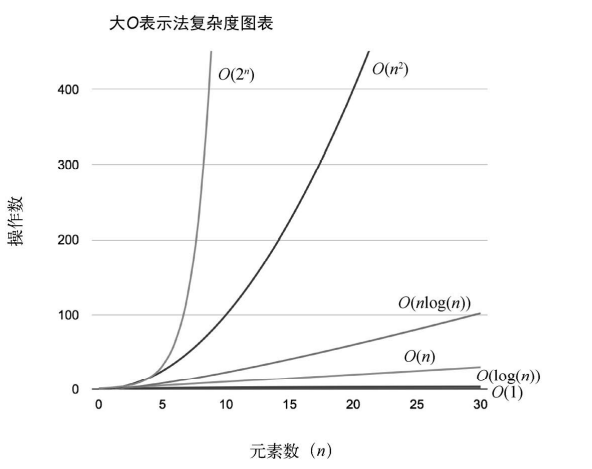

::: info 前置知识

+ 编程语言
:::

数据结构与算法是一个云里雾里的概念，在学习的过程中，没有必要去了解这些，尤其是在应用层面上面，数据结构与算法就显得不是特别重要，但是如果要了解设计层面上的东西，那么数据结构与算法就显得非常重要。可以不用，但是必须了解

数据结构就是在计算机中，存储和组织数据的方式，好比在图书馆中如何排列组织一些书，在如何取出书之前，应该先想一想如何摆放一些书籍。在计算机中解决问题的效率往往取决于数据的组织方式，计算机存储的数据量更大，种类更多，以什么样的方式来组织数据就是数据结构需要考虑的问题

常见的数据结构有：

+ 数组
+ 链表
+ 栈
+ 队列
+ 树
+ 图
+ 哈希表
+ 堆
+ ...

每一种数据结构都有其对应的应用场景，不同数据结构的不同操作性能是不一样的，根据开发需求进行选择

数据结构与算法是和编程语言无关的，使用自己最熟悉的语言实现一遍，本系列会分别使用多种语言去实现

+ C/C++：写法复杂，大量的内存管理代码，性能极高
+ JavaScript：写法简单，数组封装较好，能够自动扩容，允许不同的数据类型
+ Python：依赖解析器，同一个逻辑使用不同的写法会影响性能
+ Java：完全面向对象，无需对内存进行管理，中规中矩

## 逻辑结构和物理结构

逻辑结构指的是数据对象中的数据元素之间的相互关系，主要分为四种：

+ 集合结构 - 数据元素除了同属于一个集合以外，它们之间没有任何关系
+ 线性结构 - 数据元素之间只有一对一的关系
+ 树形结构 - 数据元素之间是一对多的关系
+ 图形结构 - 数据元素之间是多对多的关系

物理结构也叫存储结构，指的是如何将数据存储在存储器中

+ 顺序存储 - 把数据元素存放在连续的地址空间里，存储关系能够反映其逻辑关系，数组就是这种结构
+ 链式存储 - 把数据元素存放在任意的地址空间里，也可以是连续的，但是存储关系不能反映其逻辑关系，每一个数据元素还需要额外的空间来存储下一个数据元素的地址
+ 索引存储 - 分别存放数据元素和元素之间的关系的存储方式
+ 散列存储 - 将数据元素的地址空间与关键码之间建立确定的对应关系的存储方式

::: tip
逻辑结构针对于数据的定义，物理结构针对于数据的存储实现，二者基本目标是将数据及其逻辑关系存储到存储器中
:::

## 抽象数据类型

抽象是指抽取事物中具有的普遍性的本质，抽出问题的特征而忽略非本质的细节，是一种思考方式，它隐藏了细节，只保留实现目标所必需的信息，与存放数据的机器无关，与数据存储的物理结构无关，与实现操作的算法和编程语言无关，只关心数据和操作是什么，并不涉及如何实现。对已有的数据进行抽象，就有了**抽象数据类型（Abstract Data Type，ADT）**

一个 ADT 包含两个部分：数据声明和运算的明

```plain
ADT 抽象数据类型名
Data
    数据元素之间逻辑关系的定义
Operation
    操作 1
        初始条件
        操作结果描述
    操作 2
        初始条件
        操作结果描述
    操作 n
        ...
endADT
```

## 算法

在解决问题的过程中，数据的存储方式会影响效率，而算法的优劣也会影响，数据结构的实现离不开算法

算法是对解决特定问题的求解步骤的描述，没有最好的算法，只有更好的算法

算法有五个特性：

+ 输入 - 算法执行前，必须具备的先决条件，可以没有输入
+ 输出 - 算法执行后，得出的结果，必须要有输出，不一定是打印，可以是一个返回值
+ 有穷性 - 算法在执行有限的步骤后能够自动停止，且每一个步骤都能在可接受的时间内完成
+ 确定性 - 算法的每一步都有确定的含义，没有二义性，不能够模棱两可
+ 可执行性 - 算法的每一步必须是可执行的，每一步通过执行有限的次数完成，能偶被转换成计算机程序执行

算法在设计上也有要求：

+ 正确性 - 没有语法错误，对合法的数据能够产生满足需求的结果，对于不合法的数据有信息反馈
+ 可读性 - 便于人们理解的算法，否则难以调试和修改
+ 健壮性 - 对于不合法的数据，也能够做出相关处理不会产生一些莫名其妙的结果
+ 高效性 - 执行时间短，占用存储空间低，时间和空间是衡量算法性能的重要指标

## 算法的复杂度分析

数据结构与算法本身解决的是“快”与“省”的问题，不同的算法解决同一个问题，相差非常大，因此执行效率是算法的一个非常重要的考量指标，所以就有了算法的复杂度的分析，也就是算法的时间和空间复杂度分析

+ 空间复杂度 S（n） - 根据算法写成的程序在执行时占用的存储单元，占用大小往往和问题规模有关，空间复杂度过高的算法可能导致内存爆满，从而导致程序终止
+ 时间复杂度 T（n） - 根据算法写成的程序在执行时耗费的运行时间，占用的大小也和问题的规模有关，时间复杂度过高的算法会导致在有生之年也看不到结果

一般以正确性、可读性、健壮性来评估算法的优劣，好的算法就是在三个基础上，时间复杂度低，空间复杂度低，因此可以大概率上估计一个算法的好坏

把代码跑一遍，通过统计、监控就能得到算法的执行时间和占用空间，这是一种非常局限性的算法效率评估，因为测试结果非常依赖测试环境，硬件的不同导致测试结果会有很大的影响，同时也受到问题的规模影响，这个评估算法执行的效率的方法在很多书里面叫做**事后统计法**（事后诸葛亮），所以需要一个不用具体的测试数据来测试，就可以粗略的估计算法的执行效率的方法

**大 O 表示法**应运而生，它表示的是数据规模 n 对应的时间复杂度，仅仅是粗略的估算，帮助短时间内了解一个算法的复杂度，而不再需要具体的测试

符 号 | 名 称
---|---
O(1) | 常数的
O(log(n)) | 对数的
O((log(n))c) | 对数多项式的
O(n) | 线性的
O(n^2^) | 二次的
O(n^c^) | 多项式的
O(c^n^) | 指数的

`increment`是一个时间复杂度为 O(1) 的算法，无论执行多少次，`increment`的性能都是一样的，{1} 总是执行一次即可完成

```js
function increment(n) {
  return n++; // {1}
}
```

`sum`的是一个复杂度为 O(n) 的算法，如果`n = 1`，{1} 只要 1 次计算即可完成，如果`n = 10`，{1} 则要计算 10 次，因此`sum`的运行开销取决于`n`的规模

```js
function sum(n) {
  let i = 0;
  while (n > 0) {
    i += n; // {1}
    n--;
  }
  return i;
}
```

`bubbleSort`是一个复杂度为 O(n^2^) 的冒泡排序算法，`cost`是用于计算开销的变量，如果需要排序的数组元素为 3 个，那么`cost`则为 9（3^2^），如果元素个数为 10 个，那么`cost`则为 100（10^2^），第一层循环嵌套第二层的情况下就是 O(n^2^) 的代码，如果是三层则为 O(n^3^)

```js
function bubbleSort(array) {
  let cost = 0;
  for (let i = 0; i < array.length; i++) {
    cost++;
    for (let j = 0; j < array.length - 1; j++) {
      cost++;
      if(array[j] > array[j + 1]) {
        let t = array[j];
        array[j] = array[j + 1];
        array[j + 1] = t;
      }
    }
  }
}
```

这是 大 O 时间表示法的效率图示



一般一个算法固定后，会再次细分一些复杂度：

+ 最好情况复杂度 - 最理想的情况下，算法的时间复杂度很好
+ 最坏情况复杂度 - 最不想理想的情况下，算法的时间复杂度很差
+ 平均复杂度

如果在一个数组中查找元素，第一次就找到了，那么这就是最好情况，复杂度为 O(1)。如果没有找到就是最坏情况，复杂度为 O(n)。平均复杂度是最难以计算的，不过使用线性查找的方式是 O(n + 1)，因为要考虑到元素不在数组中，但是一般忽略掉常数，所以复杂度也是 O(n)

算法的优化方向：

+ 用尽量少的存储空间
+ 用尽量少的执行步骤
+ 根据情况空间换时间或时间换空间

## 参考资料

+ 算法（第 4 版）
+ 学习 JavaScript 数据结构与算法第三版
+ 算法导论
+ 天才与算法：人脑与 AI 的数学思维
+ 大话数据结构
+ 妙趣横生的算法：C++语言实现
+ 算法图解
