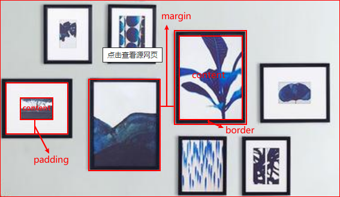

盒模型是 CSS 中非常重要的的概念，关乎元素的尺寸和显示，任何元素都可以看作一个盒子，盒模型仅仅只是一个比喻，一般指那些可以设置宽高/内外边距的元素



+ 内容（content）：显示内容的地方
+ 边框（border）：环绕在内容和内边距外面一层
+ 内边距（padding）：边框和内容的之间的距离
+ 外边距（margin）：元素与元素之间的距离

## 标准盒模型和 IE 盒模型

标准盒模型也叫 w3c 标准盒模型，如果给元素设置`width`和`height`，设置的是内容宽高，再加上`padding`和`border`一起决定盒子的大小。因为`margin`是不可见区域，所以不会参与计算，它只会影响盒子外部的空间

IE 盒模型又叫怪异盒模型，在这种模型中，`width`和`height`会影响元素的可见区域，所以内容的宽度是`width`减去边框和内边距，盒子的大小并不是标准盒模型中的累加方式

现在浏览器都是使用的标准盒模型，想要使用 IE 盒模型，可以为元素添加`box-sizing: border-box`来实现

::: demo 标准盒模型和 IE 盒模型

```html
<div class="box w3cbox"></div>
<div class="box iebox"></div>
```

```css
.box {
  width: 100px;
  height: 100px;
  border: 5px solid;
  background: pink;
}
.iebox {
  box-sizing: border-box;
}
```

:::

## 宽度和高度

大部分元素都可以设置宽高，宽高的取值可以是固定长度，也可以是百分数，以适应响应式布局，百分数是相对于父元素的宽高来计算的

不仅如此还有最小和最大尺寸：

+ `min-width` - 阻止设置的`width`的盒子小于该值
+ `min-height` - 阻止设置的`height`的盒子小于该值
+ `max-width` - 阻止设置的`width`的盒子大于该值
+ `max-height` - 阻止设置的`height`的盒子大于该值

## 外边距，内边距，边框

外边距是不可见的部分，作用仅仅是隔开元素之间的距离，当然取值也可以为负，这样盒子就会收缩，`margin`可以控制一个元素所有方向的边距，也可以单独控制一个方向：

+ `margin-top`
+ `margin-right`
+ `margin-bottom`
+ `margin-left`

::: demo margin 为正

```html
<div class="container">
  <div class="box"></div>
</div>
```

```css
.container{
  border: 2px solid black;
}
.box {
  margin-left: 20px;
  width: 100px;
  height: 100px;
  border: 5px solid;
  background: pink;
}
```

:::

::: demo margin 为负

```html
<div class="container">
  <div class="box"></div>
</div>
```

```css
.container{
  border: 2px solid black;
}
.box {
  margin-left: -20px;
  width: 100px;
  height: 100px;
  border: 5px solid;
  background: pink;
}
```

:::

::: demo margin 设置盒子居中

```html
<div class="container">
  <div class="box"></div>
</div>
```

```css
.container {
  border: 2px solid black;
}
.box {
  margin: 0 auto;
  width: 100px;
  height: 100px;
  border: 5px solid;
  background: pink;
}
```

:::

::: tip
`margin: 0 auto`只能使块级元素居中，不能使内容和内联元素居中。`text-align`只能使内容和内联元素居中，不能使块级元素居中
:::

在垂直方向的元素，margin 会有塌陷现象，即两个元素之间的距离取决于外边距最大的那个

::: demo 外边距塌陷

```html
<div class="container">
  <div class="box foo"></div>
  <div class="box bar"></div>
</div>
```

```css
.container {
  border: 2px solid black;
}
.box {
  width: 100px;
  height: 100px;
  border: 5px solid;
  background: pink;
}
.foo {
  margin-bottom: 100px;
}
.bar {
  margin-top: 50px;
}
```

:::

::: tip margin-top
如果两个元素是嵌套关系, 设置了子元素的外边距, 父元素也会被子元素外边距顶下来，可以给父元素设置`border`解决
:::

和外边距不同的是，内边距不能为负，内边距通常将内容推离边框，`padding`可以控制四个方向的内边距，也可以使用单独方向的内边距：

+ `padding-top`
+ `padding-right`
+ `padding-bottom`
+ `padding-left`

::: demo 内边距

```html
<div class="box">内容</div>
```

```css
.box {
  padding-left: 20px;
  border: 2px solid;
}
```

:::

边框有大量的属性可以设置，每个边框都可以有自己的样式，宽度和颜色，`border`可以设置四个方向的边框样式，也可以单独设置某个方向的边框样式：

+ `border-top`
+ `border-right`
+ `border-bottom`
+ `border-left`

::: demo 边框

```html
<div class="box"></div>
```

```css
.box {
  width: 100px;
  height: 100px;
  border-top: 1px solid pink;
  border-right: 2px dotted red;
  border-bottom: 3px dashed blue;
  border-left: none;
}
```

:::

边框也可以通过`border-radius`属性设置成圆角的

::: demo 圆角边框

```html
<div class="box"></div>
```

```css
.box {
  width: 100px;
  height: 100px;
  border: 5px solid pink;
  border-radius: 20px;
}
```

:::

::: tip
将圆角边框设置成宽高的一半，这个元素就是正圆的
:::

## 显示类型：display

内联元素和块级元素的本质就是`display`属性值不同，内联的取值为`inline`，块级的取值为`block`，同时还可以让一个元素混合显示，具有内联和块级元素的中间状态，取值为`inline-block`时，这元素和其他内容出现同一行，且拥有块级元素的属性

::: demo display: inline-block

```html
<p class="paragraph">当我年轻的时候，我梦想改变这个世界；当我成熟以后，我发现我不能够改变这个<span>世界</span>，我将目光缩短了些，决定只改变我的国家；当我进入暮年以后，我发现我不能够改变我们的国家，我的最后愿望仅仅是改变一下我的家庭，但是，这也不可能。当我现在躺在床上，行将就木时，我突然意识到：如果一开始我仅仅去改变我自己，然后，我可能改变我的家庭；在家人的帮助和鼓励下，我可能为国家做一些事情；然后，谁知道呢？我甚至可能改变这个世界。<p>
```

```css
.paragraph span {
  display: inline-block;
  width: 50px;
  height: 60px;
  margin-left: 10px;
  background-color: pink;
}
```

:::

`display`的作用是改变一个元素的显示模式，它可以将元素在“块级”和“内联”之间进行转换，当然它的作用不仅仅如此，还可以设置为`none`，从文档流中完全删除

## 元素的可见性

`visibility`属性的目的是控制元素的可见性，和`display`不同的是，`visibility`隐藏元素时，元素不会被移除，仍然会在文档流中占据位置。`visibility`具有继承性，只要修改子元素的`visibility`为`visible`子元素就会显示。并且`visibility`不会触发事件

+ `visible`：可见（默认值）
+ `hidden`：不可见

::: demo visibility

```html
<p>This is <span>the</span> paragraph</p>
<p>This is <span style="visibility: hidden;">the</span> paragraph</p>
```

:::

## 行高

行高和盒子的高度不是同一个概念，如果盒子没有设置高度，会被内容的行高撑开，并且内容在行高中默认是垂直居中的，因此将盒子的高度和内容的行高设置相同就会让内容在盒子中垂直居中，仅适用于一行，如果是多行则选择`padding`来实现垂直居中

CSS 并没有提供设置行间距的属性，只能通过行高`line-height`来间接设置行间距，因为`行间距 = 行高 - 内容高度`，内容的高度由字号决定，如果没有设置行高，父元素就会被内容的高度撑起，所以看起来就像行高撑起一样。内容在行高中默认是垂直居中的，如果行高比内容的高度要大，就会出现行空隙，这个就是行间距

::: demo 行高

```html
<p class="sentence foo">People always say that it's too late. However, in fact, now is the best appropriate time. For a man who really wants to seek for something, every period of life is younger and timely.</p>
<p class="sentence bar">People always say that it's too late. However, in fact, now is the best appropriate time. For a man who really wants to seek for something, every period of life is younger and timely.</p>
```

```css
.sentence {
  font-size: 18px;
}
.foo {
  line-height: 18px;
}
.bar {
  line-height: 36px;
}
```

:::

`line-height`的单位可以是以下几种：

+ `px`
+ `没有单位的数值`，表示字号的倍数
+ `百分比`，表示字号的倍数

## 内容的溢出

当往一个具有约束尺寸的盒子中塞很多东西时，往往就会产生溢出现象，就像这样：

::: demo 溢出现象

```html
<div>aaaaaaaaaaaaaaaaaaaaa</div>
```

```css
div {
  width: 150px;
  border: 1px solid #000;
}
```

:::

但是溢出的东西并不会老实的呆在盒子的返回内，CSS 对此提供了一些控制能力，`overflow`是用来控制元素的溢出方式，这些是它的取值：

+ `visible`：溢出内容可见，默认项
+ `hidden`：隐藏溢出部分
+ `scroll`：无论是否溢出，都添加滚动条
+ `auto`：滚动条仅在溢出时出现

::: demo overflow

```html
<div class="box1">aaaaaaaaaaaaaaaaaaa</div>
<div class="box2">aaaaaaaaaaaaaaaaaaa</div>
<div class="box3">aaaaaaaaaaaaaaaaaaa</div>
<div class="box4">aaaaaaaaaaaaaaaaaaa</div>
```

```css
div {
  width: 150px;
  border: 1px solid #000;
}
.box2 {
  overflow: hidden;
}
.box3 {
  overflow: scroll;
}
.box4 {
  overflow: auto;
}
```

:::

如果改变了`overflow`的取值，就产生了 BFC，结果就是盒子里的东西不会突出盒子，内容会被收纳不会遮盖外面的东西，并且盒子之外的东西不能够混进盒子里

## 盒子阴影

`border-shadow`可为元素设置阴影效果，参数：水平偏移量、垂直偏移量、模糊半径、颜色

当在所有的参数后加上`inset`后，就变成内阴影了

::: demo 盒子阴影

```html
<div class="box1">外阴影</div>
<div class="box2">内阴影</div>
```

```css
div.box1,div.box2 {
  display: inline-block;
  width: 100px;
  height: 100px;
  border: 1px solid #000;
}
.box1 {
  box-shadow: 0 0 15px orange;
}
.box2 {
  box-shadow: 0 0 15px orange inset;
}
```

:::

甚至可以添加多重阴影，只需要使用`,`分割

::: demo 多重阴影

```html
<div class="box"></div>
```

```css
.box {
  width: 100px;
  height: 100px;
  border: 1px solid #000;
  box-shadow: 0 0 5px 10px pink, 0 0 5px 20px green;
}
```

:::

## 透明度

`opacity`可以设置元素的透明度，它的取值在 0~1 之间，不需要带单位。元素依然占据空间，但是和`visibility`略微不一样的地方是元素依然会触发事件

::: demo opacity

```html
<div class="box1"></div>
<div class="box2"></div>
<div class="box3"></div>
```

```css
div.box1,div.box2,div.box3 {
  display: inline-block;
  width: 50px;
  height: 50px;
  background-color: black;
}

.box1 {
  opacity: 1;
}
.box2 {
  opacity: 0.6;
}
.box3 {
  opacity: 0.3;
}
```

:::

::: tip
`opacity`和使用 RGBA 或 HSLA 设置的透明是不同的，`opacity`影响的是整个元素，包括内容，RGBA 和 HSLA 只是影响背景的透明度`
:::

## 轮廓

`outline`可以设置元素的轮廓，轮廓是围绕在元素边框外面的线，不会影响大小，有三个参数：颜色、风格、尺寸

::: demo 轮廓

```html
<div class="box">111</div>
```

```css
.box {
  width: 100px;
  border: 5px solid #000;
  outline: green solid 5px;
}
```

:::

## 可替换元素

顾名思义，可替换元素就是可以被替换的元素，比如``，其中的内容来自于对应的`src`属性，并用该资源替换掉``本身，由于图片本身并不知道宽高，所以无法通过 CSS 控制，因此``的宽高实际上由其加载的内容决定

再比如视频会被描述具有宽高，在 HTML 上会以文件的大小显示，CSS 不能影响元素内部的布局，只能影响它们在页面上于其它元素的位置

## 渐变

渐变是一种由两种颜色或多种颜色之间的渐进过渡组成，CSS 中有 3 中类型的渐变：线性渐变，径向渐变，圆锥渐变

```css
.simple-linear {
  background: linear-gradient(blue, pink);
}
```

默认情况下，线性渐变的方向是从上到下，可以指定一个值来改变渐变的方向
`linear-gradient(direction, color1, color2, ...)`

+ 对角线渐变`linear-gradient(to bottom right, color1, color2, ...)`
+ 可以使用角度更精确的控制渐变`linear-gradient(70deg, color1, color2)`

并不局限于两种颜色，如论使用多少种，都会被均匀的分布在渐变路径

::: demo 线性渐变

```html
<div class="box a"></div>
<div class="box b"></div>
<div class="box c"></div>
```

```css
.box {
  display: inline-block;
  width: 200px;
  height: 100px;
  border: 1px solid #000;
}

.a {
  background: linear-gradient(red, green);
}

.b {
  background: linear-gradient(to bottom right, red, green);
}

.c {
  background: linear-gradient(40deg, red, green);
}
```

:::

也可以更加细粒度的控制每个颜色的渐变区域，比如`linear-gradient(to right, red 40%, green)`的意思是从红色开始渐变到宽度 40% 绿色渐变开始

::: demo 线性渐变

```html
<div class="box"></div>
```

```css
.box {
  display: inline-block;
  width: 200px;
  height: 100px;
  border: 1px solid #000;
  background: linear-gradient(to right, red 40%, green);
}
```

:::

## 背景

在 CSS 中通常使用`background`来设置元素的可见区域的背景属性（边框到内容才是元素的可见区域）

+ `background-color`：设置背景颜色

::: demo background-color

```html
<div class="foo"></div>
```

```css
.foo {
  width: 200px;
  height: 150px;
  background-color: #f40;
}
```

:::

+ `background-image`：设置背景图片，必须提供图片地址并放在`url()`中，如果图片大小没有元素大，则会自动在水平和垂直方向平铺和填充背景

::: demo background-image

```html
<div class="foo"></div>
<div class="bar"></div>
```

```css
div.foo,div.bar {
  height: 100px;
}
.foo {
  background-image: url(/avatar.png);
}
.bar {
  background-image: url(/bgImage.jpg);
}
```

:::

+ `background-repeat`：设置背景图片是否以及如何重复
  + repeat（默认值）：水平和垂直方向都平铺和填充
  + repeat-x：水平方向平铺和填充
  + repeat-y：垂直方向平铺和填充
  + no-repeat：不平铺图片

::: demo background-repeat

```html
<div class="foo"></div>
<div class="bar"></div>
<div class="baz"></div>
```

```css
div.foo,div.bar,.div.baz {
  height: 100px;
  background-image: url(/avatar.png);
}
.foo {
  background-repeat: repeat-x;
}
.bar {
  background-repeat: repeat-y;
}
.baz {
  background-repeat: no-repeat;
}
```

:::

+ `background-position`：设置背景图片的在元素中的位置，默认情况下总是显示在元素的左上角，属性有两个取值，前面控制水平方向，后面控制垂直方向。也可以通过像素精准的控制图片的位置，它的取值可以是负的
  + 水平方向：`left`，`center`，`right`|像素
  + 垂直方向：`top`，`center`，`bottom`|像素

::: demo background-position

```html
<div class="foo"></div>
<div class="bar"></div>
<div class="baz"></div>
```

```css
div.foo,div.bar,.div.baz {
  margin: 0 auto;
  border: 1px solid black;
  width: 99px;
  height: 99px;
  background-color: pink;
  background-image: url(/avatar.png);
  background-repeat: no-repeat;
}
.foo {
  background-position: right bottom;
}
.bar {
  background-position: 20px 30px;
}
.baz {
  background-position: -20px -20px;
}
```

:::

::: tip
可以同时设置背景颜色和图片，图片会在颜色的上面
:::

+ `background-size`：设置背景图片的大小，可以通过像素取值，也可以通过`cover`或`contain`来自动计算图片大小覆盖背景
+ `background-attachment`：设置背景图片是否固定或者随着页面的其余部分滚动，`scroll`是默认属性随着页面的滚动而滚动，`fixed`则不会随着页面而滚``动
+ `background-clip`：设置元素的背景（背景图片或颜色）是否延伸到边框、内边距、内容

上面都是一些单独的属性，CSS 也提供了`background`属性进行缩写：`background: 背景颜色 背景图片 平铺方式 固定方式 定位方式`，在缩写方式中，任何属性都可以省略

::: tip 背景图片和插入图片的区别
插入图片的语义比背景图片的要强，利于搜索引擎收录
:::

::: tip 精灵图技术
精灵图也叫雪碧图，是一种图片的合成技术，目的是将很多图片拼接到一张图片中，利用 CSS 背景定位来显示所需要的图片，大大的减少了网页中的请求次数
:::

## 转换

在 CSS3 中，转换属性能够对元素进行移动，缩放，旋转，拉长或拉伸，通过`transform`属性来控制元素的转换行为，它的取值是对应的转换方法

属性|说明
---|---
translate(x, y)|水平或垂直方向平移当前位置的元素
rotate(angle)|顺时针或逆时针旋转
scale(x,y)|水平或垂直方向缩放，取值是 1 默认不变，大于 1 表示放大，小于 1 表示缩小，水平和垂直参数值一样可以简写一个参数
skew(x-angle,y-angle)|x 轴或 y 轴倾斜
matrix()|方法有六个参数，包含旋转，缩放，移动（平移）和倾斜功能

::: demo transform

```html
<ul>
  <li>默认</li>
  <li>平移</li>
  <li>旋转</li>
  <li>缩放</li>
  <li>倾斜</li>
</ul>
```

```css
ul {
  width: 400px;
  height: 300px;
  margin: 0 auto;
  }
ul li {
  list-style: none;
  width: 70px;
  height: 30px;
  line-height: 30px;
  background: pink;
  margin: 20px auto;
  text-align: center;
}
ul li:nth-child(2) {
  transform: translate(10px,10px);
}
ul li:nth-child(3) {
  transform: rotate(45deg);
}
ul li:nth-child(4) {
  transform: scale(1,1);
} 
ul li:nth-child(5) {
  transform: skew(10deg,20deg);
}
```

:::

到目前为止，提供的转换方法都是 2d 的，想要 3d 的转换很简单，只需要在 2d 转换的方法后面添加一个大写的 X 或者 Y 或者 Z

## 透视属性

`perspective`属性用来改变 3D 元素的视图，只影响 3D 转换元素，只有子元素获得透视效果，本身不获得透视效果，具有近大远小的视觉效果，取值为像素，像素越小代表越近，反之越远

::: demo perspective

```html
<div class="box">
  <div></div>
</div>
```

```css
.box {
  margin: 0 auto;
  width: 150px;
  height: 180px;
  border: 1px solid black;
  perspective: 500px;
}
.box div {
  height: 180px;
  background: pink;
  transform: rotateX(20deg);
}
```

:::
