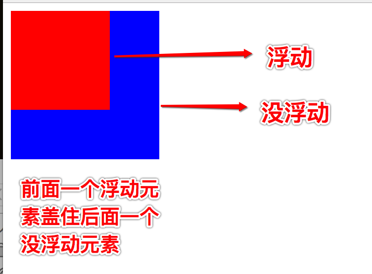

## 流

“流”实际上是 CSS 世界中的一种基本的定位和布局机制

网页的布局方式就是指浏览器是如何对网页中的元素进行排版的，如果没有使用 CSS 来改变布局规则，元素会按照正常的标准流方式来排版，标准流也叫文档流，会将元素分为块级元素/行内元素/行内块级元素

在默认情况下，块级元素的宽度是父元素的 100%，高度与其内容高度一致。而内联元素的宽高和内容一致，且无法设置宽高，本身就属于块级元素的内容，这就是一个元素内的基本布局

对于元素之间，块级元素会按照书写顺序的流动方向放置，这导致每一个块级元素都会在上一个元素下面另起一行，所以块级元素是垂直组织的。内联元素不会另起一行，只要父级元素拥有足够的宽度，它们都会与其它相邻内联元素或文本内容放置在一行，只有溢出的部分才会产生新的一行

## 块级元素和行内元素

在 HTML5 以前，大多数元素都可以划分为块级或行内（内联）

块级元素一般当做容器使用

+ 可以容纳内容和内联元素，也可以容纳其他块级元素
+ 如果没有设置宽度，默认为父元素宽度，可以设置宽高属性
+ 独占一行

::: normal-demo 块级元素

```html
<div class="foo">
  <div>块级元素</div>
  <span>内联元素</span>
  文本内容
</div>
<div class="bar"></div>
<div class="qux"></div>
```

```css
.foo {
  border: 1px solid black;
}
.bar {
  height: 50px;
  background-color: pink;
}
.qux {
  width: 400px;
  height: 50px;
  background-color: purple;
}
```

:::

内联元素只能容纳文本或者内联元素

+ 和内容或其他内联元素在一行排列
+ 不可以设置宽高属性，大小随内容变化

::: normal-demo 内联元素

```html
<span>span<strong>强调</strong></span><span>span</span>
```

```css
span {
  width: 50px;
  height: 50px;
  border: 1px solid black;
}
```

:::

在默认情况下，元素要么是内联元素，要么是块级元素。但是可以通过 CSS 中的`display: inline-block`属性将一个元素兼具内联和块级的特性：

+ 可以设置宽高
+ 不单独占一行

::: normal-demo 内联块级元素

```html
<div class="box"></div>
<div class="box"></div>
```

```css
.box {
  display: inline-block;
  width: 50px;
  height: 50px;
  background-color: green;
}
```

:::

## 浮动流

`float`是 CSS 中最令人意外的属性，它的设计初衷只是用来实现文字环绕图片的效果。浮动流是一种“半脱离标准流”的排版方式，只有水平排版这一种方式，只能设置某个浮动元素左对齐或右对齐，同时也不能使用`margin: 0 auto`来实现居中对齐，也不区分块级元素/行内元素/行内块级元素，且都可以设置宽高间距属性

::: normal-demo float

```html
<div class="float-box"><div class="float-example1"></div>当我年轻的时候，我梦想改变这个世界；当我成熟以后，我发现我不能够改变这个世界，我将目光缩短了些，决定只改变我的国家；当我进入暮年以后，我发现我不能够改变我们的国家，我的最后愿望仅仅是改变一下我的家庭，但是，这也不可能。当我现在躺在床上，行将就木时，我突然意识到：如果一开始我仅仅去改变我自己，然后，我可能改变我的家庭；在家人的帮助和鼓励下，我可能为国家做一些事情；然后，谁知道呢?我甚至可能改变这个世界。</div>
<div class="float-box"><div class="float-example2"></div>当我年轻的时候，我梦想改变这个世界；当我成熟以后，我发现我不能够改变这个世界，我将目光缩短了些，决定只改变我的国家；当我进入暮年以后，我发现我不能够改变我们的国家，我的最后愿望仅仅是改变一下我的家庭，但是，这也不可能。当我现在躺在床上，行将就木时，我突然意识到：如果一开始我仅仅去改变我自己，然后，我可能改变我的家庭；在家人的帮助和鼓励下，我可能为国家做一些事情；然后，谁知道呢?我甚至可能改变这个世界。</div>
```

```css
.float-box div {
  width: 100px;
  height: 50px;
  background-color: red;
}
.float-example1 {
  float: left;
}
.float-example2 {
  float: right;
}
```

:::

::: tip 字围现象
浮动元素不会覆盖文字，图片，表单元素
:::

::: warning 脱标
脱标即脱离标准流，当某一个元素浮动之后，这个元素看起来像是在标准流中删除了一样，如果前面的元素没有浮动，而后面的元素浮动了，后面的元素就会覆盖前面的元素，这说明了浮动流元素已经和标准流没有了任何关联，因此就不会占用了标准流的位置

:::

当浮动元素水平方向移动时，如果碰到含有边框或者另一个浮动元素就会停止移动，并贴靠在旁边，如果父元素的宽度不能显示所有的浮动元素，那么会从最后一个元素开始贴靠，如果都不能显示，将会紧贴父元素的左边或者右边，浮动顺序会按照左浮动找左浮动，右浮动找右浮动的顺序进行贴靠

::: normal-demo 贴靠现象

```html
<div class="float-box2">
  <div class="float-a">a</div>
  <div class="float-b">b</div>
  <div class="float-c">c</div>
  <div class="float-d">d</div>
</div>
<div class="float-box3">
  <div class="float-h">h</div>
  <div class="float-g">g</div>
  <div class="float-f">f</div>
  <div class="float-e">e</div>
</div>
```

```css
.float-box2,.float-box3 {
  width: 350px;
  height: 200px;
  border: 1px solid #000;
}
.float-box2 div {
  float: left;
}
.float-box3 div {
  float: left;
}
.float-a,.float-e {
  width: 100px;
  height: 50px;
  background-color: red;
}
.float-b,.float-f {
  width: 100px;
  height: 100px;
  background-color: green;
}
.float-c,.float-g {
  width: 100px;
  height: 150px;
  background-color: blue;
}
.float-d,.float-h {
  width: 100px;
  height: 50px;
  background-color: pink;
}
```

:::

## 清除浮动

浮动元素脱离了标准流，导致父元素检测不到子元素而无法撑开高度，所以会造成父元素高度坍塌的问题，对后续元素布局造成影响，清除浮动即清除浮动带来的一些影响，下面是一些处理方案

+ 将错就错 - 浮动父元素，优点是代码量极少，缺点是会影响父元素之后的其他元素布局
+ 固定高度 - 给父元素添加固定高度，只适用于已知子元素高度的情况，不够灵活，难以维护
+ `clear` - 可以设置不想受到浮动影响的元素
+ 设置父元素：`overflow：hidden/auto`
+ 在浮动的子元素后面添加一个空元素设置`clear:both`，简单易懂，容易掌握，增加无意义的标签，不利于维护
+ 伪类 - 为浮动最后一个子元素设置为`::after{clear:both}`，用伪类替代了空元素，优点是结构和语义完全正确，缺点是会导致代码量增加
+ `display：block`
+ `positon：fixed`
+ `postion：absolute`

由于这些属性触发了 BFC，这个容器就是页面上完全独立的容器，为了不影响其他元素的布局以及保证这个规则，会让子元素一起参与计算高度，变相的实现清除内部浮动的目的，有时候出于布局需要可能无法使用这些属性

## 定位流

定位流是为了解决更加精细的元素定位，也是一种脱离标准流的排版，通过`position`属性来设置一个元素的定位类型，它的取值有四种，对应着不同的定位属性，同时也需要设置`top`、`left`、`right`、`bottom`属性来调整元素的偏移距离

::: caution
如果设置相反方向的偏移，可能是无效的
:::

+ `static`：静态定位是 CSS 元素中的默认值，不会受到偏移属性的影响
+ `relative`：相对定位并没有脱离标准流，而是继续在标准流中占用空间，相对于在标准流中位置的移动，由于不脱离标准流，因此是区分块级/行内/行内块元素的，并且设置边距等属性时也会影响标准流中其他的元素
+ `absolute`：绝对定位的元素是脱离标准流的，不会占用标准流的位置，不区分块级/行内/行内块元素，设置边距等属性不会影响标准流中其他的元素，默认情况下所有的绝对定位元素，都会以 body 作为参考点移动，如果一个绝对定位元素的祖先元素也是定位流（除了静态定位），则会以那个祖先元素作为参考点
+ `fixed`：固定定位是脱离标准流的，和绝对定位一样不区分行内/块级/行内块级元素，相对于浏览器窗口进行定位
+ `sticky`：粘性定位会基于滚动的位置来定位，当页面滚动超出目标区域时，它的表现就像固定定位，否则就像相对定位一样

::: warning 注意点
如果以 body 为参考点，那么会以首屏的宽度和高度作为参考点，而不是整个网页的宽度和高度作为参考点，绝对定位的元素会忽略祖先元素的 padding
:::

::: tip 子绝父相
一般情况下是不会单独使用绝对定位的，而是和相对定位搭配起来使用，因此设置绝对定位元素同时也会将父元素设置相对定位，避免绝对定位参考点不同的弊端
:::

## 元素堆叠：z-index

使用各种定位后很容易出现重叠现象，`z-index`属性用于设置元素的堆叠顺序，拥有更高堆叠顺序的元素总是处于堆叠顺序较低的元素前面，只对定位元素上生效，取值为整数

::: normal-demo z-index

```html
<div class="container">
  <div class="box1">box1</div>
  <div class="box2">box2</div>
  <div class="box3">box3</div>
  <div class="box4">box4</div>
</div>
```

```css
.container {
  height: 150px;
}
.container>div {
  position: absolute;
  width: 100px;
  height: 80px;
  border: 1px solid #666;
}
.box1 {
  background-color: red;
  left: 100px;
  top: 40px;
  z-index: 50;
}
.box2 {
  background-color: pink;
  left: 0;
  top: 60px;
  z-index: 90;
}
/* 增加权重 */
.container>.box3 {
  position: static;
  background-color: gray;
  /* 对 static 不起作用 */
  z-index: 9999;
}
.box4 {
  background-color: orange;
  left: 40px;
  top: 50px;
  z-index: 999;
}
```

:::

## 弹性盒子 - Flex

是一种按行或按列的一维布局方法，元素可以膨胀到以填充额外的空间，收缩以适应更小的空间。长久以来，CSS 可靠的布局方式只有浮动和定位，在大多数情况很好使，但是某些方面具有很大的局限性，比如：

+ 垂直居中一个块
+ 所有的子元素占用等量的可用宽高，且不管宽高有多少可用
+ 多列布局中所有的列采用相同的高度，即使内容不同

被设置了`display: flex`的父元素被称为 Flex 容器，当元素表现为`flex`时，子元素会沿着两个轴来布局：

+ 主轴（main axis） - 默认沿着 inline 方向，该轴的开始和结束称为 main start 和 main end
+ 交叉轴（cross axis） - 垂直于主轴方向，该轴的开始和结束称为 cross start 和 cross end

在 Flex 容器中表现为弹性盒子的元素被称为 Flex 项（flex item）或项目

::: caution
容器设为 Flex 布局以后，子元素的`float`、`clear`和`vertical-align`属性将失效
:::

Flex 提供了`flex-direction`属性，用来控制主轴的方向，默认值是`row`，就是按照浏览器默认的方向排成一排，即从左到右，具有以下取值：

+ `row`：从左到右横向排列
+ `column`：从上到下竖向排列
+ `row-reverse`：反转横向排列
+ `column-reverse`：反转竖向排列

如果子项是宽高是固定的，很有可能出现溢出现象，解决该问题的办法是在容器中使用`flex-wrap: wrap`，这样溢出的子项会另起一行，此时给子项设置宽高是有效的

`flex-drection`和`flex-wrap`可以使用缩写属性`flex-flow`

`justify-content`属性定义了子项在主轴上的对齐方式，它有 5 个取值：

+ `flex-start`：对齐起始方向，默认值
+ `flex-end`：对齐结束方向
+ `center`：居中对齐
+ `space-between`：两端对齐
+ `space-around`：子项的两侧间隔相等，这导致了项目之间的间隔与项目和边框的间隔大了一倍

`align-items`属性定义了子项在交叉轴上的对齐方式，它有 5 个取值：

+ `flex-start`：起点对齐
+ `flex-end`：终点对齐
+ `center`：居中对齐
+ `baseline`: 项目的第一行文字的基线对齐
+ `stretch`：如果子项未设置高度或设为 auto，将占满整个容器的高度，默认值

`align-content`属性定义了项目在侧轴方向上有额外空间时的对齐方式，必须设置`flex-direction:row`并且设置换行`flex-wrap:wrap`才会起作用，它有 6 个取值：

+ `flex-start`：与交叉轴的起点对齐
+ `flex-end`：与交叉轴的终点对齐
+ `center`：与交叉轴的中点对齐
+ `space-between`：与交叉轴两端对齐，轴线之间的间隔平均分布
+ `space-around`：每根轴线两侧的间隔都相等。所以，轴线之间的间隔比轴线与边框的间隔大一倍
+ `stretch`：轴线占满整个交叉轴,默认值

以上都是在容器上设置的属性，接下来是在子项中可定义的属性：

+ `order`
+ `flex-grow`
+ `flex-shrink`
+ `flex-basis`
+ `flex`
+ `align-self`

`order`定义项目的排列顺序，数值越小，排列越靠前，默认为 0

`flex-grow`定义项目的放大比例，默认为 0，即如果存在剩余空间，也不放大。如果所有的值均为 1，则将均分剩余的空间。如果某一个项目的取值为 2，其它的均为 1，则这个项目占据的空间比其它多一倍

`flex-shrink`定义了项目的缩小比例，默认为 1，即如果空间不足，该项目将缩小。如果所有项目的`flex-shrink`属性都为 1，当空间不足时，都将等比例缩小。如果一个项目的`flex-shrink`属性为 0，其他项目都为 1，则空间不足时，前者不缩小

`flex-basis`定义了在分配多余空间之前，项目占据的主轴空间（main size）。浏览器根据这个属性，计算主轴是否有多余空间。它的默认值为 auto，即项目的本来大小，可以设为跟`width`或`height`属性一样的值（比如350px），则项目将占据固定空间

子项如何分配空间，取决于子项的`flex`属性，最多可以指定三个不同值的缩写属性

`flex`属性是`flex-grow`，`flex-shrink`和`flex-basis`的简写，默认值为`0 1 auto`，后两个属性可选，优先使用这个属性

`align-self`属性允许单个项目有与其他项目不一样的对齐方式，取值和`align-items`完全相同，可覆盖`align-items`属性。默认值为 auto，表示继承父元素的`align-items`属性，如果没有父元素，则等同于`stretch`

## 网格

## 多列布局

## 回流和重绘

在浏览器进行渲染之前，会把 HTML 解析成 DOM，把 CSS 解析成 CSSOM，合并两者便形成了 Render Tree。因此可以计算所有节点的样式，计算节点在页面上的大小和位置，最后绘制出来

当 Render Tree 中的节点发生尺寸、结构、位置等发生变化时，浏览器将重新进行渲染的过程称为回流（Reflow）

当元素的样式改变不会影响在页面上的位置、尺寸等变化时，浏览器不会进行回流，只是将元素的样式重新绘制一边即重绘（Repaint）

回流的代价相对于重绘来说代价要更高，因为回流必然会导致重绘

为了提高页面性能，应该优化一下操作：

在 CSS 中：

+ 不要使用`table`布局
+ 少量使用会触发回流/重绘的属性

在 JavaScript 中：

+ 避免频繁的操作样式，最好一次性写完`style`，或者一次性更改`class`
+ 使用`documentFragment`，在这里应用完所有的操作，然后插入到 DOM 中
+ 对具有复杂动画的元素使其脱离标准流，否则会影响周围元素的回流
+ 不要频繁的进行读取，应该使用变量存储起来

## BFC

从理论上来讲，被包含在父元素里的元素是不会影响到父元素旁边的元素，但实际上并不是总是如此

BFC（Block Formatting Context）直译为”块级格式化上下文“，它决定了元素如何对其内容进行定位，以及与其他元素的关系和相互作用。当涉及到可视化布局的时候，BFC 提供了一个环境，元素在这个环境中按照一定规则进行布局，简而言之就是 BFC 的目的就是形成一个完全独立的空间，让空间里的子元素不会影响到外面的布局。通过一些 CSS 属性就可以触发 BFC，最常用的触发规则有四种：

+ `body`元素
+ `float`不为`none`
+ `position`为`absolute`、`fixed`
+ `overflow`不为`visible`
+ `display`为`inline-block`、`flex`、`table-cell`

能解决的问题：  

+ 外边距垂直方向合并
+ 浮动元素令父元素高度塌陷
+ 阻止元素被浮动元素覆盖
+ 解决两栏自适应布局的问题

在现代的布局中 Flex 和 Grid，是默认为 BFC 规范的，这就是为什么能成为更好的布局方案原因之一

## 常用的布局方式

+ 水平居中
+ 垂直居中
+ 水平垂直居中
+ 左右布局
+ 左中右布局
+ 圣杯
+ 飞翼
+ 自适应宽高

水平居中：

+ `margin: 0 auto`，仅仅适用于标准流元素
+ 利用绝对定位，在定位流中设置`left: 50%`，然后设置`margin-left`为该元素的宽度一半即可实现，这个值是负数

水平垂直居中：

+ 利用绝对定位，设置`left: 50%`和`top: 50%`将元素从左上角定位到页面中心，然后使用`transform: translate(-50%, -50%)`移动自身宽高的半距离即可实现
+ 利用绝对定位，设置四个方向的偏移属性都为 0，并设置`margin: auto`由于宽高固定，可以实现对应方向平分，适应盒子有宽高的情况
+ 利用绝对定位，使用已知的宽高情况
+ 利用 flex 布局，需要考虑兼容性问题

## 布局尺寸技巧

同尺寸大小的的布局会让页面更加的对称，不要纠结使用 12px 后，其他的地方使用 13px 还是 14px 等等尺寸中纠结，应该在一定的尺寸设计系统中的遵守尺寸大小规则，比如：

+ 4px（16 * 0.25）
+ 8px（16 * 0.5）
+ 12px（16 * 0.75）
+ 16px（16 * 1）
+ 24px（16 * 1.5）
+ 32px（16 * 2）
+ 48px（16 * 3）
+ 64px（16 * 4）
+ 96px（16 * 6）
+ 128px（16 * 8）
+ 192px（16 * 12）
+ 256px（16 * 16）
+ 384px（16 * 24）
+ 512px（16 * 32）
+ 640px（16 * 40）
+ 768px（16 * 48）

很多前端框架都是这么做的，就是为了快速的建立一套设计系统，当然这并不是固定的，完全可以根据需求再调整
