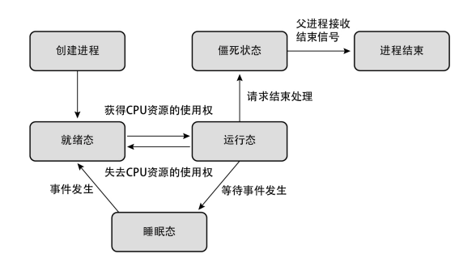

现代计算机系统由一个或多个处理器、主存、磁盘、打印机、键盘、鼠标、显示器、网络接口以及各种其他输入/输出设备组成。一般而言，现代计算机系统是一个复杂的系统。如果每个程序员都不得不掌握系统所有的细节，那就不可能再编写代码了。而且，管理所有这些部件并加以优化使用，是一件挑战性极强的工作。所以计算机安装了一层软件直接运行在裸机上，称为**操作系统**，它的任务是为用户程序提供一个更好、更简单、更清晰的计算机模型，并管理刚才提到的所有这些设备

操作系统无疑是最为复杂的软件，为无数的用户和应用程序提供服务，从用户角度来看，操作系统是一个控制软件，用于管理和运行应用程序。对下操作系统是整个计算机硬件的资源分配器、管理外设、分配资源。操作系统的层次是在硬件之上、软件之下。虽然操作系统本身是一种软件，但是它为其他的软件提供服务支撑，是软件对硬件的抽象，为上层应用提供统一的接口

Linux、Windows 的界面属于外壳（Shell），而不是内核（Kernel），对于操作系统更多的是站在内核的角度，内核底层更能看到操作系统里面的细节

Kernel - 操作系统内部组件：

+ CPU 调度器
+ 物理内存管理
+ 虚拟内存管理
+ 文件系统管理
+ 中断处理与设备驱动
+ ...

Kernel 的特征：

+ 并发 - 计算机系统中同时存在多个运行的程序，需要 OS 管理和调度
+ 共享 - “同时”访问、互斥共享
+ 虚拟 - 利用多道程序设计技术，让每个用户都觉得一个计算机专门为它服务
+ 异步 - 程序的执行不是一贯到底，而是走走停停，向前推进的速度不可预知，但只要运行环境相同，OS 需要保证程序运行的结果也要相同

操作系统至今有以下家族：

+ UNIX/Linux
+ Windows
+ macOS

早期的计算机使用纸带传输程序和数据，操作系统只起到加载作用。随着 CPU 等硬件的发展，计算机的速度得到提升，但性能未能得到充分利用

在计算机系统运行时，在硬件设备上会重复执行以下步骤

1. 通过输入设备或网络适配器，向计算机发起请求。
2. 读取内存中的命令，并在 CPU 上执行，把结果写入负责保存数据的内存区域中。
3. 将内存中的数据写入 HDD（Hard Disk Drive，硬盘驱动器）、SDD（Solid State Disk，固态硬盘）等存储器，或者通过网络发送给其他计算机，或者通过输出设备提供给用户
4. 回到步骤 1

由这些重复执行的步骤整合而成的对用户有意义的处理，就称为程序。程序大体上分为以下几种。

+ 应用程序：能让用户直接使用，为用户提供帮助的程序，例如计算机上的办公软件、智能手机和平板电脑上的应用
+ 中间件：将对大部分应用程序通用的功能分离出来，以辅助应用程序运行的程序，例如 Web 服务器、数据库系统
+ OS：直接控制硬件设备，同时为应用程序与中间件提供运行环境的程序，例如 Linux

通常情况下，程序在 OS 上以进程为单位运行。每个程序由一个或者多个进程构成。包括 Linux 在内的大部分 OS 能同时运行多个进程

调用外部设备（以下简称“设备”）是 Linux 的一个重要功能。如果没有 Linux 这样的 OS，就不得不为每个进程单独编写调用设备的代码

在这种情况下，会存在以下缺点

+ 应用程序开发人员必须精通调用各种设备的方法
+ 开发成本高
+ 当多个进程同时调用设备时，会引起各种预料之外的问题

为了解决上述问题，Linux 把设备调用处理整合成了一个叫作设备驱动程序的程序，使进程通过设备驱动程序访问设备。虽然世界上存在各种设备，但对于同一类型的设备，Linux 可以通过同一个接口进行调用

在某个进程因为 Bug 或者程序员的恶意操作而违背了“通过设备驱动程序访问设备”这一规则的情况下，依然会出现多个进程同时调用设备的情况。为了避免这种情况，Linux 借助硬件，使进程无法直接访问设备。具体来说，CPU 存在内核模式和用户模式两种模式，只有处于内核模式时才允许访问设备。另外，使设备驱动程序在内核模式下运行，使进程在用户模式下运行

除此之外，还有许多不应被普通进程调用的处理程序，如下所示

+ 进程管理系统
+ 进程调度器
+ 内存管理系统

这些程序也全都在内核模式下运行。把这些在内核模式下运行的 OS 的核心处理整合在一起的程序就叫作内核。如果进程想要使用设备驱动程序等由内核提供的功能，就需要通过被称为系统调用的特殊处理
来向内核发出请求。

需要指出的是，OS 并不单指内核，它是由内核与许多在用户模式下运行的程序构成的。关于 Linux 中的在用户模式下运行的功能，以及作为进程与内核的通信接口的系统调用

内核负责管理计算机系统上的 CPU 和内存等各种资源，然后把这些资源按需分配给在系统上运行的各个进程

在进程运行的过程中，各种数据会以内存为中心，在 CPU 上的寄存器或外部存储器等各种存储器之间进行交换。这些存储器在容量、价格和访问速度等方面都有各自的优缺点，从而构成被称为存储层次的存储系统层次结构。从提高程序运行速度和稳定性方面来说，灵活有效地运用各种存储器是必不可少的一环

虽然可以通过设备驱动程序访问外部存储器中的数据，但为了简化这一过程，通常会利用被称为文件系统的程序进行访问

对于计算机系统来说，外部存储器是不可或缺的。在启动系统时，首先需要做的就是从外部存储器中读取 OS 。此外，为了防止在关闭电源时丢失系统运行期间在内存上创建的数据，必须在关闭电源前把这些数据写入外部存储器

::: tip
准确地说，在读取 OS 之前，还存在以下操作：

1. 通过 BIOS（Basic Input Output System，基本输入 / 输出系统）或 UEFI（Unified Extensible Firmware Interface，统一可扩展固件接口）这种固化在硬件上的软件来初始化硬件设备；
2. 运行引导程序来选择需要启动的 OS
:::

## 用户模式

OS 并非仅由内核构成，还包含许多在用户模式下运行的程序。这些程序有的以库的形式存在，有的作为单独的进程运行

一般来说，由在用户模式下运行的进程通过系统调用向内核发送相应的请求，其中存在进程独有的代码直接向内核发起请求的情况，也存在进程所依赖的库向内核发起请求的情况。另外，库分为 OS 提供的库与第三方库两种类型

从整个系统来说，除了应用程序与中间件之外，OS 自身也提供了各种各样的程序

### 系统调用

进程在执行创建进程、操控硬件等依赖于内核的处理时，必须通过系统调用向内核发起请求。系统调用的种类如下

+ 进程控制（创建和删除）
+ 内存管理（分配和释放）
+ 进程间通信
+ 网络管理
+ 文件系统操作
+ 文件操作（访问设备）

系统调用需要通过执行特殊的 CPU 命令来发起。通常进程运行在用户模式下，当通过系统调用向内核发送请求时，CPU 会发生名为中断的事件。这时，CPU 将从用户模式切换到内核模式，然后根据请求内容进行相应的处理。当内核处理完所有系统调用后，将重新回到用户模式，继续运行进程

内核在开始进行处理时验证来自进程的请求是否合理（例如，请求的内存量是否大于系统所拥有的内存量等）。如果请求不合理，系统调用将执行失败。需要注意的是，并不存在用户进程绕过系统调用而直接切换 CPU 运行模式的方法（假如有，内核就失去存在的意义了）

如果想了解进程究竟发起了哪些系统调用，可以通过 strace 命令对进程进行追踪

```sh
strace -o strace.log ./hello
```

strace 的运行结果中的每一行对应一个系统调用

无论使用什么编程语言，都必须通过系统调用向内核发起请求

```sh
strace -o py.log python ./hello.py
```

甚至可以发现 python 发起的系统调用要比 C 多得多

sar 命令用于获取进程分别在用户模式与内核模式下运行的时间比例

```sh
# 每 1 秒输出所有的 CPU 运行时间比例
sar -P ALL 1

03:28:40 PM     CPU     %user     %nice   %system   %iowait    %steal     %idle
03:28:41 PM     all      0.00      0.00      0.25      0.00      0.00     99.75
03:28:41 PM       0      0.00      0.00      0.00      0.00      0.00    100.00
03:28:41 PM       1      0.00      0.00      0.99      0.00      0.00     99.01
03:28:41 PM       2      0.00      0.00      0.00      0.00      0.00    100.00
03:28:41 PM       3      0.00      0.00      0.00      0.00      0.00    100.00
```

在每一行中，从 %user 字段到 %idle 字段表示在 CPU 核心上运行的处理的类型。同一行内全部字段的值的总和是 100%。通过上面展示的数据可以看出，一行数据对应一个 CPU 核心。CPU 字段中值为 all 的那一行数据是全部 CPU 核心的平均值

将 %user 字段与 %nice 字段的值相加得到的值是进程在用户模式下运行的时间比例，而 CPU 核心在内核模式下执行系统调用等处理所占的时间比例可以通过 %system 字段得到。在采集数据时，所有 CPU 核心的 %idle 字段
的值都几乎接近 100%。这里的 %idle 指的是 CPU 核心完全没有运行任何处理时的空闲（idle）状态

也可以通过 sar 命令的第 4 个参数来指定采集信息的次数

```sh
# 每 1 秒采集 1 次
sar -P ALL 1 1
```

如果运行一个没有系统调用的程序，sar 将会这样

```sh
Average:        CPU     %user     %nice   %system   %iowait    %steal     %idle
Average:        all     25.25      0.00      0.25      0.00      0.00     74.50
Average:          0    100.00      0.00      0.00      0.00      0.00      0.00
Average:          1      0.00      0.00      0.00      0.00      0.00    100.00
Average:          2      0.00      0.00      0.99      0.00      0.00     99.01
Average:          3      1.00      0.00      0.00      0.00      0.00     99.00
```

程序始终运行在 CPU0 上，如果运行一个没有系统调用的程序，会发现 %system 占用了 35% 的执行时间，不是 100% 是因为，程序自身也需要处理循环。虽然不能一概而论，但当 %system 的值高达几十时，大多是陷入了系统调用发起过多，或者系统负载过高等糟糕的状态

```sh
03:36:59 PM     CPU     %user     %nice   %system   %iowait    %steal     %idle
03:37:00 PM     all     16.58      0.00      8.79      0.00      0.00     74.62
03:37:00 PM       0      0.00      0.00      0.00      0.00      0.00    100.00
03:37:00 PM       1      0.00      0.00      0.00      0.00      0.00    100.00
03:37:00 PM       2      1.00      0.00      0.00      0.00      0.00     99.00
03:37:00 PM       3     65.00      0.00     35.00      0.00      0.00      0.00
```

在 strace 命令后加上 -T 选项，就能以微秒级的精度来采集各种系统调用所消耗的实际时间。在发现 %system 的值过高时，可以通过这个功能来确认到底是哪个系统调用占用了过多的系统资源，下列例子中，输出 hello world\n 这一字符串总共花费了 115 微秒

```sh
execve("/usr/bin/nohup", ["nohup", "./c.out"], 0x7ffd58106b10 /* 23 vars */) = 0 <0.000589>
brk(NULL)                               = 0x5570ff0b5000 <0.000023>
arch_prctl(0x3001 /* ARCH_??? */, 0x7fff64a38850) = -1 EINVAL (Invalid argument) <0.000021>
access("/etc/ld.so.preload", R_OK)      = -1 ENOENT (No such file or directory) <0.000031>
openat(AT_FDCWD, "/etc/ld.so.cache", O_RDONLY|O_CLOEXEC) = 3 <0.000035>
brk(0x55db21e0b000)                     = 0x55db21e0b000 <0.000027>
write(1, "Hello World\n", 12)           = 12 <0.000115>
exit_group(0)                           = ?
+++ exited with 0 +++
```

Linux 提供了所有或者说绝大多数进程所依赖的库函数，以为编写程序提供方便。需要注意的是，与常规的函数调用不同，系统调用并不能被 C 语言之类的高级编程语言直接发起，只能通过与系统架构紧密相连的汇编语言代码来发起

如果没有 OS 的帮助，程序员就不得不根据系统架构为每一个系统调用编写相应的汇编语言代码，然后再从高级编程语言中调用这些代码

这样一来，不但编写程序的时间增加了，程序也将无法移植到别的架构上。

为了解决这样的问题，OS 提供了一系列被称为系统调用的包装函数的函数，用于在系统内部发起系统调用。各种架构上都存在着对应的包装函数。因此，使用高级编程语言编写的用户程序，只需调用由高级编程语言提供的包装函数即可

Linux 提供了 ldd 命令，用于查看程序所依赖的库

```sh
❯ ldd /bin/echo
        linux-vdso.so.1 (0x00007fffaaf7d000)
        libc.so.6 => /usr/lib/libc.so.6 (0x00007fbe6f480000)
        /lib64/ld-linux-x86-64.so.2 => /usr/lib64/ld-linux-x86-64.so.2 (0x00007fbe6f675000)

❯ ldd /bin/python
        linux-vdso.so.1 (0x00007ffd4b95b000)
        libpython3.11.so.1.0 => /usr/lib/libpython3.11.so.1.0 (0x00007fc28de00000)
        libc.so.6 => /usr/lib/libc.so.6 (0x00007fc28dc1e000)
        libm.so.6 => /usr/lib/libm.so.6 (0x00007fc28db31000)
        /lib64/ld-linux-x86-64.so.2 => /usr/lib64/ld-linux-x86-64.so.2 (0x00007fc28e4c0000)
```

libc 指的就是 C 标准库，C 语言拥有 ISO（International Standard Organization，国际标准化组织）定义的标准库，Linux 也提供了这些 C 语言标准库。不过，通常会以 GNU 项目提供的 glibc 作为 C 标准库使用。用 C 语言编写的几乎所有程序都依赖于 glibc 库

glibc 不仅包括系统调用的包装函数，还提供了 POSIX 标准 中定义的函数

::: tip
这个标准定义了基于 UNIX 的 OS 应该具备的各种功能
:::

python 命令同样也依赖于 libc，命令本身的实现也依赖于 C 标准库。可以说，在 OS层面上，C 语言依然在默默地发挥着很大的作用，是一种不可或缺的编程语言。对系统上的其他程序使用 ldd 命令，会发现它们大部分也依赖于libc

OS 提供的程序与 OS 提供的库一样，对绝大多数程序来说是不可或缺的。OS 同时还提供了作为自身一部分的、用于更改 OS 运行方式的程序。

下面列举了一些 OS 提供的程序。

+ 初始化系统：init
+ 变更系统的运行方式：sysctl、nice、sync
+ 文件操作：touch、mkdir
+ 文本数据处理：grep、sort、uniq
+ 性能测试：sar、iostat
+ 编译：gcc
+ 脚本语言运行环境：perl、python、ruby
+ shell：bash
+ 视窗系统：X

## 进程

进程是操作系统中最核心的概念，进程是对正在运行程序的一个抽象。操作系统的其他所有内容都是围绕着进程的概念展开的

进程是非常抽象的概念，即使可以利用的 CPU 只有一个，但也支持（伪）并发操作能力，将一个单独的 CPU 变换为多个虚拟的 CPU

所有的现代计算机经常会在同一时间做许多件事，当启动系统时，会秘密启动许多进程，所以一个支持多进程的多道程序系统是非常有必要的

在 Linux 中，创建进程有如下两个目的。

1. 将同一个程序分成多个进程进行处理（例如，使用 Web 服务器接收多个请求）
2. 创建另一个程序（例如，从 bash 启动一个新的程序）为了达成这两个目的，Linux 提供了 fork() 函数与 execve() 函数（其底层分别请求名为 clone() 与 execve() 的系统调用）。接下来，我们将介绍如何使用这两个函数。

要想将同一个程序分成多个进程进行处理，只需使用 fork() 函数即可。在调用 fork() 函数后，就会基于发起调用的进程，创建一个新的进程。发出请求的进程称为父进程，新创建的进程称为子进程。

1. 为子进程申请内存空间，并复制父进程的内存到子进程的内存空间。
2. 父进程与子进程分裂成两个进程，以执行不同的代码。这一点的实现依赖于 fork() 函数分别返回不同的值给父进程与子进程。

在打算启动另一个程序时，需要调用 execve() 函数。首先，我们来
看一下内核在运行进程时的流程。

1. 读取可执行文件，并读取创建进程的内存映像所需的信息。
2. 用新进程的数据覆盖当前进程的内存。
3. 从最初的命令开始运行新的进程。
也就是说，在启动另一个程序时，并非新增一个进程，而是替换了当
前进程

首先，读取可执行文件，以及创建进程的内存映像所需的信息。可执行文件中不仅包含进程在运行过程中使用的代码与数据，还包含开始运行程序时所需的数据。包含代码的代码段在文件中的偏移量、大小，以及内存映像的起始地址包含代码以外的变量等数据的数据段在文件中的偏移量、大小，以及内存映像的起始地址程序执行的第一条指令的内存地址（入口点）

与使用高级编程语言编写的源代码不同，在 CPU 上执行机器语言指令时，必须提供需要操作的内存地址，因此在代码段和数据段中必须包含内存映像的起始地址。比如，使用一种虚构的高级编程语言编写了如下一段源代码。

```
c = a + b
```

在机器语言层面，这段源代码将转变成下面这样的直接对内存地址进行操作的指令

```
load m100 r0 ← 将内存地址100（变量a）的值读取到名为r0的寄存器中
load m200 r1 ← 将内存地址200（变量b）的值读取到名为r1的寄存器中
add r0 r1 r2 ← 将r0与r1相加，并将结果储存到名为r2的寄存器中
store r2 m300 ← 将r2的值储存到内存地址300（变量c）
```

接下来，基于读取的信息，将程序映射到内存上，最后，从入口点开始运行程序

然而，Linux 的可执行文件的结构遵循的是名为 ELF（Executableand Linkable Format，可执行与可链接格式）的格式，并非之前描述的那样简单的结构。ELF 的相关信息可以通过 readelf 命令来获取，Entry point address 这一行中的 0x1040 就是这个程序的入口点

```sh
❯ readelf -h c.out
ELF Header:
  Entry point address:               0x1040
```

通过附加 -S 选项，可以获取代码段与数据段在文件中的偏移量、大小和起始地址

```sh
❯ readelf -S c.out

There are 30 section headers, starting at offset 0x34b8:

Section Headers:
  [Nr] Name              Type             Address           Offset
       Size              EntSize          Flags  Link  Info  Align
  [14] .text             PROGBITS         0000000000001040  00001040
       0000000000000113  0000000000000000  AX       0     0     16
  [24] .data             PROGBITS         0000000000004008  00003008
       0000000000000010  0000000000000000  WA       0     0     8
```

+ 输出的数据每两行为一组
+ 全部数值皆为十六进制数
+ 在每组的第 1 行的第 2 个字段中，.text 对应的是代码段的信息，.data 对应的是数据段的信息
+ 在这些信息中，对于每组输出，只需要关注以下内容即可
  + 每组的第 1 行的第 4 个字段：内存映像的起始地址
  + 每组的第 1 行的第 5 个字段：在文件中的偏移量
  + 每组的第 2 行的第 1 个字段：大小

在程序运行时创建的进程的内存映像信息，可以从`/proc/PID/maps`文件查看

在打算新建一个别的进程时，通常采用被称为 fork and exec 的方式，即由父进程调用 fork() 创建子进程，再由子进程调用 exec()，比如典型的 bash 进程创建 echo 进程创建

### 进程调度

Linux 内核具有进程调度器（以下简称“调度器”）的功能，它使得多个进程能够同时运行（准确来说，是看起来在同时运行）。大家在使用 Linux 系统时通常是意识不到调度器的存在的

+ 一个 CPU 同时只运行一个进程
+ 在同时运行多个进程时，每个进程都会获得适当的时长 ，轮流在 CPU 上执行处理

Linux 会将多核 CPU（现在几乎都是这样的 CPU）上的每一个核心都识别为一个 CPU。系统识别出来的 CPU（这里是指 CPU 核心）称为逻辑 CPU。另外，在开启了超线程功能时，每一个线程都会被识别为一个逻辑 CPU

在 Linux 中，`taskset`命令可以指定程序运行在某个逻辑 CPU 上

```sh
taskset -c 0 <exec>
```

结论：

+ 每个进程都只在使用逻辑 CPU 期间推进进度，换一种说法就是，在别的进程运行时并不会推进进度
+ 单位时间推进的进度约为运行单个进程时的 1/2。在进程数量为1 时，每毫秒推进 1% 左右；在进程数量为 2 时，每毫秒推进0.5% 左右
+ 处理完所有进程所消耗的时间约为运行单个进程时的 2 倍
+ 不管同时运行多少个进程，在任意时间点上，只能有一个进程运行在逻辑 CPU 上
+ 在逻辑 CPU 上运行多个进程时，它们将按轮询调度的方式循环运行，即所有进程按顺序逐个运行，一轮过后重新从第一个进程开始轮流运行
+ 每个进程被分配到的时间片的长度大体上相等
+ 全部进程运行结束所消耗的时间，随着进程数量的增加而等比例地增加

### 上下文切换

操作系统通过时间切片算法，为每个进程安排固定时间片用来运行，在时间片用完后进行 processes 切换，实现多任务运行

在任何多道程序设计系统中，CPU 由一个进程快速切换至另一个进程，使每个进程各运行几十或几百个毫秒。严格地说，在某一个瞬间，CPU 只能运行一个进程。但在 1 秒钟期间，它可能运行多个进程，这样就产生并行的错觉，伪并行就是这样的情况，以此来区分多处理系统（有两个或多个 CPU 共享一个物理内存）的真正并行。这种切换行为叫做上下文切换

当一个时间片被消耗完后，不管进程正在执行什么代码，都一定会发生上下文切换，否则会产生误解：

```c
void main() {
  foo();
  // bar() 不一定紧接着 foo() 后执行
  bar();
}
```

在现实的 Linux 中，并不能保证 bar() 紧接在 foo() 之后执行。如果 foo() 执行完后刚好消耗完时间片，则 bar() 的执行就会延后

### 进程状态

系统中究竟运行着多少个进程使用 ps ax 命令可以按照一行一个进程的格式列举出系统中当前正在运行的所有进程。然后，根据执行该命令而输出的行数，就能直接得知正在运行的进程总数

```sh
❯ ps ax | wc -l
```

进程存在几种状态，系统上的大部分进程处于睡眠态

| 状态名   | 含义                                                    |
| -------- | ------------------------------------------------------- |
| 运行态   | 正在逻辑 CPU 上运行                                     |
| 就绪态   | 进程具备运行条件，等待分配 CPU 时间                     |
| 睡眠态   | 进程不准备运行，除非发生某事件。在此期间不消耗 CPU 时间 |
| 僵死状态 | 进程运行结束，正在等待父进程将其回收                    |

处于睡眠态的进程所等待的事件有以下几种

+ 等待指定的时间（比如等待 3 分钟）
+ 等待用户通过键盘或鼠标等设备进行输入
+ 等待 HDD 或 SDD 等外部存储器的读写结束
+ 等待网络的数据收发结束

通过查看 ps ax 的输出结果中的第 3 个字段 STAT 的首字母，就可以得知进程处于哪种状态

| STAT  字段的首字母 | 状态                                                                                         |
| ------------------ | -------------------------------------------------------------------------------------------- |
| R                  | 运行态或者就绪态                                                                             |
| S 或 D             | 睡眠态。S 指可通过接收信号回到运行态，D 指 S 以外的情况（D主要出现于等待外部存储器的访问时） |
| Z                  | 僵死状态                                                                                     |

需要注意的是，处于 D 状态的进程通常会在几毫秒之内迁移到别的状态。当出现长时间处于 D 状态的进程时，需要考虑是否发生了以下状况

+ 存储器的 I/O 处理尚未结束
+ 内核中发生了某种问题

进程在被创建后的整个生命周期中，会不断地在运行态、就绪态和睡眠态之间辗转，并非简单地使用完分配到的 CPU 时间后就立刻结束



如果没有任何需要运行的进程，在此期间，逻辑 CPU 会运行一个被称为空闲进程的不执行任何处理的特殊进程。空闲进程最简单的实现方式就是创建一个新进程，或者在唤醒处于睡眠态的进程之前执行无意义的循环。但因为这样会浪费电，所以通常并不会这样处理，而是使用特殊的 CPU 指令使逻辑 CPU 进入休眠状态，直到出现就绪态的进程。大家的计算机和智能手机之所以在不运行程序时能够待机更长时间，主要就得益于逻辑CPU 能够进入空闲状态

在现实中的系统中，各个进程会根据不同的处理转换到各种不同的状态，在逻辑 CPU 上运行的进程也会随之发生变化，但重点只有两个

+ 在逻辑 CPU 上同一时间只能运行一个进程
+ 睡眠态的进程不会占用 CPU 时间

### 吞吐量和延迟

下面将介绍吞吐量和延迟这两个表示处理性能的指标的概念，它们的定义如下所示

+ 吞吐量：单位时间内的总工作量，越大越好
+ 延迟：各种处理从开始到完成所耗费的时间，越短越好

这两个指标不仅适用于逻辑 CPU，对于评价其他硬件（例如外部存储器等）的性能来说也非常重要。但是，为了便于理解，这里将集中讲解逻辑 CPU 的处理性能。下面是这两个指标的计算公式

+ 吞吐量 = 处理完成的进程数量 / 耗费的时间
+ 延迟 = 结束处理的时间 – 开始处理的时间

可以有以下结论：

+ 在耗尽逻辑 CPU 的计算能力后，也就是说，当所有逻辑 CPU 都不处于空闲状态后，不管继续增加多少个进程，吞吐量都不会再发生变化
+ 随着进程数量的增加，延迟会越来越长
+ 每个进程的平均延迟是相等的

在允许运行多个进程时，假如调度器并没有通过轮询调度的方式进行调度，会非常的不公平，虽然吞吐量不变，但是进程的延迟变了，正是为了避免这样的情况出现，调度器才把逻辑 CPU 的 CPU 时间划分为时长很短的时间片来分配给各个进程

当逻辑 CPU 始终处于工作状态（即没有空闲状态）并且没有程序处于就绪态时，吞吐量与延迟就是最优值。但是，现实中并没有这么多恰好的事情。在现实中的系统中，逻辑 CPU
会在下列状态之间不断转换

+ 空闲状态。由于逻辑 CPU 处于空闲状态，所以吞吐量会降低
+ 进程正在运行，且没有处于就绪态的进程，这是一种理想的状态。如果在这样的状态下加入一个处于就绪态的进程，则两个进程的延迟都会变长
+ 进程正在运行，且存在就绪态的进程。这时吞吐量很大，但是延迟会变长

查看`sar -q 1 1`的 runq-sz 字段查看处于运行态和就绪态的进程总数

### 多个逻辑 CPU 时的调度

当存在多个逻辑 CPU 时，如何进行调度呢？为了能够利用各个逻辑CPU，调度器会运行一个被称为负载均衡或全局调度的功能。简单来说，负载均衡负责公平地把进程分配给多个逻辑 CPU。与只有单个逻辑 CPU 时的情况相同，在各个逻辑 CPU 内，调度器为在逻辑 CPU 上运行的各个进程分配均等的 CPU 时间

+ 对于多核 CPU 的计算机来说，只有同时运行多个进程才能提高吞吐量。另外，“有 n 个核心就有 n 倍性能”这种说法，说到底也只存在于理想状态中
+ 与只有单个逻辑 CPU 时一样，当进程数量多于逻辑 CPU 数量时，吞吐量就不会再提高

### 运行时间和执行时间

通过 time 命令运行进程，就能得到进程从开始到结束所经过的时
间，以及实际执行处理所消耗的时间

+ 运行时间：进程从开始运行到运行结束为止所经过的时间。类似于利用秒表从开始运行的时间点开始计时，一直测量到运行结束
+ 执行时间：进程实际占用逻辑 CPU 的时长

```
❯ time ./c.out 
Hello World

________________________________________________________
Executed in    2.59 millis    fish           external
   usr time    2.48 millis  590.00 micros    1.89 millis
   sys time    0.24 millis  244.00 micros    0.00 millis
```

real 的值为运行时间，user 与 sys 的和为执行时间

user 表示进程在用户模式下耗费的 CPU 时间。与此对应的 sys 则表示内核为了响应用户模式发出的请求而执行系统调用所耗费的时间

可以通过`ps -eo pid,comm,etime,time` 的 etime 和 time 字段输出当前系统各个进程的运行时间和执行时间

### 优先级调度

系统会均等地分配 CPU 时间给所有可以运行的进程，但是，为特定的进程指定优先级也是可以的，在 Linux 中通过`nice`来指定程序的运行优先级，nice 能通过 -19 和 20 之间的数来设定进程的运行优先级（默认值为 0），其中，-19 的优先级最高，20 的优先级最低。优先级高的进程可以比普通进程获得更多的 CPU 时间。与此相反，优先级低的进程会获得更少的 CPU 时间

```sh
vim &
nice vim &
nice -n 19 vim &
nice -n -20 vim &

ps -l

F S   UID     PID    PPID  C PRI  NI ADDR SZ WCHAN  TTY          TIME CMD 
4 S     0   18906   18891  0  80   0 - 59236 futex_ pts/0    00:00:00 fish
4 T     0   19763   18906  0  80   0 -  3719 do_sig pts/0    00:00:00 vim 
4 T     0   19828   18906  0  90  10 -  3719 do_sig pts/0    00:00:00 vim 
4 T     0   19988   18906  0  99  19 -  3719 do_sig pts/0    00:00:00 vim 
4 T     0   20062   18906  0  60 -20 -  3719 do_sig pts/0    00:00:00 vim
4 R     0   20121   18906  0  80   0 -  2760 -      pts/0    00:00:00 ps
```

在 sar 命令的输出中，%nice 字段的值表示在从默认值0 更改为其他优先级后，进程运行时间所占的比例。在不使用 nice 命令时，%user 的值为 100；与此相对，在使用 nice 命令后，%nice 的值变成了 100

### 多线程

一个进程可以有多个线程的执行单元组成，每个线程运行在进程的上下文中，共享同样的数据，多线程相比多进程要更加的高效

### 硬件中断

硬件中断是 CPU 接收到外部事件如 I/O 设备请求的信号，发生在 CPU 执行指令的时间里。比如鼠标点击、网卡包到来等都可能产生中断。CPU会暂停当前工作，转而服务中断请求的程序，即中断处理程序。

中断避免设备等待 CPU，实现快速响应

## 虚拟内存

虚拟内存是一个抽象的概念，它为每个进程提供了一个假象，也就是每个进程在独占的使用主存。每个进程看到的内存都是一致的，称之为虚拟地址空间

## 文件

文件这个简单而精致的概念是非常强大的，因为它向应用程序提供了一个统一的视图，来看待系统中可能含有的所有的各式各样的 I/O 设备

## 参考资料

+ 现代操作系统（第3版）
+ <https://www.myfreax.com/linux-tutorial/>
+ [命令行的艺术](https://github.com/jlevy/the-art-of-command-line)
