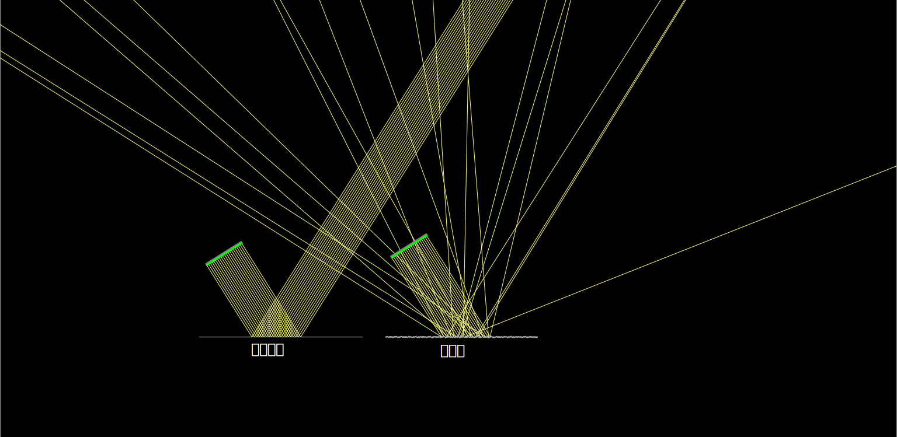

物理是对客观世界的原理和规律的描述，物理是高度数学化、公式化的学科，用数学公式描述事物的规律是物理最重要的内容

::: tip 真理
至今了解的真理只是一个逼近，人知道的每件事都是某种近似，只是因为懂得，到目前为止还不知道所有的定律
:::

## 物质

所有的物质都是原子构成的，这些原子都是小小的粒子，不断地运动着，当彼此略微离开时相互吸引，当彼此过于挤紧却又互相排斥

物质在温度的变化中会产生物态变化：固态，液态和气态

+ 熔化 - 固态变成液态
+ 凝固 - 液态变成固态

固体和液体的区别就是每个原子都有它确定的位置，不会像液体那样原子以种种方式跑来跑去，在固体中，原子以晶体阵列的方式排列着

有些固体在融化过程中不断吸热，但温度保持不变，有固定的熔化温度，这类固体叫**晶体**。不断吸热，没有熔化温度叫做**非晶体**。熔点是晶体融化时的温度，凝固点时形成晶体时的温度

+ 汽化 - 液态变成气态
+ 液化 - 气态变为液态
+ 沸腾 - 液体达到沸点时，表面发生剧烈的汽化现象
+ 蒸发 - 在任何温度下都发生汽化的现象，蒸发快慢的因素：温度高低，表面积大小，周围空气流动速度
+ 升华 - 从固态直接到气态
+ 凝华 - 从气态直接到固态

很多物质融化后会膨胀，因为这些固体的晶体结构是堆积的，融化后需要更多的空间供给原子活动。而开放结构的晶体反而会坍塌，体积反而缩小，比如水

尽管冰看起来像固体一样静止不动，但是它的原子并不是静止不动的，仍然在适当的位置上运动，即使是绝对零度也有最低限度的振动，而不是停止振动

### 化学反应

如果原子的组合改变了，就称之为化学反应。化学的任务是给物质命名，表明物质的原子名称和位置

## 能量守恒

能量有很多不同的形式：引力能，动能，热能，弹性能，电能，化学能，辐射能，核能，质能。能量是一个种抽象的对象，今天的物理学根本不知道能量究竟是什么，但是把这些能量的公式加在一起，除非有能量逸出或其他的能量加入，否则其总和永远是不会变的

把**重量和高度的乘积称之为重力势能**，这是一个物体在空间上和地球之间的相互关系具有的能量，像这种**与物体间相对位置有关的能量称为势能**，除了重力势能还有一些其他的势能

而在一个单摆中，端点在中点时，势能就消失了，将再次爬上去，这说明重力势能变幻成了另一个能量形式，而在底部使它上升的能量等于**重量和它能升高的高度的乘积**，这是物体的动能

重力势能和动能之间的转换总是遵守能量守恒定律的

弹性能是另一种能量表现方式，当弹簧被释放时谈性能就会变成动能，能量就在弹簧的伸长，压缩和动能之间来换变换，直到能量消失为止，这些消失的能量被转换成了热能，这是使用其他方式测量出来的，比如温度计

## 运动

通过观察才能理解物体的本质，尤其是定量的观察，才能发现定量的关系，这些是无力的核心。而运动的本质就是何处，何时

运动是最普遍的现象，在研究运动时要选定某一个物体作为标准，某个物体相对于这个物体位置发生了变化，就说是运动的，这个标准就是参照物，同一个物体选择的参照物不同，运动情况可能不同，有可能是运动的，也有可能是静止的，这就是运动和静止的相对性

+ 匀速直线运动 - 物体沿着直线且速度不变的运动
+ 变速直线运动 - 物体沿着直线且速度变化的运动

加速度是速度的时间变化率

## 万有引力

宇宙中每个物体都以一定的力吸引着每一个其他的物体

## 光

光本质是电磁波，传播速度是 3*10^8^m/s，**光年是一个长度单位**，即光在一年传播的距离。光在均匀介质中是直线传播的，而在不均匀介质中是会产生**折射**现象。如果无法穿透介质，会产生**反射**现象，分别是镜面反射和漫反射。光在通过三棱镜会解析各种不同的颜色

在反射现象中，反射光线，入射光线和法线都在同一平面内，反射光线，入射光线分别位于法线两侧，反射角等于入射角，光路是可逆的

平面镜成像的特点：

+ 像与物体的大小相等
+ 像与物体到平面镜的距离相等
+ 像和物体的连线与镜面垂直

平面镜成虚像，不能用光屏承接，虚像同样能够被人和相机观察到

球面镜分为凸面镜和凹面镜，凸面镜对光线具有发散所用，凹面镜对光线具有会聚作用

在折射现象中，从空气射入其他透明介质时，折射角小于入射角，从其他透明介质射入空气时，折射角大于入射角。入射角为 0 时，折射角也为 0。光路也是可逆的

## 需要具备的基础物理

由于测量仪器不精确，实验方法组略，环境因素等客观影响，加上测量者主观因素的影响，测量值和真实值之间总会由差别，这就是**误差**。错误是由于测量不遵守仪器使用规则，测量方法错误等造成的，是不应该发生的，能够避免。**误差不可以消除，只能减小**

速度决定物体运动的快慢，平均速度用来粗略描述物体在某一段路程中的运动快慢

声音是由振动产生的，声音的传播需要介质，比如固体、液体、气体。无法在真空中无法传播，不同介质传播速度：固体 > 液体 > 气体。其中，在 15° 时空气中的声速是 340m/s

::: tip
一个充满水的水管会响三下，三个介质
:::

声音遇到障碍物就会被反射回来形成**回声**，只有返回到人耳的时间大于 0.1s 时，人才能区分

声音的三大特征：

+ 音调（频率） - 低音、中音、高音
+ 响度（振幅） - 强弱
+ 音色（材质） - 不同类型的声音

超声波和次声波：

+ 超声波 - 频率高于 20000 Hz 的声，方向性好，穿透能力强
+ 次声波 - 频率低于 20 Hz 的声，容易绕过障碍物，可以传的很远

声音还有两种功能：

+ 传递信息：回声定位，B 超
+ 传递能量：清洗机

让人不舒服的声音就是噪音，即使悦耳的乐声影响人睡觉也是噪音，减少噪音主要从三个方面下手：

+ 声源处
+ 传播中
+ 人耳处

噪音有专门用分贝（db）来表示级别，30 ~ 40db 是理想的安静环境，超过 90db 会对听力造成影响

力可以改变物体的运动状态和形状，运动和静止是相对的，要借助参考物

只有两种电荷，正和负电荷。同电荷互相排斥，异电荷互相吸引，一个物体中的正负电荷等量即为中和状态

电荷定向移动时会形成电流，正电荷移动的方向是电流的方向，负电荷移动的方向与电流相反

容易导电的物体是**导体**，不容易导电的是**绝缘体**。导体和绝缘体没有绝对的界限，在一定条件改变时可以相互转化。导体导电原因是导体中存在自由电荷，绝缘体不易导电是因为电荷被束缚，不能自由移动

::: tip
半导体的导电能力介于导体和绝缘体之间
:::

电路由：电源、导线、用电器组成。电路有三种状态：通路、断路、短路

电压是形成电流的原因，电源是提供电压的装置

电阻是指导体中对电流的阻碍作用，与导体的长度、横截面积、材料、温度有关

连接方式有：串联和并联

## 公式

## 扩展

## 工具

+ [射线光学模拟](https://phydemo.app/ray-optics/cn/)
+ [PhET互动仿真程序](https://phet.colorado.edu/zh_CN/)

## 术语

## 参考资料

+ 费曼的物理学讲义
