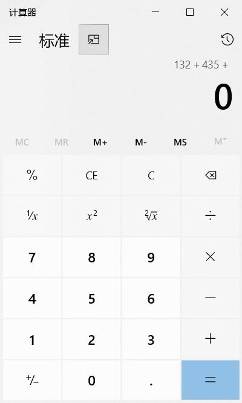

## Office

通常使用[OTP](https://otp.landian.vip/zh-cn/download.html)来部署 Office 应用，安装步骤如下：

1. 体系结构为“64 位“
2. 更新通道为“Office 2019 企业长期版”
3. 添加产品”Office 专业增强版 2019 - 批量许可证“
4. 添加语言”中文简体“
5. 开始部署

激活步骤：

1. 选择安装的版本，并安装许可证
2. KMS 管理设置主机和端口，主机地址参考<https://www.coolhub.top/tech-articles/kms_list.html>
3. 激活！！！

### Excel

+ 列宽或行高一致：选中边缘要调整的所有列或行，选择其中一个进行大小调整，其他就会自动变成一致
+ 自动递增：选择需要递增的列，末尾是数字则会自动加 1 填充，可以根据两个单元格的数字差距进行隔数递增，如果不想递增 1，则可以选择两个单元格，word 会根据两个单元格的数字差来递增
+ 冻结窗格：常用于解决行或列过长而导致看不到标题信息，在“视图”选项卡中使用冻结窗格功能，需要选中行或列，从下一行或列开始冻结
+ 分割视窗：常用于对比不同行之间的数据，在“视图”选项卡中使用拆分功能，选中行或列，从下一行或列开始拆分
+ 排序：在排序时不要选中所有的行，否则会造成数据混乱
+ 分类排序：可以自定义排序来实现归类排序
+ 自定义序列排序：自定义序列排序可以根据规则来排序
+ 筛选快捷键：ctrl + shift + L
+ 文本筛选：可以根据一些关键字来实现模糊筛选
+ 色彩排序：也可以根据单元格的颜色进行排序，前提是必须上色
+ 切片器：可以更加直观的筛选数据
+ 条件格式：可以根据筛选条件来格式化单元格样式，必须选择所有列或行
+ 根据生日计算年龄：公式“=DATEDIF([@生日]， "2017/1/1"， "y")”
+ 水平垂直居中打印：文件-打印-页面设置-页边距

### Word

+ 视图：视图 -> 大纲，可以查看 Word 中的所有细节，非常利于调试格式

页码从第二张开始：

1. 添加分节符到第一张
2. 添加页码到第二节第一张
3. 取消链接上一节

### PPT

+ 当你保存你的 ppt 时，用后缀`.pps`或`.ppsx`，那样的话，打开时会直接进入幻灯片播放模式。不仅节省时间，还看起来十分专业

### 三者之间的互动

<!-- to be updated -->

## Adobe

### Photoshop

### Illustrator

+ 选择工具组
  + 选择工具：选择、移动、缩放、旋转
  + 直接选择工具：选择、移动、变形
  + 套索工具：自由选择锚点
  + 魔棒工具：色容差
+ 填色和描边
  + 前后置换：x
  + 颜色置换：Shift + x
  + 默认黑白：D
  + 关闭：/
+ 描边
  + 可改颜色
  + 实现、虚线
  + 端点
  + 折角

### Premiere

界面的各种功能区域：

+ 项目面板 - 管理您的视频、音频、图像等素材文件
+ 时间线 - 在这里编排和剪辑您的视频片段
+ 预览窗口 - 可以实时预览您的编辑成果
+ 工具箱 - 包含各种编辑和特效工具

先做什么：

1. 新建序列，设置帧大小，像素长宽比，可以参考 HDV 预设进行修改，然后保存为自定义
2. 导入素材到项目

将视频片段拖放到时间线上:

1. 在项目面板中找到您想要用到的视频文件
2. 单击并按住视频文件，将其拖拽到时间线的相应轨道上
3. 松开鼠标，视频片段就会被添加到时间线上了

对视频进行裁剪和分割:

1. 在时间线上找到您需要裁剪的视频片段
2. 将播放头移动到想要裁剪的位置
3. 点击"修剪"工具，然后拖动左右两侧的边缘进行裁剪
4. 如果需要分割视频，可以在想要分割的位置点击"分割"工具，将视频分成两段

添加转场特效:

1. 在时间线上找到两个相邻的视频片段
2. 在它们之间的空白区域右键单击，选择"添加转场"
3. 在弹出的转场库中选择您喜欢的转场效果
4. 拖动转场效果到两个片段之间，即可应用转场

## Blender

## 其他

为找不到资源的种子而担忧？不用怕。你可以通过 Google 直接找到下载地址

下载电影时，用以下方式搜索：

```
“你要搜的内容”-inurl:(htm|html|php|pls|txt) intitle:index.of “last modified” (mkv|mp4|avi)
```

这个搜索技巧不仅仅可以下载电影，也可以是其他任意软件。只要把文件格式 (如 mp3|wma|aac|flac )换成你需要搜索的文件格式就可以了。这样你就可以直接搜索到你想要的任何东西

上 youtube 网站时，在地址栏：

+ 把“youtube”换成“listentoyoutube”，可以下载视频的音频
+ 把“youtube”换成“ssyoutube”，可以下载任意图像质量的视频
+ 把“youtube”换成“listenonrepeat”，可以自动重放视频
+ 把“youtube”换成“youtubeskip”，你将不会看到广告

获取 Windows 上所有已安装目标程序的快捷方式

```
%windir%\explorer.exe shell:::{4234d49b-0245-4df3-b780-3893943456e1}
```

在计算器上，C 和 CE 是有区别的，尽管很多人都觉得它们一样。C 按钮能清除你曾输入的所有东西，但是 CE 只清除最新输入的内容

比如：我在计算机上输入这些：


CE 按钮会做这些：



而 C 按钮会做这些：


