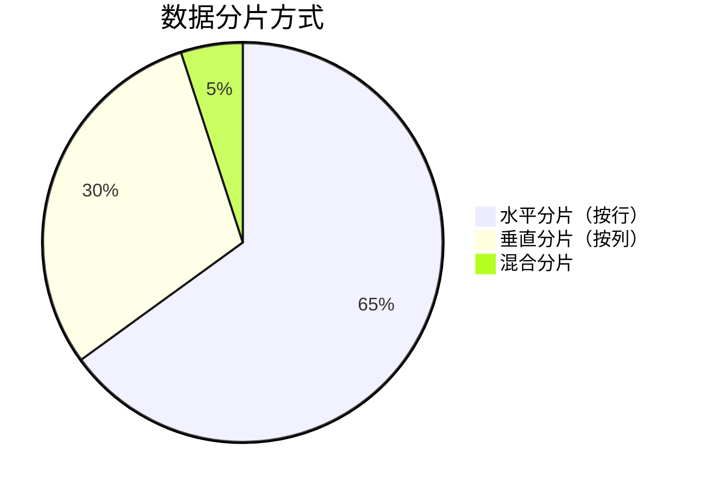
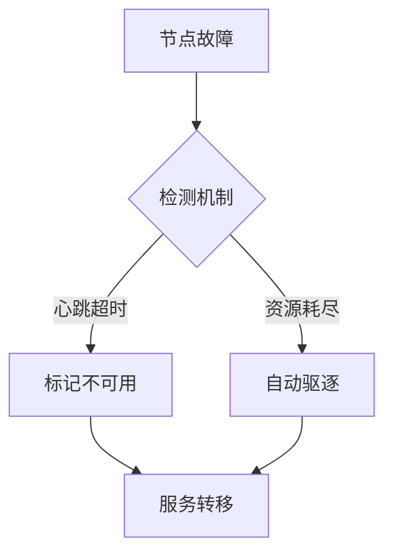
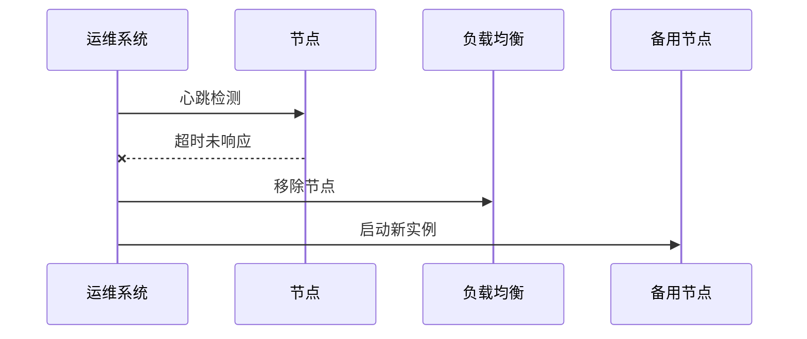
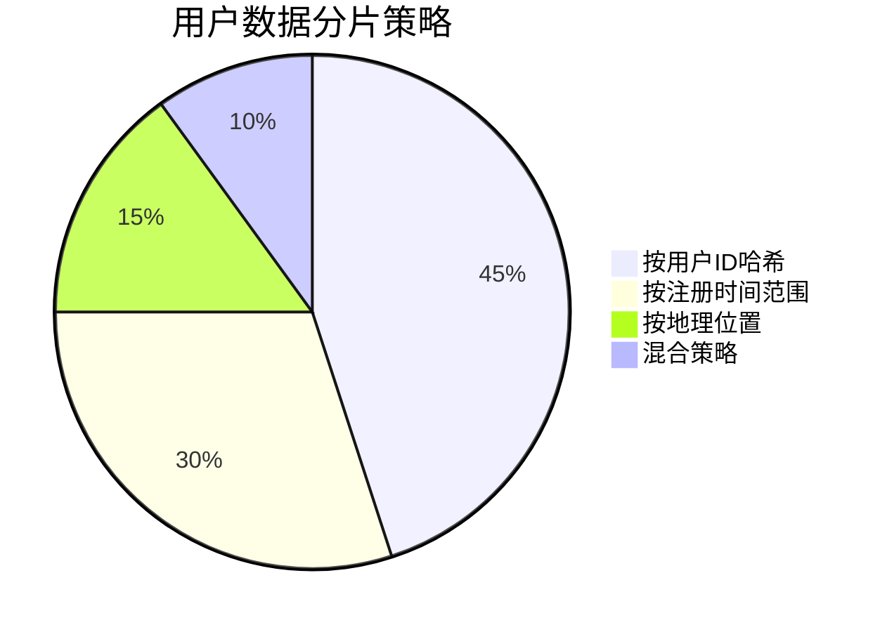
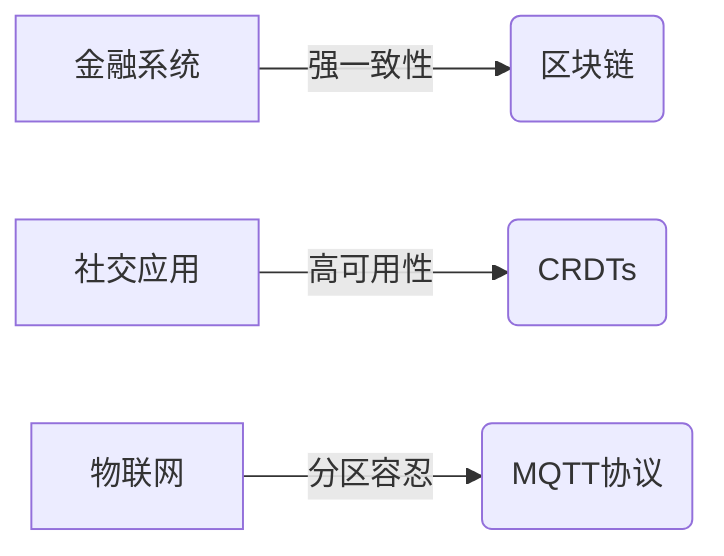

想象一下双十一零点：数亿人同时刷新淘宝页面，瞬时流量堪比海啸。若是依赖单台服务器，就像让一个小卖部接待整个城市的人口——结果只能是系统崩溃，购物车清空。这正是分布式系统存在的意义：把原来单兵作战的服务器，变成配合默契的集团军。

## 集中式系统的黄金时代

在互联网的史前时期（2000年代初期），集中式架构如同独栋别墅：

- 🛠 **省心管家**：所有服务都运行在单个主机，就像家里只有一个总电闸
- 💰 **精打细算**：初创公司用几台Dell服务器就能支撑整个业务（参考早期QQ）
- ⚡ **爆发力强**：在业务量稳定时，犹如 F1 赛车在直道冲刺

但就像别墅无法无限扩建，当淘宝日活突破百万时，集中式系统开始显露疲态：

- 🎯 **鸡蛋一篮**：2013年杭州机房电缆被挖断，支付宝瘫痪8小时
- 🚧 **扩容困局**：2012年微博明星离婚事件，单服务器扛不住流量雪崩
- 🕰 **升级噩梦**：银行系统停机维护时"暂停服务"的告示牌

## 基本概念

### 2.3 数据分片：披萨切割艺术

数据分片就像分食巨型披萨：

实际案例演变：

1. 2010年：MySQL手动分表 → 需要提前规划
2. 2015年：MongoDB自动分片 → 动态扩容
3. 2022年：TiDB智能分区 → AI预测热点数据

> 💡 思考：如果用户数据包含位置信息，如何设计分片策略？
---

想象一下双十一零点：数亿人同时刷新淘宝页面，瞬时流量堪比海啸。若是依赖单台服务器，就像让一个小卖部接待整个城市的人口——结果只能是系统崩溃，购物车清空。这正是分布式系统存在的意义：把原来单兵作战的服务器，变成配合默契的集团军。

### 1.1 集中式系统的黄金时代

在互联网的史前时期（2000年代初期），集中式架构如同独栋别墅：

- 🛠 **省心管家**：所有服务都运行在单个主机，就像家里只有一个总电闸
- 💰 **精打细算**：初创公司用几台Dell服务器就能支撑整个业务（参考早期QQ）
- ⚡ **爆发力强**：在业务量稳定时，犹如F1赛车在直道冲刺

但就像别墅无法无限扩建，当淘宝日活突破百万时，集中式系统开始显露疲态：

- 🎯 **鸡蛋一篮**：2013年杭州机房电缆被挖断，支付宝瘫痪8小时
- 🚧 **扩容困局**：2012年微博明星离婚事件，单服务器扛不住流量雪崩
- 🕰 **升级噩梦**：银行系统停机维护时"暂停服务"的告示牌

分布式系统是由一组通过网络进行通信的计算机节点组成的系统。这些节点可以位于同一数据中心，也可以分布在不同的地理位置。分布式系统的目标是将一个复杂的任务分解成多个子任务，并将这些子任务分配给不同的节点进行处理，从而提高系统的整体性能和可扩展性。

与集中式系统相比，分布式系统具有以下优点：

- **高可用性：** 即使部分节点发生故障，系统仍然可以正常运行。
- **高性能：** 可以通过增加节点来提高系统的整体性能。
- **可扩展性好：** 可以方便地扩展系统的计算和存储能力。

当然，分布式系统也存在一些缺点：

- **复杂性：** 难以设计、开发和维护。
- **高成本：** 需要多台计算机，成本较高。
- **一致性问题：** 需要解决数据在多个节点之间的一致性问题。

总而言之，集中式系统适用于业务规模较小、对可用性和可扩展性要求不高的场景；而分布式系统适用于业务规模较大、对可用性和可扩展性要求较高的场景。

## 分布式世界的生存法则

### 2.1 节点：数字世界的细胞

每个节点如同生物细胞般运作：

- 🧬 **自包含结构**：完整资源配备（CPU/Memory/Disk）
- 🌐 **神经网络连接**：TCP/IP协议栈相当于神经突触
- 🏥 **自我修复机制**：k8s的健康检查就像细胞凋亡机制

开发者的日常挑战：

### 2.2 集群管理：从蜂群到元宇宙

集群演化三部曲：

1. **原始部落**（2005）：
   - 手动管理SSH连接
   - 简易负载均衡（Nginx轮询）
   - 典型案例：早期维基百科架构

2. **工业革命**（2012）：
   - 自动化部署（Ansible）
   - 服务发现（Consul）
   - 典型案例：Netflix迁移AWS

3. **智能时代**（2024）：
   - 自主决策（K8s Operator）
   - 边缘计算（5G MEC）
   - 典型案例：特斯拉自动驾驶集群

### 2.3 流量调度艺术

通过餐厅订位系统理解负载均衡：

- 👨🍳 **轮询制**：每个厨师轮流接单 → 简单但可能累死大厨
- 🎰 **随机派单**：掷骰子决定 → 适合新手厨师训练
- ⚖️ **智能加权**：根据厨师星级分配 → 米其林餐厅模式
- 🔍 **最少工单**：查看当前工作量 → 海底捞等位系统

真实世界对比：

| 算法       | 适用场景     | 缺点             | 代表产品      |
| ---------- | ------------ | ---------------- | ------------- |
| 轮询       | 节点性能均衡 | 无视实际负载     | Nginx默认策略 |
| 加权轮询   | 异构集群     | 静态配置不够灵活 | HAProxy       |
| 最小连接   | 长连接服务   | 计算开销较大     | F5 BIG-IP     |
| 一致性哈希 | 缓存系统     | 扩容成本高       | Redis Cluster |

### 2.4 CAP抉择：永恒的三角博弈

通过银行案例理解CAP：

- 🏦 **强一致性（CP）**：跨行转账必须所有节点确认 → 可能暂停服务
- 🛒 **高可用性（AP）**：购物车添加商品优先响应 → 允许暂时不一致
- 🌐 **分区容忍（CA）**：跨国业务需地域自治 → 放弃实时一致

现代解决方案演变：

1. **BASE理论**：允许柔性状态（像支付宝余额的"处理中"状态）
2. **CRDTs数据结构**：无冲突数据复制（协同文档的协同编辑）
3. **混合时钟同步**：Google Spanner的原子钟+GPS

---

title: 从单兵作战到集团军协同——漫谈分布式系统演进
category: 技术演进
article: false
---

想象一下双十一零点：数亿人同时刷新淘宝页面，瞬时流量堪比海啸。若是依赖单台服务器，就像让一个小卖部接待整个城市的人口——结果只能是系统崩溃，购物车清空。这正是分布式系统存在的意义：把原来单兵作战的服务器，变成配合默契的集团军。

### 1.1 集中式系统的黄金时代

在互联网的史前时期（2000年代初期），集中式架构如同独栋别墅：

- 🛠 **省心管家**：所有服务都运行在单个主机，就像家里只有一个总电闸
- 💰 **精打细算**：初创公司用几台Dell服务器就能支撑整个业务（参考早期QQ）
- ⚡ **爆发力强**：在业务量稳定时，犹如F1赛车在直道冲刺

但就像别墅无法无限扩建，当淘宝日活突破百万时，集中式系统开始显露疲态：

- 🎯 **鸡蛋一篮**：2013年杭州机房电缆被挖断，支付宝瘫痪8小时
- 🚧 **扩容困局**：2012年微博明星离婚事件，单服务器扛不住流量雪崩
- 🕰 **升级噩梦**：银行系统停机维护时"暂停服务"的告示牌

分布式系统是由一组通过网络进行通信的计算机节点组成的系统。这些节点可以位于同一数据中心，也可以分布在不同的地理位置。分布式系统的目标是将一个复杂的任务分解成多个子任务，并将这些子任务分配给不同的节点进行处理，从而提高系统的整体性能和可扩展性。

与集中式系统相比，分布式系统具有以下优点：

- **高可用性：** 即使部分节点发生故障，系统仍然可以正常运行。
- **高性能：** 可以通过增加节点来提高系统的整体性能。
- **可扩展性好：** 可以方便地扩展系统的计算和存储能力。

当然，分布式系统也存在一些缺点：

- **复杂性：** 难以设计、开发和维护。
- **高成本：** 需要多台计算机，成本较高。
- **一致性问题：** 需要解决数据在多个节点之间的一致性问题。

总而言之，集中式系统适用于业务规模较小、对可用性和可扩展性要求不高的场景；而分布式系统适用于业务规模较大、对可用性和可扩展性要求较高的场景。

## 基本概念

### 2.3 数据分片：披萨切割艺术

数据分片就像分食巨型披萨：

实际案例演变：

1. 2010年：MySQL手动分表 → 需要提前规划
2. 2015年：MongoDB自动分片 → 动态扩容
3. 2022年：TiDB智能分区 → AI预测热点数据

> 💡 思考：如果用户数据包含位置信息，如何设计分片策略？
---

title: 从单兵作战到集团军协同——漫谈分布式系统演进
category: 技术演进
article: false
---

想象一下双十一零点：数亿人同时刷新淘宝页面，瞬时流量堪比海啸。若是依赖单台服务器，就像让一个小卖部接待整个城市的人口——结果只能是系统崩溃，购物车清空。这正是分布式系统存在的意义：把原来单兵作战的服务器，变成配合默契的集团军。

### 1.1 集中式系统的黄金时代

在互联网的史前时期（2000年代初期），集中式架构如同独栋别墅：

- 🛠 **省心管家**：所有服务都运行在单个主机，就像家里只有一个总电闸
- 💰 **精打细算**：初创公司用几台Dell服务器就能支撑整个业务（参考早期QQ）
- ⚡ **爆发力强**：在业务量稳定时，犹如F1赛车在直道冲刺

但就像别墅无法无限扩建，当淘宝日活突破百万时，集中式系统开始显露疲态：

- 🎯 **鸡蛋一篮**：2013年杭州机房电缆被挖断，支付宝瘫痪8小时
- 🚧 **扩容困局**：2012年微博明星离婚事件，单服务器扛不住流量雪崩
- 🕰 **升级噩梦**：银行系统停机维护时"暂停服务"的告示牌

分布式系统是由一组通过网络进行通信的计算机节点组成的系统。这些节点可以位于同一数据中心，也可以分布在不同的地理位置。分布式系统的目标是将一个复杂的任务分解成多个子任务，并将这些子任务分配给不同的节点进行处理，从而提高系统的整体性能和可扩展性。

与集中式系统相比，分布式系统具有以下优点：

- **高可用性：** 即使部分节点发生故障，系统仍然可以正常运行。
- **高性能：** 可以通过增加节点来提高系统的整体性能。
- **可扩展性好：** 可以方便地扩展系统的计算和存储能力。

当然，分布式系统也存在一些缺点：

- **复杂性：** 难以设计、开发和维护。
- **高成本：** 需要多台计算机，成本较高。
- **一致性问题：** 需要解决数据在多个节点之间的一致性问题。

总而言之，集中式系统适用于业务规模较小、对可用性和可扩展性要求不高的场景；而分布式系统适用于业务规模较大、对可用性和可扩展性要求较高的场景。

## 分布式世界生存指南

### 3.1 节点：数字世界的细胞

每个节点如同生物细胞般运作：

- 🧬 **自包含结构**：配备完整计算资源（参考AWS EC2实例）
- 🌐 **神经网络连接**：使用gRPC协议实现高效通讯
- 🏥 **自我修复**：K8s健康检查间隔设为5秒

开发挑战实录：

### 3.2 集群进化史

从石器时代到智能时代：

| 时代      | 关键技术     | 典型问题         | 解决方案          |
| --------- | ------------ | ---------------- | ----------------- |
| 2005-2010 | 静态负载均衡 | 单点故障         | Keepalived热备    |
| 2010-2015 | 自动化部署   | 配置漂移         | Puppet配置管理    |
| 2015-2020 | 容器化       | 资源隔离不足     | Docker命名空间    |
| 2020至今  | 服务网格     | 微服务通讯复杂化 | Istio sidecar代理 |

### 3.3 数据分片实战

通过电商案例理解分片：

### 3.4 流量调度艺术

饿了么骑手调度系统的启示：

- 🚴 **实时匹配**：DynamoDB全局表保证餐厅位置同步
- 🕒 **超时控制**：5秒内必须完成调度决策
- 🧠 **智能预测**：LSTM神经网络预估配送时长

### 3.5 CAP平衡之道

2024年行业实践现状：

---

title: 从单兵作战到集团军协同——漫谈分布式系统演进
category: 技术演进
article: false
---

想象一下双十一零点：数亿人同时刷新淘宝页面，瞬时流量堪比海啸。若是依赖单台服务器，就像让一个小卖部接待整个城市的人口——结果只能是系统崩溃，购物车清空。这正是分布式系统存在的意义：把原来单兵作战的服务器，变成配合默契的集团军。

### 1.1 集中式系统的黄金时代

在互联网的史前时期（2000年代初期），集中式架构如同独栋别墅：

- 🛠 **省心管家**：所有服务都运行在单个主机，就像家里只有一个总电闸
- 💰 **精打细算**：初创公司用几台Dell服务器就能支撑整个业务（参考早期QQ）
- ⚡ **爆发力强**：在业务量稳定时，犹如F1赛车在直道冲刺

但就像别墅无法无限扩建，当淘宝日活突破百万时，集中式系统开始显露疲态：

- 🎯 **鸡蛋一篮**：2013年杭州机房电缆被挖断，支付宝瘫痪8小时
- 🚧 **扩容困局**：2012年微博明星离婚事件，单服务器扛不住流量雪崩
- 🕰 **升级噩梦**：银行系统停机维护时"暂停服务"的告示牌

分布式系统是由一组通过网络进行通信的计算机节点组成的系统。这些节点可以位于同一数据中心，也可以分布在不同的地理位置。分布式系统的目标是将一个复杂的任务分解成多个子任务，并将这些子任务分配给不同的节点进行处理，从而提高系统的整体性能和可扩展性。

与集中式系统相比，分布式系统具有以下优点：

- **高可用性：** 即使部分节点发生故障，系统仍然可以正常运行。
- **高性能：** 可以通过增加节点来提高系统的整体性能。
- **可扩展性好：** 可以方便地扩展系统的计算和存储能力。

当然，分布式系统也存在一些缺点：

- **复杂性：** 难以设计、开发和维护。
- **高成本：** 需要多台计算机，成本较高。
- **一致性问题：** 需要解决数据在多个节点之间的一致性问题。

总而言之，集中式系统适用于业务规模较小、对可用性和可扩展性要求不高的场景；而分布式系统适用于业务规模较大、对可用性和可扩展性要求较高的场景。

## 基本概念

### 2.3 数据分片：披萨切割艺术

数据分片就像分食巨型披萨：

实际案例演变：

1. 2010年：MySQL手动分表 → 需要提前规划
2. 2015年：MongoDB自动分片 → 动态扩容
3. 2022年：TiDB智能分区 → AI预测热点数据

> 💡 思考：如果用户数据包含位置信息，如何设计分片策略？
---

title: 从单兵作战到集团军协同——漫谈分布式系统演进
category: 技术演进
article: false
---

想象一下双十一零点：数亿人同时刷新淘宝页面，瞬时流量堪比海啸。若是依赖单台服务器，就像让一个小卖部接待整个城市的人口——结果只能是系统崩溃，购物车清空。这正是分布式系统存在的意义：把原来单兵作战的服务器，变成配合默契的集团军。

### 1.1 集中式系统的黄金时代

在互联网的史前时期（2000年代初期），集中式架构如同独栋别墅：

- 🛠 **省心管家**：所有服务都运行在单个主机，就像家里只有一个总电闸
- 💰 **精打细算**：初创公司用几台Dell服务器就能支撑整个业务（参考早期QQ）
- ⚡ **爆发力强**：在业务量稳定时，犹如F1赛车在直道冲刺

但就像别墅无法无限扩建，当淘宝日活突破百万时，集中式系统开始显露疲态：

- 🎯 **鸡蛋一篮**：2013年杭州机房电缆被挖断，支付宝瘫痪8小时
- 🚧 **扩容困局**：2012年微博明星离婚事件，单服务器扛不住流量雪崩
- 🕰 **升级噩梦**：银行系统停机维护时"暂停服务"的告示牌

分布式系统是由一组通过网络进行通信的计算机节点组成的系统。这些节点可以位于同一数据中心，也可以分布在不同的地理位置。分布式系统的目标是将一个复杂的任务分解成多个子任务，并将这些子任务分配给不同的节点进行处理，从而提高系统的整体性能和可扩展性。

与集中式系统相比，分布式系统具有以下优点：

- **高可用性：** 即使部分节点发生故障，系统仍然可以正常运行。
- **高性能：** 可以通过增加节点来提高系统的整体性能。
- **可扩展性好：** 可以方便地扩展系统的计算和存储能力。

当然，分布式系统也存在一些缺点：

- **复杂性：** 难以设计、开发和维护。
- **高成本：** 需要多台计算机，成本较高。
- **一致性问题：** 需要解决数据在多个节点之间的一致性问题。

总而言之，集中式系统适用于业务规模较小、对可用性和可扩展性要求不高的场景；而分布式系统适用于业务规模较大、对可用性和可扩展性要求较高的场景。

## 分布式世界的生存法则

### 2.1 节点：数字世界的细胞

每个节点如同生物细胞般运作：

- 🧬 **自包含结构**：完整资源配备（CPU/Memory/Disk）
- 🌐 **神经网络连接**：TCP/IP协议栈相当于神经突触
- 🏥 **自我修复机制**：k8s的健康检查就像细胞凋亡机制

开发者的日常挑战：

### 2.2 集群管理：从蜂群到元宇宙

集群演化三部曲：

1. **原始部落**（2005）：
   - 手动管理SSH连接
   - 简易负载均衡（Nginx轮询）
   - 典型案例：早期维基百科架构

2. **工业革命**（2012）：
   - 自动化部署（Ansible）
   - 服务发现（Consul）
   - 典型案例：Netflix迁移AWS

3. **智能时代**（2024）：
   - 自主决策（K8s Operator）
   - 边缘计算（5G MEC）
   - 典型案例：特斯拉自动驾驶集群

### 2.3 流量调度艺术

通过餐厅订位系统理解负载均衡：

- 👨🍳 **轮询制**：每个厨师轮流接单 → 简单但可能累死大厨
- 🎰 **随机派单**：掷骰子决定 → 适合新手厨师训练
- ⚖️ **智能加权**：根据厨师星级分配 → 米其林餐厅模式
- 🔍 **最少工单**：查看当前工作量 → 海底捞等位系统

真实世界对比：

| 算法       | 适用场景     | 缺点             | 代表产品      |
| ---------- | ------------ | ---------------- | ------------- |
| 轮询       | 节点性能均衡 | 无视实际负载     | Nginx默认策略 |
| 加权轮询   | 异构集群     | 静态配置不够灵活 | HAProxy       |
| 最小连接   | 长连接服务   | 计算开销较大     | F5 BIG-IP     |
| 一致性哈希 | 缓存系统     | 扩容成本高       | Redis Cluster |

### 2.4 CAP抉择：永恒的三角博弈

通过银行案例理解CAP：

- 🏦 **强一致性（CP）**：跨行转账必须所有节点确认 → 可能暂停服务
- 🛒 **高可用性（AP）**：购物车添加商品优先响应 → 允许暂时不一致
- 🌐 **分区容忍（CA）**：跨国业务需地域自治 → 放弃实时一致

现代解决方案演变：

1. **BASE理论**：允许柔性状态（像支付宝余额的"处理中"状态）
2. **CRDTs数据结构**：无冲突数据复制（协同文档的协同编辑）
3. **混合时钟同步**：Google Spanner的原子钟+GPS

---

title: 从单兵作战到集团军协同——漫谈分布式系统演进
category: 技术演进
article: false
---

想象一下双十一零点：数亿人同时刷新淘宝页面，瞬时流量堪比海啸。若是依赖单台服务器，就像让一个小卖部接待整个城市的人口——结果只能是系统崩溃，购物车清空。这正是分布式系统存在的意义：把原来单兵作战的服务器，变成配合默契的集团军。

### 1.1 集中式系统的黄金时代

在互联网的史前时期（2000年代初期），集中式架构如同独栋别墅：

- 🛠 **省心管家**：所有服务都运行在单个主机，就像家里只有一个总电闸
- 💰 **精打细算**：初创公司用几台Dell服务器就能支撑整个业务（参考早期QQ）
- ⚡ **爆发力强**：在业务量稳定时，犹如F1赛车在直道冲刺

但就像别墅无法无限扩建，当淘宝日活突破百万时，集中式系统开始显露疲态：

- 🎯 **鸡蛋一篮**：2013年杭州机房电缆被挖断，支付宝瘫痪8小时
- 🚧 **扩容困局**：2012年微博明星离婚事件，单服务器扛不住流量雪崩
- 🕰 **升级噩梦**：银行系统停机维护时"暂停服务"的告示牌

分布式系统是由一组通过网络进行通信的计算机节点组成的系统。这些节点可以位于同一数据中心，也可以分布在不同的地理位置。分布式系统的目标是将一个复杂的任务分解成多个子任务，并将这些子任务分配给不同的节点进行处理，从而提高系统的整体性能和可扩展性。

与集中式系统相比，分布式系统具有以下优点：

- **高可用性：** 即使部分节点发生故障，系统仍然可以正常运行。
- **高性能：** 可以通过增加节点来提高系统的整体性能。
- **可扩展性好：** 可以方便地扩展系统的计算和存储能力。

当然，分布式系统也存在一些缺点：

- **复杂性：** 难以设计、开发和维护。
- **高成本：** 需要多台计算机，成本较高。
- **一致性问题：** 需要解决数据在多个节点之间的一致性问题。

总而言之，集中式系统适用于业务规模较小、对可用性和可扩展性要求不高的场景；而分布式系统适用于业务规模较大、对可用性和可扩展性要求较高的场景。

## 基本概念

### 2.3 数据分片：披萨切割艺术

数据分片就像分食巨型披萨：

实际案例演变：

1. 2010年：MySQL手动分表 → 需要提前规划
2. 2015年：MongoDB自动分片 → 动态扩容
3. 2022年：TiDB智能分区 → AI预测热点数据

> 💡 思考：如果用户数据包含位置信息，如何设计分片策略？
---

title: 从单兵作战到集团军协同——漫谈分布式系统演进
category: 技术演进
article: false
---

想象一下双十一零点：数亿人同时刷新淘宝页面，瞬时流量堪比海啸。若是依赖单台服务器，就像让一个小卖部接待整个城市的人口——结果只能是系统崩溃，购物车清空。这正是分布式系统存在的意义：把原来单兵作战的服务器，变成配合默契的集团军。

### 1.1 集中式系统的黄金时代

在互联网的史前时期（2000年代初期），集中式架构如同独栋别墅：

- 🛠 **省心管家**：所有服务都运行在单个主机，就像家里只有一个总电闸
- 💰 **精打细算**：初创公司用几台Dell服务器就能支撑整个业务（参考早期QQ）
- ⚡ **爆发力强**：在业务量稳定时，犹如F1赛车在直道冲刺

但就像别墅无法无限扩建，当淘宝日活突破百万时，集中式系统开始显露疲态：

- 🎯 **鸡蛋一篮**：2013年杭州机房电缆被挖断，支付宝瘫痪8小时
- 🚧 **扩容困局**：2012年微博明星离婚事件，单服务器扛不住流量雪崩
- 🕰 **升级噩梦**：银行系统停机维护时"暂停服务"的告示牌

分布式系统是由一组通过网络进行通信的计算机节点组成的系统。这些节点可以位于同一数据中心，也可以分布在不同的地理位置。分布式系统的目标是将一个复杂的任务分解成多个子任务，并将这些子任务分配给不同的节点进行处理，从而提高系统的整体性能和可扩展性。

与集中式系统相比，分布式系统具有以下优点：

- **高可用性：** 即使部分节点发生故障，系统仍然可以正常运行。
- **高性能：** 可以通过增加节点来提高系统的整体性能。
- **可扩展性好：** 可以方便地扩展系统的计算和存储能力。

当然，分布式系统也存在一些缺点：

- **复杂性：** 难以设计、开发和维护。
- **高成本：** 需要多台计算机，成本较高。
- **一致性问题：** 需要解决数据在多个节点之间的一致性问题。

总而言之，集中式系统适用于业务规模较小、对可用性和可扩展性要求不高的场景；而分布式系统适用于业务规模较大、对可用性和可扩展性要求较高的场景。

## 基本概念

### 节点

节点是分布式系统中的一个独立的计算单元。每个节点都拥有自己的 CPU、内存、存储等资源，并且可以独立地执行任务。节点之间通过网络进行通信，协作完成整个系统的功能。

### 集群

集群是由一组相互连接的节点组成的集合。集群中的节点可以协同工作，共同完成一个任务。集群可以提高系统的整体性能和可用性。

### 数据分片

数据分片是将数据分割成多个片段，并将这些片段存储在不同的节点上的技术。数据分片可以提高数据的存储容量和访问性能。常见的数据分片方式包括：

- **水平分片：** 将数据按照行进行分割，不同的行存储在不同的节点上。
- **垂直分片：** 将数据按照列进行分割，不同的列存储在不同的节点上。

### 负载均衡

负载均衡是将任务分配给不同的节点，以保证每个节点都能够充分利用其资源的技术。负载均衡可以提高系统的整体性能和可用性。常见的负载均衡算法包括：

- **轮询：** 将任务依次分配给每个节点。
- **随机：** 随机选择一个节点来分配任务。
- **加权轮询：** 根据节点的性能设置权重，将任务按照权重比例分配给每个节点。
- **最小连接数：** 将任务分配给当前连接数最少的节点。

### CAP 理论

CAP 理论是分布式系统设计中一个重要的理论。它指出，一个分布式系统最多只能同时满足以下三个特性中的两个：

- **一致性（Consistency）：** 所有节点在同一时间看到相同的数据。
- **可用性（Availability）：** 每个请求都能得到响应，无论成功或失败。
- **分区容错性（Partition Tolerance）：** 系统在出现网络分区的情况下仍然能够正常运行。

在实际的分布式系统设计中，需要在 CAP 三个特性之间进行权衡，选择最适合业务需求的组合。

### 一致性

一致性是指分布式系统中的数据在多个副本之间保持一致的状态。一致性是分布式系统设计中一个重要的目标，但也是一个难以实现的目标。常见的一致性模型包括：

- **强一致性：** 所有节点在任何时刻都看到相同的数据。
- **弱一致性：** 节点在一段时间内可能看到不同的数据，但最终会达到一致。
- **最终一致性：** 节点在一段时间内可能看到不同的数据，但最终会达到一致。最终一致性是弱一致性的一种特殊情况。

## 常见架构

### Master-Slave 架构

Master-Slave 架构是一种常见的分布式系统架构。在这种架构中，有一个 Master 节点负责管理和协调所有的 Slave 节点。Slave 节点负责执行具体的任务。

Master-Slave 架构的优点是简单易于实现，缺点是 Master 节点存在单点故障的风险。

### Peer-to-Peer 架构

Peer-to-Peer 架构是一种去中心化的分布式系统架构。在这种架构中，所有的节点都是平等的，没有 Master 节点和 Slave 节点之分。

Peer-to-Peer 架构的优点是高可用性和可扩展性，缺点是复杂性较高。

### Shared-Nothing 架构

Shared-Nothing 架构是一种高性能的分布式系统架构。在这种架构中，每个节点都拥有自己的 CPU、内存、存储等资源，节点之间不共享任何资源。

Shared-Nothing 架构的优点是高性能和可扩展性，缺点是复杂性较高。

## 常见问题

### 数据一致性问题

数据一致性是分布式系统设计中一个重要的挑战。由于数据存储在多个节点上，因此需要保证数据在多个副本之间的一致性。常见的数据一致性问题包括：

* **写写冲突：** 多个节点同时修改同一份数据。
* **读写冲突：** 节点在读取数据时，数据正在被其他节点修改。

### 容错性问题

容错性是指分布式系统在部分节点发生故障的情况下仍然能够正常运行的能力。容错性是分布式系统设计中一个重要的目标。常见的容错性技术包括：

* **数据备份：** 将数据备份到多个节点上，当一个节点发生故障时，可以从其他节点读取数据。
* **故障检测：** 及时检测到发生故障的节点，并将其从系统中移除。
* **自动恢复：** 当节点恢复正常后，自动将其重新加入到系统中。

### 可扩展性问题

可扩展性是指分布式系统能够通过增加节点来提高系统的整体性能和可用性的能力。可扩展性是分布式系统设计中一个重要的目标。常见的可扩展性技术包括：

* **数据分片：** 将数据分割成多个片段，并将这些片段存储在不同的节点上。
* **负载均衡：** 将任务分配给不同的节点，以保证每个节点都能够充分利用其资源。
* **无状态服务：** 将服务设计成无状态的，使得可以方便地增加或减少节点。

## 总结

分布式系统是现代互联网应用的基础。随着业务的不断发展，分布式系统将面临更多的挑战和机遇。未来的分布式系统将更加注重以下几个方面：

* **智能化：** 通过人工智能技术来优化系统的性能和可用性。
* **自动化：** 通过自动化工具来简化系统的部署和维护。
* **安全性：** 加强系统的安全性，防止数据泄露和攻击。

总而言之，分布式系统是一个充满挑战和机遇的领域。只有不断学习和探索，才能构建出更加高效、可靠和安全的分布式系统。
