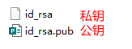
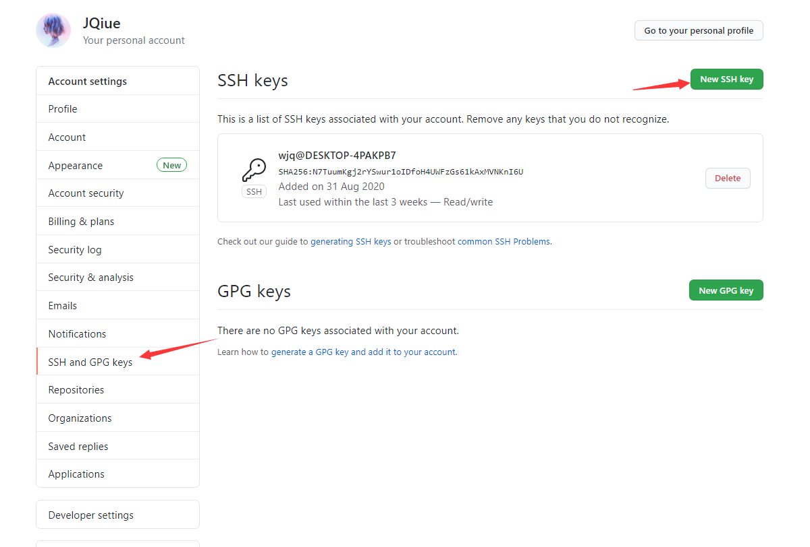
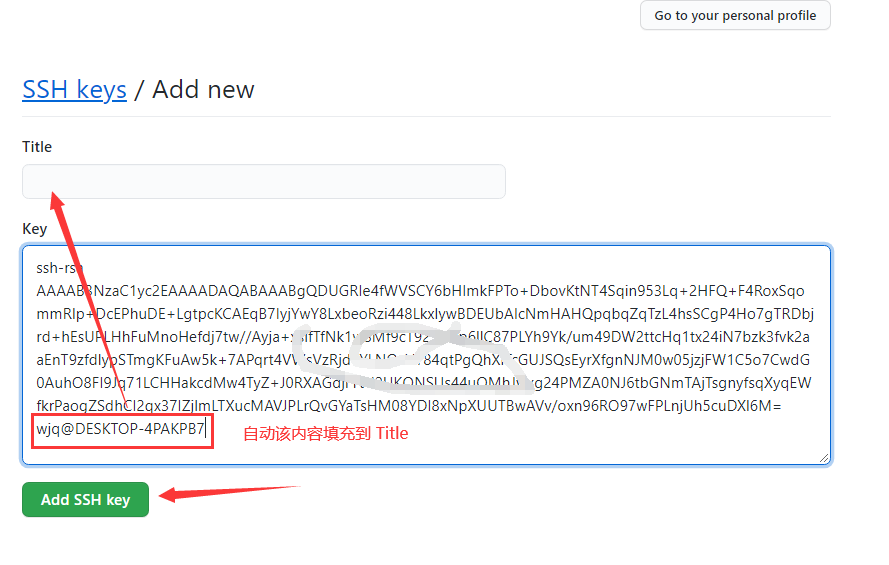
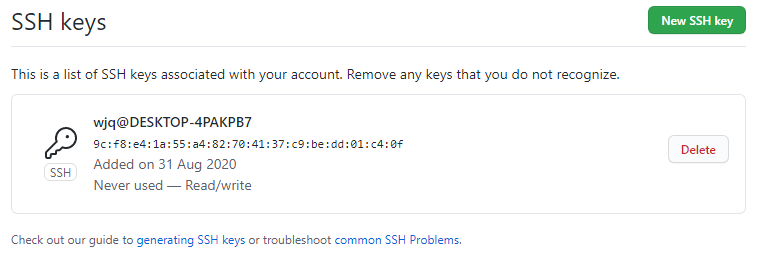

Git 是一套程序源代码的分布式版本管理系统，最初用于管理 Linux 核心代码的开发，后来被多个开源工程使用，如今已经成为互联网协作开发的标准源代码管理工具

从开发者的角度上来看，Git 有以下功能：

1. 从服务器上克隆代码到自己的机器上
2. 在自己的机器上创建分支，修改代码
3. 将自己机器上的代码提交到服务器上
4. 合并分支
5. .....

主要的竞争对手：

+ SVN
+ CVS
+ Mercurial

## 理解版本管理流程

这是一般使用 Git 的流程：

1. 编写代码
2. 将更改放入到暂存区
3. 将暂存区中的文件快照推送到本地仓库
4. 将本地仓库推送到远程仓库
5. 从远程仓库获取最新代码
6. 继续修改编写代码
7. 重复第二部以后的操作

这是 Git 的一些基础概念，非常重要：

+ 工作空间（workspace）
+ 暂存区（Stage）
+ Git 库（Repository）
  + local：本地仓库
  + remote：远程仓库

## 初入 Git

如果是第一次使用 Git 要配置用户名和邮箱，因为 Git 是基于分布式的管理系统，所以每个贡献者都有自己的用户名和地址，这样便于跟踪用户的操作

```sh
git config --global user.name 'your_name'
git config --global user.email 'your_email@domian.com'
```

再次使用上述命令会变更`config`的信息，`git config --global --list`用于查看配置

`config`在分别使用不同的指令参数时，有不同的作用域：

+ `local`：对某个仓库有效，当缺省的时候默认为`local`，优先级最高
+ `global`：对当前用户所有仓库有效，优先级次之
+ `system`：对系统所有登陆的用户有效，优先级最低

使用`git config -e`会弹出一个编辑文本来编辑`config`文件

## 初始化 Git 库

如果想要管理某个工作空间，应该使用`git init`初始化一个 Git 库，执行后会在该文件夹中创建一个`.git`的文件夹，这里包含了 Git 管理这个工作空间的所有信息

## 提交流程

将修改提交到本地仓库之前，应该使用`git status`查看一下当前的状态，如果是一个刚初始化的 Git 仓库，将会得到：

```sh
On branch master

No commits yet

nothing to commit (create/copy files and use "git add" to track)
```

这时向该工作空间创建一个`index.html`文件，再次使用`git status`会变成这样：

```sh
On branch master

No commits yet

Untracked files:
  (use "git add <file>..." to include in what will be committed)
        index.html

nothing added to commit but untracked files present (use "git add" to track)
```

它表示`index.html`文件没有被添加到暂存区，现在使用`git add index.html`提交到暂存区，然后使用`git status`进行查看

```sh
On branch master

No commits yet

Changes to be committed:
  (use "git rm --cached <file>..." to unstage)
        new file:   index.html
```

::: tip
`git status`显示的信息可能过于复杂了，添加额外的`-s`会让信息更简洁紧凑
:::

如果需要提交到暂存区中的的文件很多，`git add <file>`这种方式比较麻烦，但是 Git 提供了`git add .`命令用来将文件夹中的所有修改提交到暂存区，如果需要选择性的提交，可以使用`git add <file1> <file2> <file3>...`这种方式

暂存区保存着工作树的快照，并且将该快照作为下一次提交到本地仓库的内容。现在`index.html`已经被添加到暂存区，已经可以使用`git commit`命令提交到本地仓库了，增加额外`-m`参数来描述一下这个提交所做的内容

```sh
git commit -m "created index.html"

[master (root-commit) e85d691] created index.html
 1 file changed, 0 insertions(+), 0 deletions(-)
 create mode 100644 index.html
```

再次使用`git status`会得到这样的信息：

```sh
On branch master
nothing to commit, working tree clean
```

以上就是使用 Git 进行管理的基本操作

## 查看提交日志

在很多情况下，想要追踪代码的提交历史，就要使用`git log`命令，它会列出`git commit`的提交信息，这非常有用。比如刚刚进行的一次提交后，使用`git log`命令会得到以下信息：

```sh
commit e85d691b5d6bf4dd0dd9c2d1944017a750984652 (HEAD -> master)
Author: xxx <xxxxxxxx@xx.com>
Date:   Mon Sep 6 14:04:25 2021 +0800

    created index.html
```

每次提交都会生成唯一的 ID，在进行版本回退的时候有用

`git log`有很多额外的参数：

+ `-<number>`：显示最近的`number`次提交信息
+ `--oneline`：一行显示每一次的提交信息
+ `-p`：详细显示提交信息
+ `--stat`：额外显示类似于`git status`的信息
+ `--help`：显示`git log`有关帮助信息
+ `--graph`：增加分支合并图显示

## 文件状态

文件有未追踪以及追踪两种状态，从来没有被`git add`的文件即为未追踪的状态：

+ `Untracked files`：有未被追踪的文件
  + `new file`：新的文件被追踪
+ `Changes to be committed`：文件已经被添加到暂存区

使用`git rm --cached <file>`命令可以让一个文件变成未追踪的状态，也就是从暂存区中移除，不会更改文件中的内容。如果在追踪状态下有未提交的更改，使用这个命令会报`error: the following file has staged content different from both the file and the HEAD`这样的错误，可以增加额外的`-f`参数强制移除

当文件被追踪时的状态：

+ `Changes not staged for commit`：已提交到暂存区后，又产生了更改
  + `modified`：文件已修改
  + `deleted`：文件已删除

如果此时的更改有错误，可以使用`git restore <file>`命令进行撤销操作，这里非常危险，会改变文件中的内容

## 修改比较

虽然`git status`也会输出一些修改信息，但并不能准确地直到修改了哪些地方。而`git diff`则是通过文件补丁的格式用来显示具体的哪些行为发生了变化，但是它只会显示尚未暂存的改动，因此有时候提交了所有的改动再次运行它会发现什么都没有

`git diff`只会比较工作空间和暂存区中的文件差异，如果提交了所有的改动执行这个命令会什么也得不到，但是增加一个额外的`--cached`参数会比较暂存区中和上一次提交的文件差异

`git diff <branch> <branch>`会比较两个分支中的所有差异，如果加上`--stat`则只会告诉有差异的文件里表，`git diff <branch> <branch> <file>`，则显示指定文件的差异

## 跳过暂存区进行提交

将所有的改动提交到暂存区可以精心的准备提交的细节，但是在某些情况下比较繁琐，Git 也提供了直接跳过暂存区的方式，只要给`git commit`增加一个额外的`-a`参数，Git 就会将所有已经跟踪过的文件一起提交，从而跳过`git add`步骤

## 更新最后的提交

如果最近的一次`git commit`操作有问题，并且不想追加新的提交次数，可以使用`git commit --amend`命令，使用后会打开一个`COMMIT_EDITMSG`文件用于修改提交信息，当关闭这个文件后就完成了该次提交。该操作并不会追加新的提交次数，但是会产生一个新的提交 ID

## 移动文件

如果对已经跟踪的文件进行了重命名操作，Git 不会显示的体现出这是一个改名操作，但是 Git 知道它发生了什么，如果对某个文件名不满意，可以使用`git mv <old_name> <new_name>`命令进行修改

## 版本回滚

有时候某个提交的版本有问题，需要进行回滚操作，可以使用`git reset`命令，在默认情况下，执行这个命令就相当于增加了一个额外的参数`--mixed`，所以不同的额外参数有不同的效果：

+ `soft`：重置提交历史记录，不会更改暂存区和工作空间
+ `mixed`：重置提交历史记录，撤销暂存区中的更改，不会更改工作空间
+ `hard`：重置提交历史记录，暂存区和工作空间都会被重置到指定的历史记录

综合来看，`hard`是最危险的选项，因为它会让暂存区和工作空间任何待处理的工作丢失，进行了一次“硬重置”，这种数据丢失是无法找回的。`mixed`是默认的选项，相比`hard`来说只是重置了暂存区，不会丢失数据。`soft`是一种“软重置”，除了重置一下历史提交记录，其他的什么都不会改变

由于提交历史记录的 ID 是唯一的，通常这样使用`git rest --[soft|mixed|hard] <commit_id>`来进行版本回滚操作

除此之外，`git reset`还能向前重置，这必须借助`git reflog`命令，它会保留所有的版本提交修改操作，其中包括每一次的提交 ID，这太妙了，只要有 ID，就能够通过`git reset`回到任意历史，也是需要根据额外的参数来决定的

## 分支开发

分支是 Git 最重要的功能，代码库应该有且只有一个主分支，所有的正式版本都会在这个分支下进行发布

Git 有一个名为`master`默认主分支，初始化后的 Git 默认都是在这个分支下的，想要查看当前的分支可以使用`git branch`，它会列出所有的本地分支，并且用`*`表示当前处于的分支，增加额外的`-a`参数可以查看本地和远程的所有分支

主分支只用来发布重大的版本，但是一般的日常开发都会在另一条分支上完成。使用`git branch <branch_name>`即可创建一个新的分支，使用`git checkout <branch_name>`即可切换到指定的分支下，当然也可以使用`git checkout -b <branch_name>`命令创建分支的同时进行切换

如果工作空间发生改变，这些改变对所有的分支可见，如果某个分支将这些改变作为一个提交，这个分支就是最新的，其他分支再也不会检测到状态变化

现在可以使用`git merge <branch_name>`进行分支合并了，注意，如果要合并其他分支到当前分支，一定要查看以下当前处于的分支，否则就合并错了。另外，`git merge <branch_name>`是一种“快进式合并”（Fast-forward），会直接将当前分支指向合并的分支，这可能不是特别好，因为主分支可能看起来像指向了其他分支一样。为了让版本迭代更加清晰，更推荐增加一个额外的参数`--no-ff`，它会在当前分支产生一个新的节点，然后正常的合并其他分支，而不是直接修改分支的指向

如果想要删除某个分支，使用`git branch -d <branch_name>`命令即可，删除远程仓库的分支则使用`git push --delete <remote> <branch_name>`，删除追踪的远程分支使用`git branch --delete --remotes <remote>/<branch_name>`

在日常开发中，合理的参照下面的图进行分支开发即可：


> 来源自 [https://nvie.com/posts/a-successful-git-branching-model/](https://nvie.com/posts/a-successful-git-branching-model/)

根据上图，我们知道每个开发人员都要熟悉`master`和`develop`这两个主要的分支，它们拥有无限的寿命

且在主要的分支旁边还可以使用其他类型的辅助分支，这三种分支都是临时性的，用完后就应该删除：

+ `feature-*`：功能分支
+ `release-*`：预发布分支
+ `hotfix-*`：热修复分支

功能分支是从开发分支上分离出来的，当功能开发完成后再次合并到开发分支。预发布分支是从开发分支上分离出来的，用来在发布正式版本前测试的版本，当确认没有问题后就合并到主分支和开发分支上。热修复分支是一种修复 BUG 的分支，正式版本的软件难免会有问题，从主分支上分离出来进行修补，然后再合并到主分支和开发分支上

## 分支冲突

当主分支和其它分支各自有新的提交时，这种情况下，Git 无法执行”快速合并“，只能试图把各自的修改合并起来，于是就产生了合并冲突，这时 Git 就会提示哪里出现了冲突内容，要手动处理冲突内容再次提交

## 打标签

任何软件在发布时都应该给一个版本号，来管理每次发布的内容，Git 可以给仓库历史中的提交打上标签，通常用来标记一些版本号，使用`git tag <tagname>`命令来为当前最近的一次提交打上 tag，它不会影响什么其他的功能，只是用来修饰一些提交内容，单独使用`git tag`会列出打出过的所有 tag。如果使用`git show <tag>`会显示当前标签对应的提交记录

::: tip
一个记录可以打多个标签
:::

如果想要对过去的历史记录打标签，可以使用`git tag <tagname> <commitID>`命令

`git tag <tagname>`只是单独打的一个轻量标签，它只是某个提交的引用，而增加额外的`-a`参数就会变成附注标签，也还需要一个`-m`参数描述一下该标签的信息，当使用`git show`访问这个标签时得到的信息会更加详细

如果想要删掉标签，可以使用`git tag -d <tagname>`

在默认情况下，`git push`命令不会将标签推送到远程仓库，因此需要单独为标签进行推送操作，使用`git push <remote> --tags`会推送所有的标签，如果单独推送某个标签就使用`git push <remote> <tagname>`

同样的，删除本地标签的命令不会影响远程仓库，如果想要删除远程仓库上的标签，应该使用`git push <remote> --delete <tagname>`

## 别名的用法

Git 允许设置一些命令的别名以简化使用，它的命令大致是这样的`git config --global alias.[name] [command_name]`，是的，它具有作用域。这种别名的方式根据每个人的使用习惯而有所不同，可以在项目开始前作为统一的项目规则指定下来，提高沟通效率

## 忽略文件

一般有些文件不需要纳入 Git 的管理，比如 NodeJS 的`node_modules`，但是使用`git add .`命令会添加所有的东西，这种情况就可以在工作空间下创建一个`.gitignore`文件，编写要忽略的文件模式，匹配到的文件会被 Git 所忽略

## 变基（rebase）

变基是相对于合并来说 Git 的另一种整合更改的方式

## 基于 Git 的云服务

+ Github
+ Gitee
+ Coding
+ Gitlab

Github 是用于存放使用 Git 版本控制的软件代码和内容项目的网站，不仅如此，它还是：

1. 网站
2. 免费博客
3. 管理配置文件
4. 收集资料
5. 简历
6. 托管编程环境
7. 写作
8. ...

Github 可以托管各种 Git 仓库，并提供可管理的 Web 界面

## 远程仓库的推送和拉取

远程仓库是指类似于 Github 这样的云服务提供的服务，一个项目可以有很多个远程仓库，运行`git remote`就会列出所有远程仓库，当然，刚初始化后的仓库自然是没有的

`git remote add <name> <url>`用于添加一个远程仓库，使用`<name>`可以代替整个 URL，也可以使用`git remote rename <old> <new>`修改新的名字，`git remote remove <name>`用于移除远程仓库

如果已经在托管服务器创建了一个远程仓库，就可以使用`git push <url/name> <branch>`将某个分支推送到指定 URL 的服务器上，注意，这种做法仅仅只是推送本地的某一个分支到远程仓库中，`git push <url/name> --all`命令才会将本地所有分支推送上去

众所周知，Git 是分布式管理系统，这意味着远程仓库的代码可能比本地还要新，如果想要更新本地的代码就要用到`git pull <url/name> <branch>`命令，它会直接暴力的将本地仓库的代码更新至远程仓库里的最新版本

另一种更新办法是使用`git fetch <url/name> <branch>`，它不会像`git pull`那样暴力的更新代码，它只会跟踪远程分支的最新状态，此时本地分支并没有发生变化，这个时候可以使用`git merge`命令来将远程分支和本地分支进行合并，此时才发生变化

虽然看起来`git pull = git fetch + git merge`一样，但是推荐使用`git fetch`，因为`git pull`的会将一些过程的细节隐藏起来，一旦代码出现问题，就很难找到出错的地方

## 代码克隆

从指定的服务器地址克隆代码到本地：

```sh
git clone <remote>
```

这样便可以修改本地的代码了，当完成了一定量的修改后，可以做个阶段的提交

`clone`默认会把远程仓库都复制到本地，但是只会创建一个默认的`master`分支，对于远程的其他分支只会建立关联，如果想要克隆其他分支，就要使用`checkout`命令签出，比如克隆远程`dev`分支的命令是`git checkout -b dev <remote>/dev`，`-b`参数的意思是克隆后立即切换到这个分支下，如果为了省事，也可以使用`-t`参数进行替代，`git checkout -t <remote>/dev`不但会克隆远程分支，还会自动创建同名的本地分支，也会切换到该分支下

## 让 git 走 Clash 代理

由于各种不为人知的原因，在国内使用 Git 推送以及拉取 Github 仓库时总是产生莫名其妙的网络原因导致失败，因此必须给 Git 安排一下代理。Git 有 HTTP 和 SSH 两种协议推送到远程仓库，这里介绍的是 Clash 代理的用法，首先需要确定 Clash 的访问端口，然后打开 Git 的`config`文件加上这样一行话：

```
[core]
  gitproxy = socks5://127.0.0.1:10808
```

默认的 Clash 端口都是`10808`，所以这里要填写成一样的，这个时候进行推送或拉取操作都会走 Clash，实在是快乐，这里并不想解释 socks5 是啥玩意，就是这么任性

## 提交规范

为什么要对提交信息进行规范，则是因为每个人的风格不同，不利于事后的追溯，因此统一的格式化提交信息是有必要的，会很方便的浏览提交信息

Angular 规范是使用的最广泛的规范，是一种非常合理的设计

```
<type>(<scope>): <subject>
<BLANK LINE>
<body>
<BLANK LINE>
<footer>
```

大致分为三个部分(使用空行分割):

+ 标题行: 必填, 描述主要修改类型和内容
+ 主题内容: 描述为什么修改, 做了什么样的修改, 以及开发的思路等等
+ 页脚注释: 放 Breaking Changes 或 Closed Issues

type: commit 的类型

+ init: 初始化
+ feat: 新特性
+ fix: 修改问题
+ refactor: 代码重构
+ docs: 文档修改
+ style: 代码格式修改, 注意不是 css 修改
+ test: 测试用例修改
+ build: 构建项目
+ chore: 其他修改, 比如依赖管理
+ scope: commit 影响的范围, 比如: route, component, utils, build...
+ subject: commit 的概述

body 是对本次 commit 的详细描述

footer: 一些备注, 通常是 BREAKING CHANGE 或修复的 bug 的链接

下面是一些提交示例：

+ fix（修复BUG）

如果修复的这个BUG只影响当前修改的文件，可不加范围。如果影响的范围比较大，要加上范围描述

例如这次 BUG 修复影响到全局，可以加个 global。如果影响的是某个目录或某个功能，可以加上该目录的路径，或者对应的功能名称

```
// 示例1
fix(global):修复checkbox不能复选的问题
// 示例2 下面圆括号里的 common 为通用管理的名称
fix(common): 修复字体过小的BUG，将通用管理下所有页面的默认字体大小修改为 14px
// 示例3
fix: value.length -> values.length
```

+ feat（添加新功能或新页面）

```
feat: 添加网站主页静态页面

这是一个示例，假设对页面内容进行了一些描述

这里是备注，可以是放BUG链接或者一些重要性的东西
```

+ chore（其他修改）

chore 的中文翻译为日常事务、例行工作，顾名思义，即不在其他 commit 类型中的修改，都可以用 chore 表示

```
chore: 将表格中的查看详情改为详情
```

其他类型的 commit 和上面三个示例差不多，在此不再叙述

## 让你的提交带上 emoji

在 git commit 说明中也可以通过特殊字符来转义一些小表情

```shell
git commit -m "fix：:bug: 修复一个缺陷"
```

这是别人看到的 commit 信息 => fix：:bug:修复一个缺陷

::: details 展开查看更多

🎨 - `:art:` - 改进代码的结构/格式.  
⚡️ - `:zap:` - 提高性能.  
🔥 - `:fire:` - 删除代码或文件.  
🐛 - `:bug:` - 修复一个缺陷.  
🚑 - `:ambulance:` - 关键的热修复补丁.  
✨ - `:sparkles:` - 引入新特性.  
📝 - `:pencil:` - 编写文档.  
🚀 - `:rocket:` - 部署内容.  
💄 - `:lipstick:` - 更新UI和样式文件.  
🎉 - `:tada:` - 初始提交.  
➕ - `:heavy_plus_sign:` - 添加依赖项.  
➖ - `:heavy_minus_sign:` - 删除依赖项.  
🔧 - `:wrench:` - 更改配置文件.  
✏️ - `:pencil2:` - 修复拼写错误.  
🔀 - `:twisted_rightwards_arrows:` - 合并分支.  
📦 - `:package:` - 更新已编译的文件或包.  
🚚 - `:truck:` - 移动或重命名文件.  
💬 - `:speech_balloon:` - 更新文本和文本.  
🙈 - `:see_no_evil:` - 添加或更新 .gitignore 文件.  
✅ - `:white_check_mark:` - 更新测试.  
🔒 - `:lock:` - 修复安全问题.  
🍎 - `:apple:` - 在 macOS 上修复某些内容.  
🐧 - `:penguin:` - 在 Linux 上修复某些内容.  
🏁 - `:checkered_flag:` - 在 Windows 上修复某些内容.  
🤖 - `:robot:` - 在 Android 上修复某些内容.  
🍏 - `:green_apple:` - 在 ios 上修复某些内容.  
🔖 - `:bookmark:` - 释放/版本标记.  
🚨 - `:rotating_light:` - 删除 liter 警告.  
🚧 - `:construction:` - 工作正在进行中.  
💚 - `:green_heart:` - 修复 CI 生成.  
⬇️ `- :arrow_down:` - 降级依赖项.  
⬆️ `- :arrow_up:` - 升级依赖项.  
📌 - `:pushpin:` - 将依赖项固定到特定版本.  
👷 - `:construction_worker:` - 添加 CI 生成系统.  
📈 - `:chart_with_upwards_trend:` - 添加分析或跟踪代码.  
♻️ - `:recycle:` - 重构代码.  
🐳 - `:whale:` - 有关 Docker 的工作.  
🌐 - `:globe_with_meridians:` - 国际化和本地化.  
💩 - `:poop:` - 编写需要改进的坏代码.  
⏪ - `:rewind:` - 还原更改.  
👽 - `:alien:` - 由于外部 API 更改而更新代码.  
📄 - `:page_facing_up:` - 添加或更新许可证.  
💥 - `:boom:` - 引入重大变革.  
🍱 - `:bento:` - 添加或更新资产.  
👌 - `:ok_hand:` - 由于代码审阅更改而更新代码.  
♿️ - `:wheelchair:` - 提高可访问性.  
💡 - `:bulb:` - 记录源代码.  
🍻 - `:beers:` - 醉酒地写代码.  
🗃 - `:card_file_box:` - 执行与数据库相关的更改.  
🔊 - `:loud_sound:` - 添加日志.  
🔇 - `:mute:` - 删除日志.  
👥 - `:busts_in_silhouette:` - 添加参与者.  
🚸 - `:children_crossing:` - 改善用户体验/可用性.  
🏗 - `:building_construction:` - 进行体系结构更改.  
📱 - `:iphone:` - 致力于响应式设计.  
🤡 - `:clown_face:` - 模仿事物.  
🥚 - `:egg:` - 加入复活节彩蛋.  
📸 - `:camera_flash:` - 添加或更新快照.  
⚗ - `:alembic:` - 尝试新事物.  
🔍 - `:mag:` - 改进 SEO.  
☸️ - `:wheel_of_dharma:` - 关于库伯内斯的工作.  
🏷️ - `:label:` - 添加或更新类型（流、类型脚本）.  
🌱 - `:seedling:` - 添加或更新种子文件.  
🚩 - `:triangular_flag_on_post:` - 添加、更新或删除功能标志.  
🥅 - `:goal_net:` - 捕获错误.  
💫 - `:dizzy:` - 添加或更新动画和过渡.  
🗑 - `:wastebasket:` - 需要清理的弃用代码.

:::

## SSH 免登录推送

基于 HTTPS 的推送方式，需要登录远程仓库的账号来获得推送权限，这可能带来一个问题，每当推送的时候就可能需要登录一次，这带来了不必要的麻烦，尽管有些操作系统会帮我们记住账号免于输入

SSH 通过密钥来实现身份验证，而密钥是成对出现的，分为公钥和私钥，通过验证公钥和私钥的配对情况来决定验证是否成功，公钥和私钥需要使用命令生成，公钥提供给代码托管服务商，而私钥则保留在本地，当开发者通过 SSH 方式推送时，远程公钥和本地私钥就会进行配对，如果配对成功，则会将本地仓库推送到远程仓库，免去了输入账号的麻烦

打开终端输入一下命令生成密钥对：

```sh
ssh-keygen
```

此命令会出现一个问题选择，用来询问密钥的创建方式，一路回车即可

```sh
Generating public/private rsa key pair.
Enter file in which to save the key (/c/Users/wjq/.ssh/id_rsa):
Enter passphrase (empty for no passphrase):
Enter same passphrase again:
Your identification has been saved in /c/Users/wjq/.ssh/id_rsa
Your public key has been saved in /c/Users/wjq/.ssh/id_rsa.pub
The key fingerprint is:
SHA256:N7TuumKgj2rYSwur1oIDfoH4UWFzGs61kAxMVNKnI6U wjq@DESKTOP-4PAKPB7
The key's randomart image is:
+---[RSA 3072]----+
| +==..           |
|  ..@ +          |
|   * @ .  .      |
|  E B .  . .     |
|. .o .  S +      |
|o....    o .     |
|*ooo..    .      |
|+O+=  o  .       |
|Bo*o.. .oo.      |
+----[SHA256]-----+
```

当问题选择完毕时，会在用户目录`(C:\Users\***\.ssh)`下生成公钥和私钥



### 配置远程仓库的公钥

以 Github 为例，进入`Settings`，找到`SSH and GPG keys`选项



点击`New SSH key`，打开公钥文件将字符串粘贴到到对应的输入框中，点击`Add SSH key`



这时 Github 会要求输入密码确认一次，验证完成后即可看到公钥添加成功



接下来只要使用 SSH 地址进行推送就行了，SSH 链接也是可以起别名的

```sh
git remote add origin_ssh SSH地址
```

::: tip
对于其他代码托管服务商都是类似的操作
:::
