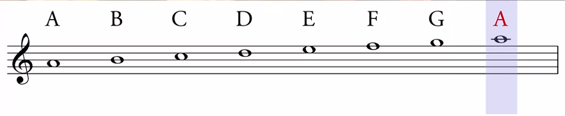
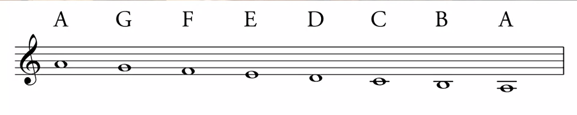

## 音乐理论基础

### 音符系统

在音乐理论中，音符是表示音高的基本单位。西方音乐使用 A 到 G 七个字母来表示不同的音高（不包含 H）

从 A 到 G 越来越低的表示

所以音乐字符是从 A-G 的序列，然后重复，形成不同八度的音阶

在五线谱中，一个实用的记忆方法是：

现代音乐中常用的记谱法包括：

+ 五线谱记谱法（国际通用标准）
+ 简谱记谱法（以阿拉伯数字1-7表示）
+ 字母记谱法（使用A-G字母）

### 音高和八度

一个完整的八度包含 8 个音级（从任意音到其高八度音）。现代钢琴有 88 个键，跨越了 7 个完整的八度

### 音程和半音

+ 音程：两个音之间的垂直距离
+ 半音：相邻两个音（包括黑键）之间的最小间隔
+ 全音：等于两个半音的间隔（例如 C 到 D）

### 和弦

和弦是三个或更多音同时发声形成的组合。基本和弦类型包括：

1. 三和弦（最基本的和弦形式）
  + 大三和弦：根音 + 大三度 + 完全五度（如 C-E-G）
  + 小三和弦：根音 + 小三度 + 完全五度（如 C-Eb-G）
  + 减三和弦：根音 + 小三度 + 减五度（如 C-Eb-Gb）
  + 增三和弦：根音 + 大三度 + 增五度（如 C-E-G#）
2. 七和弦（在三和弦基础上加入第七音）
  + 大七和弦：大三和弦 + 大七度
  + 属七和弦：大三和弦 + 小七度
  + 小七和弦：小三和弦 + 小七度
  + 减七和弦：减三和弦 + 减七度

### 调式

调式是以某个音为中心，按照特定音程关系排列的音阶体系

自然大调：

+ 全音-全音-半音-全音-全音-全音-半音
+ 例如 C 大调：C-D-E-F-G-A-B-C
+ 音级功能：主音(1)、上主音(2)、中音(3)、下属音(4)、属音(5)、下中音(6)、导音(7)

自然小调：

+ 全音-半音-全音-全音-半音-全音-全音
+ 例如 A 小调：A-B-C-D-E-F-G-A

和声小调：

+ 在自然小调基础上将第七音升高半音
+ 例如：A-B-C-D-E-F-G#-A

旋律小调：

上行：升高第六、七音
下行：恢复自然小调形式

口琴演奏中的调式应用：

+ 口琴多为 C 调或 G 调，演奏其他调式时需要掌握转调技巧
+ 不同调式给音乐带来不同的情感色彩
+ 理解调式有助于即兴演奏和曲目改编

五声音阶（中国传统音乐常用）：

+ 宫、商、角、徵、羽
+ 相当于大调的 1、2、3、5、6 音
+ 在口琴演奏中国民乐时经常使用

通过对和弦和调式的深入理解，可以：

+ 更好地把握曲目的和声结构
+ 提高即兴演奏能力
+ 丰富演奏的表现力
+ 为编曲和改编提供理论基础

## 连奏和断奏

口琴是靠呼吸演奏的乐器，如果呼-吸控制不当，就会给人一种不连贯的感觉

演奏一呼一吸的两个音的连奏，后一个音要比前一个音弱

断奏就是没有连线符号的音断开演奏，用吐音演奏，遇到相同音连续重复时，在气息不断地情况下轻吐断开

## 替代音

是可以通过提高半音得到相同的音，比如 低音7 升半音就变中音 1，它们是等效的，可以互相替代

+ 4，5 孔吹 = #4 孔吸
+ 6 孔吸 = #6 孔吹

比如卡农某一段 ”5 345 345“，在演奏到”4“的时候会吸气，如果想要全程吹气，就可以改成”5 3#35 3#35“，降低了吹奏难度，这就是替代音的作用

## 断音

主要有两种方式：

+ 舌断：吐一下舌头，也称为”吐音“，音断的干净
+ 喉断：，也称为”咳音“，音断的略微不干净，但非常饱满

## 震音

主要有以下方式：

+ 气震音：下巴快速咬合，依靠气息强弱变化
+ 手震音：左手快速交合

## 颤音

有以下方式：

+ 快速推动和松开推键
+ 快速吹吸一个孔

## 装饰音技巧

+ 倚音：包括长倚音和短倚音
+ 滑音：平滑过渡在两个音符之间
+ 和音：同时几个孔发音，但是口琴不是擅长进行和音

## 左右开弓

## 最佳实践

+ 大量练习音阶，每个调都练到位，不出错，达到极限速度
+ 持续练习某个曲子，发现问题，边吹边解决
+ 练音阶不等于练曲子，要时时刻刻在曲子中感悟
+ 要做到脑子里想唱哪个音就要立马吹哪个音

## 口琴的保养

口琴不需要清洗，这建立在以下条件中：

1. 吹口琴前刷牙嗽口
2. 吹完后保存到琴盒中
