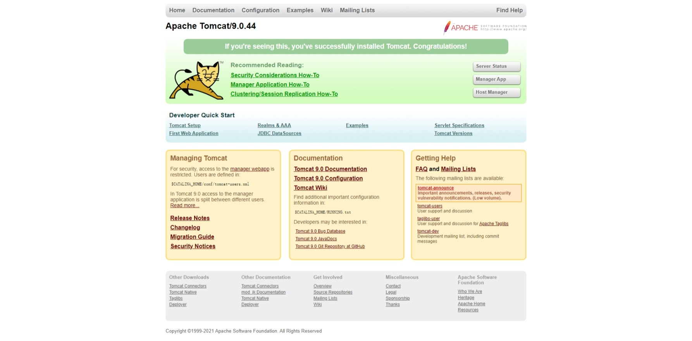

## Tomcat

::: info 前置知识

+ HTML
+ CSS
+ JavaScript
+ Java
+ HTTP
:::

Tomcat 是 Apache 公司开发的一款免费的 Web 应用服务器，虽然它为 HTML 页面提供服务，但实际上运行的是 JSP 和 Servlet。因为处理静态 HTML 的能力不如其他服务器，所以它只能算是一个运行 JSP 和 Servlet 的容器，能够单独处理 HTML 页面

从[官网](https://tomcat.apache.org/)下载它，Tomcat 依赖于 Java 运行，在[这里](https://tomcat.apache.org/whichversion.html)查看匹配当前 Java 版本的 Tomcat。如果没有配置`JAVA_HOME`系统环境变量，一定要配置，它为 Tomcat 指明 Java 所在的目录，否则启动时只能看到一闪而过的窗口

在`bin`目录下，找到`startup.bat`（如果是 Windows）双击它，会弹出一个终端窗口启动 Tomcat（如果没有问题）。这时不要关闭它，打开浏览器输入`localhost:8080`访问，出现下图就代表 Tomcat 以及相关配置没有问题



不要直接关闭打开中的终端来停止 Tomcat，应该双击`bin`目录下的`shutdown.bat`来处理

掌握 Tomcat 的一些目录是非常有必要的

+ bin：存放一些可执行命令，比如启动服务器和关闭服务器
+ conf：存放服务器启动时相关的配置，核心配置文件`server.xml`
+ lib：运行时依赖的库
+ logs：存放执行日志信息的目录
+ temps：临时文件夹目录
+ webapps：发布应用的目录
+ work：处理 JSP 的工作目录

最重要的是`webapps`，通过网址访问的路径都是这个目录下的应用，如果打开这个目录，会发现 Tomcat 自带几个 Web 应用，通过`localhost:8080`会默认指向`ROOT`目录中的应用

一个 Web 应用的目录结构是这样的：

```
WebName
│  index.jsp
│  ...
└─WEB-INF
    │  web.xml # 当前整个 Web 应用的核心配置文件
    │
    ├─classes # 编译后的 java 字节码文件
    └─lib # jar 包
```

::: danger
`host-manager`、`manager`、`ROOT`这三个项目最好不要删，其它的都可以删掉以增加启动速度
:::

### 核心配置

`server.xml`是 Tomcat 的核心配置文件

```xml
<Server>
  <Service name="catalina">
    <Connector connectionTimeout="20000" port="8080" protocol="HTTP/1.1" redirectPort="8443"/>
    <Connector port="8009" protocol="AJP/1.3" redirectPort="8443"/>
    <Engine defaultHost="Localhost" name="catalina">
      <Host appBase="webapps" autoDeploy="true" name="LocaLhost" unpackwARs="true">
        <Context docBase="project1" path=" /project1" reloadable="true" />
        <Context docBase="project2" path="/project2" reloadable="true" />
      </Host>
      <Host appBase="webapps" autoDeploy="true" name="m. myxq.com" unpackWARs="true">
        <Context docBase="project1" path="/project1" reloadable="true" >
        <Context docBase="project2" path="/project2" reloadable="true" >
      </Host>
    </Engine>
  </Service> 
</Server>
```

- Server - 整个Server容器组合，可以包含一个或者多个 Service
- Service - 由一个或者多个 Connector 组成，以及一个 Engine，负责处理所有的 Connector 所获得的客户请求
- Connector - 客户端与程序交互组件，负责接受请求以及向客户端返回响应
- Engine - 处理连接器接受到请求
- Host - 虚拟主机
- Context - 一个 Context 对应一个 Web Application

#### 虚拟目录

```xml
<Context docBase="" path="" reloadable="" source=""/>
```

+ docBase：Web 应用的文件目录
+ path：URL 入口
+ reloadable：字节码改变时是否重新加载

### Servlet

Servlet 提供处理处理请求和响应的 API，由`servlet-api.jar`提供对应的接口，每一个实现该接口的 Java 类都是一个 Servlet 处理程序。在运行对应的 Servlet 时，不需要`main`方法，会被编译成字节码文件放入`WEB-INF -> classes`目录下根据请求去执行对应的 Servlet 程序

Tomcat 启动时会将网页中的 URL 映射成 webapps 中的应用目录，一个 URL 对应一个 Servlet，当请求这个 URL 时，会执行`<servlet>`标签中对应的 java 程序，这个程序是编译过的字节码文件，存放在`classes`目录，但是无法访问 WEB-INF 目录下的文件

如果想要将 URL 映射成对应的 Servlet 程序，则应该在`web.xml`中进行配置，比如：

```xml
<web-app>
  <servlet>
    <servlet-name>hello</servlet-name>
    <servlet-class>HelloServlet</servlet-class>
  </servlet>
  <servlet-mapping>
    <servlet-name>hello</servlet-name>
    <url-pattern>/hello</url-pattern>
  </servlet-mapping>
</web-app>
```

因此一个标准的目录是这样的：

```
.
├── src（java 源码）
├── WEB-INF（提供 Tomcat 执行的信息）
│   ├── classes（编译后的字节码文件）
├── ├── lib（依赖的库）
├── ├── web.xml（应用配置项）
├── index.jsp（页面）
```

工作的流程：

1. 编写 Servlet 程序
2. 编译成字节码放入 classes
3. 导入依赖库
4. 配置 web.xml 中的映射关系
5. 发布到 webapps 目录下
6. 启动 Tomcat
7. 访问对应 Web 应用

### 部署方式

+ 直接将 war 放入`webapps`文件夹中
+ 指定虚拟目录

使用`jar -cvf <outnname.war> [file1, file2, ...]`命令，比如`jar -cvf test.war *`会将当前目录所有的文件打包成`test.war`文件，丢到`webapps`启动时，会在当前目录下解压出来部署

<!-- more -->

## Nginx

是一款开源免费，高性能的 Web 服务器，一般用于静态服务和负载均衡以及反向代理

在 Ubuntu 中安装后的目录结构大致如下：

+ 程序执行在`/usr/sbin/nginx`
+ 所有的配置文件在`/etc/nginx`
+ 日志文件在`/var/log/nginx`
+ 默认的虚拟主机目录在`/var/www`或`/var/www/html`

在 Windows 中目录结构大致如下：

+ 程序文件在安装的根目录
+ 配置文件在`conf`
+ 日志文件在`logs`
+ 默认的虚拟主机目录在`html`

这是一些常用到的命令：

```sh
# 启动
nginx
# 查看版本号
nginx -v
# 检查配置文件语法错误
nginx -t
# 重新应用配置文件
nginx -s reload
# 快速关闭
nginx -s stop
# 等待工作进程处理完成后关闭
nginx -s quit
```

Nginx 采用的是简单文件格式的配置文件，下面是指令的一些特性

+ 注释 - 以`#`开头
+ 简单指令 - 以分号结尾
+ 块指令 - 以`{}`包围
+ 包含指令 - `include`

```text
events 
{
  # ... 
}
http  
{
  server
  { 
    location path
    {
      # ...
    }
    location path
    {
     # ...
    }
     }
  server
  {
    # ...
  }
}
```

### 代理静态资源

### 内置变量

| 变量名             | 功能                                                            |
| ------------------ | --------------------------------------------------------------- |
| `$host`            | 请求信息中的 Host，如果请求中没有 Host 行，则等于设置的服务器名 |
| `$request_method`  | 客户端请求类型，如 GET、POST                                    |
| `$remote_addr`     | 客户端的 IP 地址                                                |
| `$args`            | 请求中的参数                                                    |
| `$content_length`  | 请求头中的 Content-length 字段                                  |
| `$http_user_agent` | 客户端 agent 信息                                               |
| `$http_cookie`     | 客户端 cookie 信息                                              |
| `$remote_addr`     | 客户端的 IP 地址                                                |
| `$remote_port`     | 客户端的端口                                                    |
| `$server_protocol` | 请求使用的协议，如 HTTP/1.0、HTTP/1.1                           |
| `$server_addr`     | 服务器地址                                                      |
| `$server_name`     | 服务器名称                                                      |
| `$server_port`     | 服务器的端口号                                                  |

### 正向代理和反向代理

正向代理是为客户端服务的，客户端可以通过正向代理访问它本身无法访问到的服务器。对于服务端来说，服务端无法区分是否来自代理访问还是真实客户端访问

反向代理是为服务端服务的，反向代理可以帮助服务端接受请求，进行请求转发，负载均衡等。反向代理隐藏了真实的服务端，对于客户端来说是没有感知的，就像拨打`10086`一样，每次接电话的客服并不是同一个人，而是由`10086`分配一个客服，`10086`就承担着反向代理的角色

nginx 反向代理靠`proxy_pass`项来完成，比如：

```text
server {
  listen 80;
  server_name jinqiu.wang;
  location / {
      proxy_pass http://127.0.0.1:8888;
  }
}
```

这个配置就是说，将来自`jinqiu.wang:80`端口的请求，代理到`http://127.0.0.1:8888`上面，由`http://127.0.0.1:8888`处理真正的请求

在使用反向代理的时候，每次请求的 IP 都是本地 IP，这是因为 Nginx 所在的运行环境所致，导致处理方永远获得的都是 Nginx 的地址，如果有获取用户 IP 的需求，可以增加配置项

```text
server {
  listen 80;
  server_name jinqiu.wang;
  location / {
      proxy_pass http://127.0.0.1:8888;
      proxy_set_header X-Real-IP $remote_addr;
  }
}
```

意思是说，Nginx 将请求方的地址添加到请求头中，因此真正处理请求的机器，可以通过这个请求头来获取请求方的真实 IP

::: danger
Nginx 无法分辨请求方的 IP 是否真实，也可能是伪造的
:::

### 配置 gzip 压缩传输

gzip 压缩能够提高网站速度节约网站流量，开启 gzip 之后的网站加载速度几乎是未开启的两倍，所以非常推荐开启，将下面的内容添加到配置文件，重启 nginx

```plain
gzip on;
gzip_disable "msie6";
gzip_vary on;
gzip_proxied any;
gzip_comp_level 6;
gzip_buffers 16 8k;
gzip_http_version 1.1;
gzip_min_length 256;
gzip_types application/atom+xml application/geo+json application/javascript application/x-javascript application/json application/ld+json application/manifest+json application/rdf+xml application/rss+xml application/xhtml+xml application/xml font/eot font/otf font/ttf image/svg+xml text/css text/javascript text/plain text/xml;
```

只需要检查响应头是否包含`content-encoding: gzip`即可

### 设置响应头

比如跨域请求可使用`add_header`进行添加跨域头来允许

```text
server {
  listen 80;
  server_name httptest.jinqiu.wang;
  location / {
    proxy_pass http://127.0.0.1:8888;
    add_header Access-Control-Allow-Origin *;
  }
}
```

### 请求体

如果上传的文件过大，会返回 413 错误，Nginx 默认是 1m 大小的限制，但是可以添加`client_max_body_size`进行修改

```text
server {
  listen 80;
  server_name space.jinqiu.wang;
  location / {
    client_max_body_size 50m;
    proxy_pass http://127.0.0.1:8889;
  }
}
```

### 限制控制

默认情况下，有多少带宽，Nginx 就能消耗掉多少，Nginx 允许限制来自 HTTP 连接所使用的最大速率，比如使用`limit_rate`就可以限制下载速度：

```text
server {
  listen 80;
  server_name space.jinqiu.wang;
  location / {
    limit_rate 100k;
    client_max_body_size 50m;
    proxy_pass http://127.0.0.1:8889;
  }
}
```

甚至可以优化一下，比如前 10m 不限速，超过后开始限速：

```text
server {
  listen 80;
  server_name space.jinqiu.wang;
  location / {
    limit_rate_after 10m;
    limit_rate 100k;
    client_max_body_size 50m;
    proxy_pass http://127.0.0.1:8889;
  }
}
```

### 负载均衡

### 配置 HTTPS
