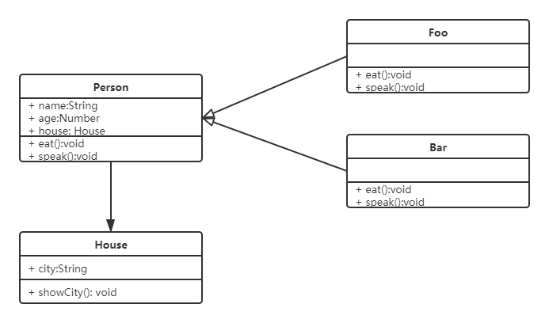

设计模式是一套反复使用、思想成熟、经过分类和无数实战设计经验的总结，适用设计模式是为了让系统代码可重用、可扩展、可解耦、更容易被人理解且能保证代码的可靠性。使代码开发真正工程化，是软件工程的基石脉络，如同大厦的结构一样

设计模式运用在程序设计中已经很多年了，现在已经被应用到各种各样的编程语言，最大的魅力是在各种编程语言中表现都是一样的，只是语法不同，相互转换很容易

## 面向对象编程

类和对象是两个概念，在编程中使用的非常多，很容混淆，但实际上很多人都无法精确的区分它们，这影响了它们正确的建立面向对象思想。面向对象编程在英文中译为“Object Oriented Programming”，简称 OOP，在其中并没有类的概念，因为类是对象的抽象表述

抽象是一种归纳和总结的方式，对象是显示具有物体特征的实体，因此万事万物都可以看作对象，简称万物皆对象。对于人来说，每个人都是具体的实体，都具有共同的特征和行为，比如身高，体重，年龄，甚至可以跑和跳，尽管每个人的特征都有所不同，但是它们都具有这种特征，因此就可以将这个特征进行归纳总结，当特征和行为抽象出来后，就可以用编程语言来描述，比如每个人都能够被描述为`Person`的类

万物皆对象的核心就是任何实体都可以抽象成一个通用的类，一般这个类就是基类或根类，编程中叫做`Object`，大部分编程语言都是将`Object`作为基类

当对象被抽象为类之后，就可以通过类来创建具体的实例，实例就是该类的一个具体的实体，比如创建一个`Person`的实例，每一个实例都有自己的特征和行为，都属于该类但又是不同的个体，因此在编程中，类的实例被称之为对象，而对象是类的实例，所以创建对象的过程叫做实例化

虽然大部分面向对象语言都使用的类来完成面向对象编程，但是类并不是唯一能够用来完成面向对象编程的方法。JavaScript 使用的构造器和原型来实现面向对象编程，所以不能够将面向对象误解为类，很多人都是一想到面向对象，就会想到类，这实际上是一个误区

面向对象编程设计是围绕着真实世界的概念来组织程序中的模型的设计方法，因此：

::: center
对象 = 数据 + 作用数据的操作
:::

面向对象的意义并不是为了模拟世间万物，这只是为了好学习好理解而已，而是为了数据结构化，将一些混乱的数据集中管理，对于计算机来说，结构化才是最简单的，编程应该简单和抽象

### 继承

在编程中通常需要一些这样的类，这些类能够与其他的类拥有相同的属性和方法，为了使这一点变得更加容易，类的功能可以从其他的类扩展出来，而扩展出来的类都用于和基类一样的属性和方法，并且自身有更多定义的部分，因此就可以避免写一些重复的代码，在继承的关系中，两个类应该是一种“属于”的关系，通过继承创建的类叫做子类或派生类，被继承的类称为基类、父类或超类

```js
// 父类
class Person {
  constructor (name, age) {
    this.name = name;
    this.age = age;
  }
  eat () {
    console.log(this.name + 'eat something');
  }
}

// 子类继承父类
class Student extends Person {
  constructor (name, age, number) {
    super(name, age);
    this.number = number;
  }
  study() {
    console.log(this.name + ' study');
  }
}
```

父类是公共的，不仅仅服务一个子类，继承可以将公共方法抽离出来，提高复用，减少冗余

### 封装

对象中数据的权限和保密，减少耦合，不该外露的不外露，利于数据、接口的权限管理

### 多态

同一个接口不同实现

### jQuery 面型对象编程实现

```js
class jQuery {
  constructor(selector) {
    let slice = Array.prototype.slice;
    let dom = slice.call(document.querySelectorAll(selector));
    let len = dom ? dom.length : 0;
    for (let i = 0; i < len; i++) {
      this[i] = dom[i];
    }
    this.length = len;
    this.selector = selector || '';
  }
  append(node) {}
  addCalss(name) {}
  html(data) {}
  /* 省略若干 API */
}
```

## UML

UML（Unified Modeling Language）即统一建模语言，类图即包含很多类的图，关系主要将泛化和关联



这张类图就是下面的代码表示：

```js
class Person {
  constructor(name, age, house) {
    this.name = name;
    this.age = age;
    this.hosue = hosue;
  }
  eat() {}
  speack() {}
}

class House {
  constructor(city) {
    this.city = city;
  }
  showCity() {}
}

class Foo extends Person {
  constructor(name, age, house) {
    super(name, age, house);
  }
  eat() {}
  speack() {}
}

class Bar extends Person {
  constructor(name, age, house) {
    super(name, age, house);
  }
  eat() {}
  speack() {}
}
```

## 设计原则

设计即按照哪一种思路或标准来实现功能，功能相同会有不同的设计方案来实现，伴随着需求增加，设计的作用才能体现出来

根据《UNIX/LINUX 设计哲学》可以总结出以下软件设计准则：

+ 小即是美
+ 让每个程序只做好一件事
+ 快速建立原型
+ 舍弃高效率而取可移植性
+ 采用纯文本来存储数据
+ 充分利用软件的杠杆效应（软件复用）
+ 设用 shell 脚本来提高杠杆效应和可移植性
+ 避免强制性的用户界面
+ 让每个程序都成为过滤器
+ 允许用户定制环境
+ 尽量使操作系统内核小而轻量化
+ 适用小写字母并尽量简短
+ 沈默是金
+ 各部分之和大于整体
+ 寻求 90% 的解决方案

### S-O-L-I-D 五大设计原则

+ S - 单一职责原则

一个程序只做好一件事，过于复杂就拆分开，每个部分保持独立

+ O - 开放封闭原则

对于扩展开放，对于修改封闭，增加需求时，扩展新代码，而非修改已有代码，这也是软件设计的终极目标

+ L - 李氏置换原则

子类能覆盖父类，父类能出现的地方子类就能出线

+ I - 接口独立原则

保持接口的单一独立，避免出现“胖接口”

+ D - 依赖导致原则

面向接口编程，依赖于抽象而不依赖具体，使用方只关注接口而不关注具体类的实现

### 从设计到模式

设计是设计，模式是模式，它们是独立的

## 创建型

### 工厂模式

工厂模式是将`new`操作单独封装，遇到`new`的时候就需要考虑是否该适用工厂模式了

```js
class Product {
  constructor(name) {
    this.name = name;
  }
  init() {}
  func1() {}
  func2() {}
}

class Creator {
  create(name){
    return new Product(name);
  }
}

const creator = new Creator();
const product1 = creator.create('product1');
product1.init();
```

意义：

1. 构造函数和创建者分离
2. 符合开放封闭原则

使用场景：

1. jQuery
2. React.createElement
3. Vue 异步组件

### 单例模式

单例模式就是保证一个类只有一个实例，实现方法就是先判断实例是否存在，如果存在直接返回，不存在就创建了再返回，确保一个类只有一个实例对象

<CodeGroup>

<CodeGroupItem title="Java" active>

```java
public class SingleObject {
  private SingleObject instance = null;
  // 私有化构造方法
  private SingleObject (){}
  // 获取实例的唯一方法
  public SingleObject getInstance() {
  // 判断实例是否存在，否则只 new 一次
    if(instance == null) {
      return new SingleObject();
    }
    return instance;
  }
}

public class Main {
  public static void main(String args[]) {
    // 报错，构造方法私有化了
    // SingleObject instance = new SingleObject();
    SingleObject instance = SingleObject.getInstance();
  }
}
```

</CodeGroupItem>

<CodeGroupItem title="JavaScript">

```js
class SingleObject {}

SingleObject.getInstance = (function() {
  let instance;
  return function(){
    if(!instance) {
      instance = new SingleObject();
    }
    return instance;
  }
})();

let single1 = SingleObject.getInstance();
let single2 = SingleObject.getInstance();
console.log(single1 === single2); // true
```

</CodeGroupItem>

</CodeGroup>

意义：

1. 符合单一职责原则
2. 没法开放封闭原则，但是绝对不违反开放封闭原则

使用场景：

1. 模拟登录框
2. jQuery 只有一个`$`
3. 购物车
4. vuex 和 redux 中的 store

### 原型模式

## 结构型

### 适配器模式

适配器模式是将一个类的接口转换成客户希望的另一个接口，使原本由于接口不兼容而不能一起工作的类可以一起工作

```js
class Adaptee {
  foo(){
    return 'foo';
  }
}

class Target {
  constructor(){
    this.adaptee = new Adaptee();
  }
  bar() {
    return `bar -> ${this.adaptee.foo()}`;
  }
}

let target = new Target();
console.log(target.bar());  // 'foo'
```

设计原则：

1. 旧接口和使用者相分离
2. 符合开放封闭原则

使用场景：

1. 使用一个已经存在的对象，但其方法或接口不符合要求，封装旧接口
2. 创建一个可复用的对象，该对象可以与其他不相关或不可见的对象协同工作
3. 适用已经存在一个或多个对象，但是不能进行继承以匹配它的接口
4. vue computed 转换 data

### 装饰器模式

### 代理模式

### 外观模式

### 桥接模式

### 组合模式

### 享元模式

## 行为型

### 策略模式

### 模板方法模式

### 观察者模式

### 迭代器模式

Iterator 模式用于在数据集合中按照顺序遍历集合，iterate 在英文中有反复做某件事的意思，在中文中被称为“迭代”

```java
interface Iterator {
    public abstract boolean hasNext();
    public abstract Object next();
}

class Book {
    private String name;
    public Book(String name) {
        this.name = name;
    }
    public String getName() {
        return this.name;
    }
}

class BookShelf {
    private Book[] books;
    private int last = 0;
    public BookShelf(int maxsize) {
        this.books = new Book[maxsize];
    }
    public Book getBookAt(int index) {
        return this.books[index];
    }
    public void appendBook(Book book) {
        this.books[last] = book;
        this.last++;
    }
    public int getLength() {
        return last;
    }
    public Iterator iterator() {
        return new BookShelfIterator(this);
    }
}

class BookShelfIterator implements Iterator {
    private BookShelf bookShelf;
    private int index;
    public BookShelfIterator (BookShelf bookShelf) {
        this.bookShelf = bookShelf;
        this.index = 0;
    }
    public boolean hasNext() {
        if (index < bookShelf.getLength()) {
            return true;
        } else {
            return false;
        }
    }
    public Object next() {
        Book book = bookShelf.getBookAt(index);
        index++;
        return book;
    }
}

public class Main {
    public static void main(String args[]) {
        BookShelf bookShelf = new BookShelf(4);
        bookShelf.appendBook(new Book("编程珠玑"));
        bookShelf.appendBook(new Book("人月神话"));
        bookShelf.appendBook(new Book("没有银弹"));
        bookShelf.appendBook(new Book("整洁之道"));
        System.out.println(bookShelf.getLength());
        Iterator it = bookShelf.iterator();
        while (it.hasNext()) {
            Book book = (Book)it.next();
            System.out.println(book.getName());
        }
    }
}
```

+ Iterator：该角色负责定义按照顺序遍历每个元素的接口，定义了 hasNext() 和 next() 两个方法
+ ConcreteIterator：该角色负责实现 Iterator 所定义的接口，存储了遍历集合的必要信息
+ Aggregate：该角色负责创建 Iterator 角色的接口，这是一个方法，会创建一个能够迭代内部元素东西
+ ConcreteAggregate：该角色负责实现 Aggregate 所定义的接口

### 职责连模式

### 命令模式

### 备忘录模式

### 状态模式

### 访问者模式

### 中介者模式

### 解释器模式
