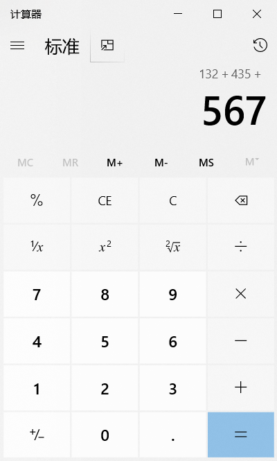
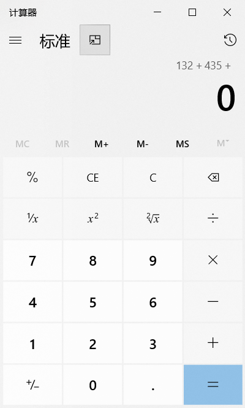
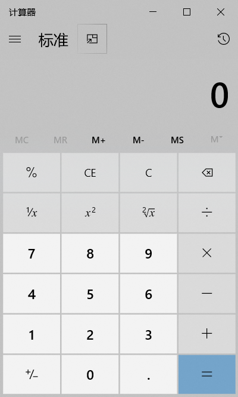

为找不到资源的种子而担忧？不用怕。你可以通过 Google 直接找到下载地址

下载电影时，用以下方式搜索：

```
“你要搜的内容”-inurl:(htm|html|php|pls|txt) intitle:index.of “last modified” (mkv|mp4|avi)
```

这个搜索技巧不仅仅可以下载电影，也可以是其他任意软件。只要把文件格式 (如 mp3|wma|aac|flac )换成你需要搜索的文件格式就可以了。这样你就可以直接搜索到你想要的任何东西。

上 youtube 网站时，在地址栏：

+ 把“youtube”换成“listentoyoutube”，可以下载视频的音频；  
+ 把“youtube”换成“ssyoutube”，可以下载任意图像质量的视频；  
+ 把“youtube”换成“listenonrepeat”，可以自动重放视频；  
+ 把“youtube”换成“youtubeskip”，你将不会看到广告。

获取 Windows 上所有已安装目标程序的快捷方式

```
%windir%\explorer.exe shell:::{4234d49b-0245-4df3-b780-3893943456e1}
```

在计算器上，C 和 CE 是有区别的，尽管很多人都觉得它们一样。C 按钮能清除你曾输入的所有东西，但是 CE 只清除最新输入的内容

比如：我在计算机上输入这些：



CE 按钮会做这些：



而 C 按钮会做这些：



## Excel

+ 列宽或行高一致：选中边缘要调整的所有列或行，选择其中一个进行大小调整，其他就会自动变成一致
+ 自动递增：选择需要递增的列，末尾是数字则会自动加1填充，可以根据两个单元格的数字差距进行隔数递增，如果不想递增1，则可以选择两个单元格，word 会根据两个单元格的数字差来递增
+ 冻结窗格：常用于解决行或列过长而导致看不到标题信息，在“视图”选项卡中使用冻结窗格功能，需要选中行或列，从下一行或列开始冻结
+ 分割视窗：常用于对比不同行之间的数据，在“视图”选项卡中使用拆分功能，选中行或列，从下一行或列开始拆分
+ 排序：在排序时不要选中所有的行，否则会造成数据混乱
+ 分类排序：可以自定义排序来实现归类排序
+ 自定义序列排序：自定义序列排序可以根据规则来排序
+ 筛选快捷键：ctrl + shift + L
+ 文本筛选：可以根据一些关键字来实现模糊筛选
+ 色彩排序：也可以根据单元格的颜色进行排序，前提是必须上色
+ 切片器：可以更加直观的筛选数据
+ 条件格式：可以根据筛选条件来格式化单元格样式，必须选择所有列或行
+ 根据生日计算年龄：公式“=DATEDIF([@生日], "2017/1/1", "y")”

## Word

+ 视图：视图 -> 大纲，可以查看 Word 中的所有细节，非常利于调试格式

## PPT

+ 当你保存你的 ppt 时，用后缀`.pps`或`.ppsx`，那样的话，打开时会直接进入幻灯片播放模式。不仅节省时间，还看起来十分专业

## 三者之间的互动

<!-- to be updated -->

## Adobe Photoshop

## Adobe Illustrator

+ 选择工具组
  + 选择工具：选择、移动、缩放、旋转
  + 直接选择工具：选择、移动、变形
  + 套索工具：自由选择锚点
  + 魔棒工具：色容差
+ 填色和描边
  + 前后置换：x
  + 颜色置换：Shift + x
  + 默认黑白：D
  + 关闭：/
+ 描边
  + 可改颜色
  + 实现、虚线
  + 端点
  + 折角
