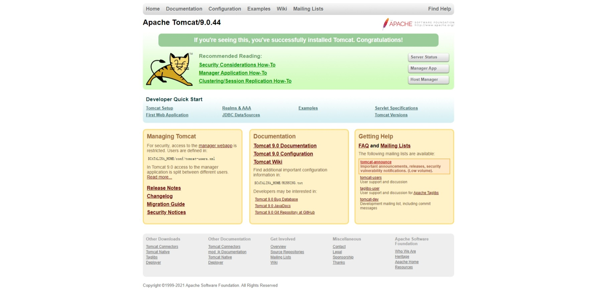

## Tomcat

::: info 前置知识

+ HTML
+ CSS
+ JavaScript
+ Java
+ HTTP
:::

Tomcat 是 Apache 公司开发的一款免费的 Web 应用服务器，虽然它为 HTML 页面提供服务，但实际上运行的是 JSP 和 Servlet。因为处理静态 HTML 的能力不如其他服务器，所以它只能算是一个运行 JSP 和 Servlet 的容器，能够单独处理 HTML 页面

从[官网](https://tomcat.apache.org/)下载它，Tomcat 依赖于 Java 运行，在[这里](https://tomcat.apache.org/whichversion.html)查看匹配当前 Java 版本的 Tomcat。如果没有配置`JAVA_HOME`系统环境变量，一定要配置，它为 Tomcat 指明 Java 所在的目录，否则启动时只能看到一闪而过的窗口

在`bin`目录下，找到`startup.bat`（如果是 Windows）双击它，会弹出一个终端窗口启动 Tomcat（如果没有问题）。这时不要关闭它，打开浏览器输入`localhost:8080`访问，出现下图就代表 Tomcat 以及相关配置没有问题



不要直接关闭打开中的终端来停止 Tomcat，应该双击`bin`目录下的`shutdown.bat`来处理

掌握 Tomcat 的一些目录是非常有必要的

+ bin：存放一些可执行命令，比如启动服务器和关闭服务器
+ conf：存放服务器启动时相关的配置，核心配置文件`server.xml`
+ lib：运行时依赖的库
+ logs：存放执行日志信息的目录
+ temps：临时文件夹目录
+ webapps：发布应用的目录
+ work：处理 JSP 的工作目录

最重要的是`webapps`，通过网址访问的路径都是这个目录下的应用，如果打开这个目录，会发现 Tomcat 自带几个 Web 应用，通过`localhost:8080`会默认指向`ROOT`目录中的应用

一个 Web 应用的目录结构是这样的：

```
WebName
│  index.jsp
│  ...
└─WEB-INF
    │  web.xml # 当前整个 Web 应用的核心配置文件
    │
    ├─classes # 编译后的 java 字节码文件
    └─lib # jar 包
```

::: danger
`host-manager`、`manager`、`ROOT`这三个项目最好不要删，其它的都可以删掉以增加启动速度
:::

### 核心配置

`server.xml`是 Tomcat 的核心配置文件

```xml
<Server>
  <Service name="catalina">
    <Connector connectionTimeout="20000" port="8080" protocol="HTTP/1.1" redirectPort="8443"/>
    <Connector port="8009" protocol="AJP/1.3" redirectPort="8443"/>
    <Engine defaultHost="Localhost" name="catalina">
      <Host appBase="webapps" autoDeploy="true" name="LocaLhost" unpackwARs="true">
        <Context docBase="project1" path=" /project1" reloadable="true" />
        <Context docBase="project2" path="/project2" reloadable="true" />
      </Host>
      <Host appBase="webapps" autoDeploy="true" name="m. myxq.com" unpackWARs="true">
        <Context docBase="project1" path="/project1" reloadable="true" >
        <Context docBase="project2" path="/project2" reloadable="true" >
      </Host>
    </Engine>
  </Service> 
</Server>
```

- Server - 整个Server容器组合，可以包含一个或者多个 Service
- Service - 由一个或者多个 Connector 组成，以及一个 Engine，负责处理所有的 Connector 所获得的客户请求
- Connector - 客户端与程序交互组件，负责接受请求以及向客户端返回响应
- Engine - 处理连接器接受到请求
- Host - 虚拟主机
- Context - 一个 Context 对应一个 Web Application

#### 虚拟目录

```xml
<Context docBase="" path="" reloadable="" source=""/>
```

+ docBase：Web 应用的文件目录
+ path：URL 入口
+ reloadable：字节码改变时是否重新加载

### Servlet

Servlet 提供处理处理请求和响应的 API，由`servlet-api.jar`提供对应的接口，每一个实现该接口的 Java 类都是一个 Servlet 处理程序。在运行对应的 Servlet 时，不需要`main`方法，会被编译成字节码文件放入`WEB-INF -> classes`目录下根据请求去执行对应的 Servlet 程序

Tomcat 启动时会将网页中的 URL 映射成 webapps 中的应用目录，一个 URL 对应一个 Servlet，当请求这个 URL 时，会执行`<servlet>`标签中对应的 java 程序，这个程序是编译过的字节码文件，存放在`classes`目录，但是无法访问 WEB-INF 目录下的文件

如果想要将 URL 映射成对应的 Servlet 程序，则应该在`web.xml`中进行配置，比如：

```xml
<web-app>
  <servlet>
    <servlet-name>hello</servlet-name>
    <servlet-class>HelloServlet</servlet-class>
  </servlet>
  <servlet-mapping>
    <servlet-name>hello</servlet-name>
    <url-pattern>/hello</url-pattern>
  </servlet-mapping>
</web-app>
```

因此一个标准的目录是这样的：

```
.
├── src（java 源码）
├── WEB-INF（提供 Tomcat 执行的信息）
│   ├── classes（编译后的字节码文件）
├── ├── lib（依赖的库）
├── ├── web.xml（应用配置项）
├── index.jsp（页面）
```

工作的流程：

1. 编写 Servlet 程序
2. 编译成字节码放入 classes
3. 导入依赖库
4. 配置 web.xml 中的映射关系
5. 发布到 webapps 目录下
6. 启动 Tomcat
7. 访问对应 Web 应用

### 部署方式

+ 直接将 war 放入`webapps`文件夹中
+ 指定虚拟目录

使用`jar -cvf <outnname.war> [file1, file2, ...]`命令，比如`jar -cvf test.war *`会将当前目录所有的文件打包成`test.war`文件，丢到`webapps`启动时，会在当前目录下解压出来部署

<!-- more -->
